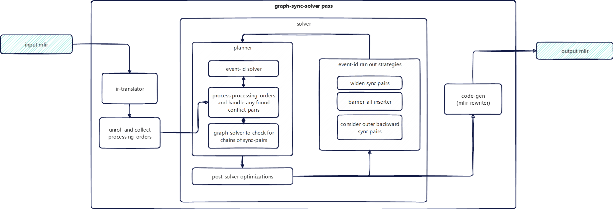
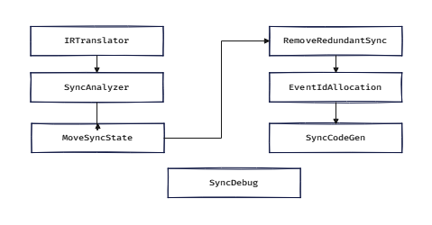

# Auto-Sync

Auto-sync is the AscendNPU-IR (HIVM) compiler feature that automatically inserts synchronization operations so producers and consumers of shared data or resources are correctly ordered. Goals: **correctness** (no data races or ordering bugs) and **minimal overhead** (fewest syncs needed, reuse of hardware events when safe).

## Hardware Background

### AICore Architecture

<https://www.hiascend.com/document/detail/zh/CANNCommunityEdition/83RC1/opdevg/Ascendcopdevg/atlas_ascendc_10_0008.html>

### HIVM Synchronization Operations

Synchronization ops are defined in `bishengir/include/bishengir/Dialect/HIVM/IR/HIVMSynchronizationOps.td`. Below they are described in terms of **MLIR usage** (operands/attributes), not assembly syntax.

#### Intra-Core-Sync (Normal-Sync)

- **`hivm.set_flag`**
  Operands/attributes: `set_pipe`, `wait_pipe`, and event id (`static_event_id` and/or `dynamic_event_id`)
  Executes on `set_pipe` after all previous instructions on that pipe have finished.
  Triggers the event id on execution.

- **`hivm.wait_flag`**
  Operands/attributes: `set_pipe`, `wait_pipe`, and event id (`static_event_id` and/or `dynamic_event_id`)
  Executes on `wait_pipe`.
  Blocks all following instructions on that pipe until the matching event id is triggered.

- **`hivm.pipe_barrier`**
  Operands/attributes: `pipe`
  Barrier across a given pipe.
  Blocks all following instructions on `pipe` until all previous instructions on that pipe finish.

#### Cross-Core-Sync (Block-Sync) (Intra-Block)

- **`hivm.sync_block_set`**
  Operands/attributes:
    - `tcore_type` — target core type (vector/cube)
    - `tpipe`, `pipe` — set/wait pipes on the target core
    - flag id (`static_flag_id` and/or `dynamic_flag_id`)
    - optional `ffts_base_addr` (required on memory-based architectures such as Ascend910B)
    - `tsync_instr_mode` (default `INTRA_BLOCK_SYNCHRONIZATION`)

  Executes on `tpipe` (set pipe) on the `tcore_type` core after all previous instructions on that pipe finish.
  Sets the flag id.

- **`hivm.sync_block_wait`**
  Operands/attributes:
    - `tcore_type` — target core type (vector/cube)
    - `tpipe`, `pipe` — set/wait pipes on the target core
    - flag id (`static_flag_id` and/or `dynamic_flag_id`)
    - `tsync_instr_mode` (default `INTRA_BLOCK_SYNCHRONIZATION`)

  Executes on `pipe` (wait pipe) on the `tcore_type` core.
  Blocks all following instructions on that pipe until the matching flag id is triggered.

Related ops used by some flows (not always emitted by auto-sync itself): `hivm.sync_block` (multi-mode block barrier), `hivm.anchor` (positional markers for delayed cross-core analysis), and sync-block lock/unlock helpers.

## Algorithm Principles

### AutoSync Solution Overview

The codebase provides two families of auto-sync solutions. Pipelines select between them via compile options (see [Interfaces](#interfaces)).

- **`GraphSyncSolver` / `CrossCoreGSS` / `DelayedCrossCoreGSS`** (default)

  Graph-based algorithms analyze conflicts, choose set/wait (or barrier) pairs, allocate event/flag ids, and emit HIVM sync ops. This is the **default** path (`--enable-hivm-graph-sync-solver` and `--enable-hivm-cross-core-gss` default to `true`). On RegBase, delayed cross-core GSS is also enabled by default.

- **`InjectSync` / `InjectBlockSync`** (fallback)

  Multi-stage inject passes: insert needed syncs, move/remove redundant ones, and allocate flag/event ids via liveliness analysis. Used when graph sync is disabled, or when barrier-all / block-all debug modes force the inject path.

In Triton-Ascend, graph sync can also be selected via `sync_solver=True` (maps to the graph-sync-solver path).

### GraphSyncSolver

**Purpose**: Primary intra-core auto-sync. Uses graph-based algorithms to decide when to insert set/wait pairs (or pipe barriers) and to allocate event ids. Supports unit-flag mode and SyncSolver V1/V2.

**Source code**:

- Headers: `bishengir/include/bishengir/Dialect/HIVM/Transforms/GraphSyncSolver/`
- Implementation: `bishengir/lib/Dialect/HIVM/Transforms/GraphSyncSolver/`
  (`GraphSyncSolver.cpp`, `SyncSolverBase.cpp`, `SyncSolverV1.cpp`, `SyncSolverV2.cpp`, `SyncSolverIR.cpp`, `SyncSolverIRTranslator.cpp`, `SyncSolverCodeGen.cpp`, `GraphSolver.cpp`, `GraphSolverBase.cpp`, `GraphSolverUnitFlag.cpp`, `EventIdSolver.cpp`, `MemInfo.cpp`, `CustomMacroSync.cpp`, `Utility.cpp`, plus tester helpers)

**Stages**:

1. **IRTranslator**:
   Build Sync-IR from the input function (function, scopes, loops, conditions, RW operations).
2. **Solver** (`SyncSolverV1` / `SyncSolverV2`, default **v2**):
   Collect conflict pairs (producer–consumer), run pair selection and ordering under a graph reachability model, allocate/reuse event ids, optionally apply unit-flag and custom-macro reservations.
3. **CodeGenerator**:
   Emit `hivm.set_flag` / `hivm.wait_flag` / `hivm.pipe_barrier`.

### CrossCoreGSS

**Purpose**: Insert block-level (intra-block) cross-core synchronization for **MIX** kernels (cube and vector): `sync_block_set`, `sync_block_wait` (and related block sync forms in special modes).

**Source code**: `CrossCoreGSS.cpp`; reuses `IRTranslator`, `SyncSolver`, and `CodeGenerator` from GraphSyncSolver.

**Working Principles**:

- Same solver stack as intra-core GSS, configured for `CROSS_CORE_SYNC`.
- Runs only on **MIX** kernels (not host, not pure AIC/AIV).
- On memory-based architectures, inserts `SetFFTSBaseAddrOp` when an FFTS base-addr kernel argument is present.
- Supports CV patterns, multibuffer flag-id strategies, round-robin event-id retry on mem-based arches, and block-all mode.

### DelayedCrossCoreGSS

**Purpose** (RegBase pipeline): Resolve cross-core sync **after** mix-kernel splitting, using anchors and a backup mix function so positional RW information survives cube/vector split.

**Source code**: `DelayedCrossCoreGSS.cpp`; companion pass `InsertAnchorsAndBackup` (`InsertAnchorsAndBackup.cpp`, pass name `hivm-insert-anchors-and-backup`).

**Working Principles**:

1. **Step 1** (before split): Run CrossCoreGSS (often with CV patterns disabled), then `InsertAnchorsAndBackup` to place `hivm.anchor` markers and clone a backup mix function.
2. **Step 2** (after split): `DelayedCrossCoreGSS` matches backup mix + split cube/vector functions, removes stale intra-block syncs, rebuilds interval RW info from anchors, solves, and materializes syncs into mix/cube/vector functions; cleanup removes anchors/backups.

Enabled when both `--enable-hivm-cross-core-gss` and `--enable-hivm-delayed-cross-core-gss` are true (both default `true` on the RegBase compile surface).

### InjectSync

**Purpose**: Fallback core-level (intra-core) synchronization (`set_flag` / `wait_flag` / `pipe_barrier`) using memory-dependence analysis, sync analysis, event-id allocation, and cleanup (move/remove redundant syncs).

**Source code**:

- Headers: `bishengir/include/bishengir/Dialect/HIVM/Transforms/InjectSync/`
- Implementation: `bishengir/lib/Dialect/HIVM/Transforms/InjectSync/`
  (`InjectSync.cpp`, `MemoryDependentAnalyzer.cpp`, `SyncAnalysis.cpp`, `SyncEventIdAllocation.cpp`, `IRTranslator.cpp`, `SyncCodegen.cpp`, `MoveSyncState.cpp`, `RemoveRedundantSync.cpp`, `SyncCommon.cpp`, `SyncDebug.cpp`)

**Stages**:

1. **IRTranslator**:
   Build Sync-IR from the input function (compound elements, loops, conditions, memory ops).
2. **SyncAnalyzer**:
   For each pair of conflicting operations, insert a set_flag/wait_flag pair, or a `pipe_barrier` if both operations are on the same pipe.
3. **MoveSyncState**:
   Reposition sync ops to reduce stalls while preserving semantics.
4. **RemoveRedundantSync**:
   Drop redundant sync pairs.
5. **SyncEventIdAllocation**:
   Assign static or dynamic event IDs; reuse them when safe.
6. **SyncCodegen**:
   Emit `hivm.set_flag` / `hivm.wait_flag` / `hivm.pipe_barrier`.

Barrier-all debug mode (`--enable-hivm-inject-barrier-all-sync`) inserts `pipe_barrier(PIPE_ALL)` before memory-effect ops instead of the normal analysis path.

### InjectBlockSync

**Purpose**: Fallback block-level (intra-block) cross-core synchronization for **MIX** kernels: `sync_block_set`, `sync_block_wait` (and `sync_block` in block-all mode).

**Source code**: `bishengir/lib/Dialect/HIVM/Transforms/InjectBlockSync.cpp`, `bishengir/include/bishengir/Dialect/HIVM/Transforms/InjectBlockSync.h`

**Behavior**:

- Runs only on **MIX** kernels (not host, not pure AIC/AIV).
- Inserts `SetFFTSBaseAddrOp` when an FFTS base-addr kernel argument is present (still done even if auto insertion of set/wait is disabled).
- Modes (controlled by options and fusion kind):
    - **InjectAllBlockSync** — Emit block sync around every relevant handoff (`--enable-hivm-inject-block-all-sync`).
    - **InjectBlockShallowSync** — For `ShallowCV` fusion: sync around matmul / mix-matmul / call sites.
    - **InjectBlockMixSync** — Full mix: build block sync IR via `SyncBlockIRTranslator`, then run SyncAnalyzer (`BLOCKSYNC`), MoveSyncState, RemoveRedundantSync, SyncEventIdAllocation, SyncCodegen.

## Interfaces

### Command Line Options

These are typically wired in the compiler driver (e.g. `bishengir-compile`); see `bishengir/include/bishengir/Tools/bishengir-compile/Options.td`, HIVM `Passes.td`, and `bishengir/lib/Dialect/HIVM/Pipelines/` for exact mapping.

<table>
  <thead>
    <tr>
      <th style="white-space: nowrap;">Flag</th>
      <th>Type</th>
      <th>Default</th>
      <th>Description</th>
    </tr>
  </thead>
  <tbody>
    <tr>
      <td style="white-space: nowrap;">`--enable-hivm-graph-sync-solver`</td>
      <td>bool</td>
      <td>true</td>
      <td>Use GraphSyncSolver instead of InjectSync for intra-core auto-sync.</td>
    </tr>
    <tr>
      <td style="white-space: nowrap;">`--enable-hivm-cross-core-gss`</td>
      <td>bool</td>
      <td>true</td>
      <td>Use CrossCoreGSS (or DelayedCrossCoreGSS) instead of InjectBlockSync for cross-core auto-sync.</td>
    </tr>
    <tr>
      <td style="white-space: nowrap;">`--enable-hivm-delayed-cross-core-gss`</td>
      <td>bool</td>
      <td>true</td>
      <td>On RegBase, run delayed cross-core GSS (anchors + post-split solve) when cross-core GSS is enabled.</td>
    </tr>
    <tr>
      <td style="white-space: nowrap;">`--hivm-sync-solver-version`</td>
      <td>string</td>
      <td>v2</td>
      <td>Select SyncSolver implementation (`v1` or `v2`) for graph-based auto-sync passes.</td>
    </tr>
    <tr>
      <td style="white-space: nowrap;">`--disable-auto-inject-block-sync`</td>
      <td>bool</td>
      <td>false</td>
      <td>Disable automatic block-level set/wait insertion (InjectBlockSync / CrossCoreGSS / DelayedCrossCoreGSS). FFTS base-addr setup may still run.</td>
    </tr>
    <tr>
      <td style="white-space: nowrap;">`--disable-hivm-auto-inject-sync`</td>
      <td>bool</td>
      <td>false</td>
      <td>Disable intra-core auto-sync entirely (GraphSyncSolver and InjectSync).</td>
    </tr>
    <tr>
      <td style="white-space: nowrap;">`--enable-hivm-inject-barrier-all-sync`</td>
      <td>bool</td>
      <td>false</td>
      <td>Force InjectSync barrier-all mode (also overrides GraphSyncSolver selection). Useful when diagnosing auto-sync failures.</td>
    </tr>
    <tr>
      <td style="white-space: nowrap;">`--enable-hivm-inject-block-all-sync`</td>
      <td>bool</td>
      <td>false</td>
      <td>Force block-all insertion for block sync (InjectBlockSync / CrossCoreGSS / DelayedCrossCoreGSS).</td>
    </tr>
    <tr>
      <td style="white-space: nowrap;">`--enable-hivm-unit-flag-sync`</td>
      <td>bool</td>
      <td>false*</td>
      <td>Enable unit-flag sync for supported ops. *On Ascend950/RegBase, enabled by default unless the flag is set explicitly.</td>
    </tr>
    <tr>
      <td style="white-space: nowrap;">`--enable-hivm-assume-alive-loops`</td>
      <td>bool</td>
      <td>false</td>
      <td>Assume `for`/`while` loops execute at least once (affects InjectSync / InjectBlockSync analysis).</td>
    </tr>
  </tbody>
</table>

Pipeline selection summary:

- Intra-core: GraphSyncSolver if `--enable-hivm-graph-sync-solver` and not barrier-all; else InjectSync (unless `--disable-hivm-auto-inject-sync`).
- Cross-core: if block sync disabled, skip; else if cross-core GSS disabled → InjectBlockSync; else if delayed GSS enabled (RegBase) → DelayedCrossCoreGSS flow; else → CrossCoreGSS.

## Constraints and Capabilities

- **Hardware ordering model**: Auto-sync orders execution by inserting HIVM synchronization ops (`hivm.set_flag` / `hivm.wait_flag`, `hivm.pipe_barrier`, and when applicable `hivm.sync_block_set` / `hivm.sync_block_wait` / `hivm.sync_block`). Ordering is expressed in terms of **cores** and **pipes**, plus event/flag ids.
- **Correctness via feasibility checking**: For the solver-based flow, candidate sync constraints are accepted only if they remain feasible under a graph-based reachability/ordering model (avoids deadlock or over-constraining schedules).
- **Kernel coverage (block-level sync)**: Block-level cross-core sync is intended for **MIX** kernels (cube/vector handoff). InjectBlockSync / CrossCoreGSS / DelayedCrossCoreGSS do not apply to non-MIX flows (host or pure AIC/AIV).
- **Architecture differences**: Memory-based arches require FFTS base addr for mix block sync; RegBase can use delayed cross-core GSS after split; unit-flag defaults differ by target.
- **Optional feature modes**: Unit-flag sync, SyncSolver V1/V2, barrier-all / block-all debug modes, and explicit fallback to InjectSync/InjectBlockSync via compiler options.
- **Verification requirements**: Emitted ops must satisfy dialect verification; matching set/wait pairs must share the same event/flag id and compatible core/pipe endpoints.
