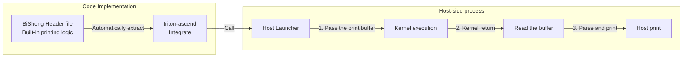

# Debug module (DFX)

## device_print

### Hardware context

`device_print` is a device-side debugging tool provided by the Triton framework on the Ascend NPU, allowing developers to directly print scalar/vector information during the execution of operator kernels. The core process is as follows:



Key Hardware Resource Constraints:

- **UB Print Buffer**: Each aicore is fixed with **16KB** of space for temporary data storage, and all print operations within the same aicore share this 16KB buffer. When the buffer is full, a warning is issued indicating that the data size exceeds the maximum buffer capacity, and new data will be discarded.

- **Multi-Core Concurrency**: Each aicore executes kernel code independently, and the final print results from each core are presented on the host side.

### Algorithm overview

The implementation involves three components working together: Triton Ascend, AscendNPU IR, and the Bisheng compiler. This section focuses on AscendNPU IR.

#### Triton Ascend

Produces the initial `.ttadapter` IR. During this process, Triton’s `tl.device_print` is converted to `func.call @triton_print_*` interface.

#### AscendNPU IR

After receiving the `.ttadapter` IR, the following transformations are applied in the AscendNPU IR stage.

##### AdaptTritonKernel

Converts the `func.call @triton_print_*` interface to the `hfusion.print` interface.

```mlir
// Before AdaptTritonKernel
%reinterpret_cast = memref.reinterpret_cast %arg2 to offset: [0], sizes: [8], strides: [1] : memref<?xi64> to memref<8xi64, strided<[1]>>
%alloc = memref.alloc() : memref<8xi64>
memref.copy %reinterpret_cast, %alloc : memref<8xi64, strided<[1]>> to memref<8xi64>
%0 = bufferization.to_tensor %alloc restrict writable : memref<8xi64>
call @triton_print_0(%0) : (tensor<8xi64>) -> ()

// After AdaptTritonKernel
%reinterpret_cast = memref.reinterpret_cast %arg2 to offset: [0], sizes: [8], strides: [1] : memref<?xi64> to memref<8xi64, strided<[1]>>
%alloc = memref.alloc() : memref<8xi64>
memref.copy %reinterpret_cast, %alloc : memref<8xi64, strided<[1]>> to memref<8xi64>
%0 = bufferization.to_tensor %alloc restrict writable : memref<8xi64>
hfusion.print " x: " {hex = false} %0 : tensor<8xi64>
```

##### HFusionToHIVM

Converts the `hfusion.print` interface to the `hivm.hir.debug` interface.

```mlir
// Before ConvertHFusionToHIVM
%reinterpret_cast = memref.reinterpret_cast %arg3 to offset: [0], sizes: [8], strides: [1] : memref<?xi64> to memref<8xi64, strided<[1]>>
%alloc = memref.alloc() : memref<8xi64>
memref.copy %reinterpret_cast, %alloc : memref<8xi64, strided<[1]>> to memref<8xi64>
%0 = bufferization.to_tensor %alloc restrict writable : memref<8xi64>
hfusion.print " x: " {hex = false} %0 : tensor<8xi64>

// After ConvertHFusionToHIVM
%reinterpret_cast = memref.reinterpret_cast %arg3 to offset: [0], sizes: [8], strides: [1] : memref<?xi64> to memref<8xi64, strided<[1]>>
%alloc = memref.alloc() : memref<8xi64>
memref.copy %reinterpret_cast, %alloc : memref<8xi64, strided<[1]>> to memref<8xi64>
%0 = bufferization.to_tensor %alloc restrict writable : memref<8xi64>
hivm.hir.debug {debugtype = "print", hex = false, prefix = " x: ", tcoretype = #hivm.tcore_type<CUBE_OR_VECTOR>} %0 : tensor<8xi64>
```

##### InlineFixpipe

Inserts fixpipe for `hivm.print` when the printed value is the result of mmad that is yielded from `scf.for`.

```mlir
// Before InlineFixpipe
%init = tensor.empty()
%res = scf.for iter_arg(%arg = %init) {
    %t = hivm.mmadL1 ins() outs(%arg)
    hivm.print %t
    scf.yield %t
}

// After InlineFixpipe
%init = tensor.empty()
%res = scf.for iter_arg(%arg = %init) {
    %t = hivm.mmadL1 ins() outs(%arg)
    %fixpipe = hivm.fixpipe int(%t)
    hivm.print %fixpipe
    scf.yield %t
}
```

##### InsertNZ2NDForDebug

device_print only supports printing data on UB/GM. Therefore when printing L1 data, the data must first be moved from L1 to GM. This pass: when it identifies `hivm::MmadL1Op`, checks whether an input of that op is used by `hivm::DebugOp`; if so, allocates a workspace and inserts an NZ2ND op so that the data is moved to GM for printing.

```mlir
// Before InsertNZ2NDForDebug
%12 = bufferization.to_tensor %alloc restrict writable : memref<1x4xf32>
%13 = arith.index_cast %arg8 : i32 to index
%14 = arith.index_cast %5 : i32 to index
%reinterpret_cast_0 = memref.reinterpret_cast %arg4 to offset: [%14], sizes: [4, 1], strides: [%13, 1] : memref<?xf32> to memref<4x1xf32, strided<[?, 1], offset: ?>>
%alloc_1 = memref.alloc() : memref<4x1xf32>
hivm.hir.load ins(%reinterpret_cast_0 : memref<4x1xf32, strided<[?, 1], offset: ?>>) outs(%alloc_1 : memref<4x1xf32>) init_out_buffer = false may_implicit_transpose_with_last_axis = false
%15 = bufferization.to_tensor %alloc_1 restrict writable : memref<4x1xf32>
%16 = arith.muli %8, %arg8 : i32
%17 = arith.index_cast %16 : i32 to index
%18 = arith.addi %17, %14 : index
%19 = tensor.empty() : tensor<1x1xf32>
%c1 = arith.constant 1 : index
%c4 = arith.constant 4 : index
%c1_2 = arith.constant 1 : index
%20 = hivm.hir.mmadL1 {fixpipe_already_inserted = true} ins(%12, %15, %true, %c1, %c4, %c1_2 : tensor<1x4xf32>, tensor<4x1xf32>, i1, index, index, index) outs(%19 : tensor<1x1xf32>) -> tensor<1x1xf32>
hivm.hir.debug {debugtype = "print", hex = false, prefix = " a_vals: ", tcoretype = #hivm.tcore_type<CUBE_OR_VECTOR>} %12 : tensor<1x4xf32>

// After InsertNZ2NDForDebug
%12 = bufferization.to_tensor %alloc restrict writable : memref<1x4xf32>
%13 = memref_ext.alloc_workspace() : memref<1x4xf32>
%14 = bufferization.to_tensor %13 restrict writable : memref<1x4xf32>
%15 = hivm.hir.nz2nd ins(%12 : tensor<1x4xf32>) outs(%14 : tensor<1x4xf32>) -> tensor<1x4xf32>
%16 = arith.index_cast %arg8 : i32 to index
%17 = arith.index_cast %5 : i32 to index
%reinterpret_cast_0 = memref.reinterpret_cast %arg4 to offset: [%17], sizes: [4, 1], strides: [%16, 1] : memref<?xf32> to memref<4x1xf32, strided<[?, 1], offset: ?>>
%alloc_1 = memref.alloc() : memref<4x1xf32>
hivm.hir.load ins(%reinterpret_cast_0 : memref<4x1xf32, strided<[?, 1], offset: ?>>) outs(%alloc_1 : memref<4x1xf32>) init_out_buffer = false may_implicit_transpose_with_last_axis = false
%18 = bufferization.to_tensor %alloc_1 restrict writable : memref<4x1xf32>
%19 = arith.muli %8, %arg8 : i32
%20 = arith.index_cast %19 : i32 to index
%21 = arith.addi %20, %17 : index
%22 = tensor.empty() : tensor<1x1xf32>
%23 = hivm.hir.mmadL1 {fixpipe_already_inserted = true} ins(%12, %18, %true, %c1, %c4, %c1 : tensor<1x4xf32>, tensor<4x1xf32>, i1, index, index, index) outs(%22 : tensor<1x1xf32>) -> tensor<1x1xf32>
hivm.hir.debug {debugtype = "print", hex = false, prefix = " a_vals: ", tcoretype = #hivm.tcore_type<CUBE_OR_VECTOR>} %15 : tensor<1x4xf32>
```

##### SplitMixKernel

For mix kernels, the Debug op is first processed in this pass with InferCoreType to infer the precise core type (VECTOR/CUBE); the default is CUBE_OR_VECTOR. The mix function is then split into pure Cube and pure Vector functions, which determines whether the Debug op finally runs on the Cube core or the Vector core.

##### InsertInitAndFinishForDebug

If any Debug op exists, inserts `hivm.hir.init_print` at the beginning of each function and `hivm.hir.finish_print` after each `hivm.hir.print`. `hivm.hir.init_print` is used for preparation before printing; `hivm.hir.finish_print` is used for work after printing. Currently they have no specific effect and are reserved for future extension of device_print.

```mlir
// Before InsertInitAndFinishForDebug
hivm.hir.mmadL1 {fixpipe_already_inserted = true} ins(%cast, %cast_1, %true, %c1, %c4, %c1 : memref<?x?x?x?xf32, #hivm.address_space<cbuf>>, memref<?x?x?x?xf32, #hivm.address_space<cbuf>>, i1, index, index, index) outs(%cast_2 : memref<?x?x?x?xf32, #hivm.address_space<cc>>) sync_related_args(%c1_i64, %c0_i64, %c-1_i64, %c-1_i64, %c-1_i64, %c-1_i64, %c-1_i64 : i64, i64, i64, i64, i64, i64, i64)
hivm.hir.set_flag[<PIPE_M>, <PIPE_FIX>, <EVENT_ID0>]
%16 = arith.index_cast %2 : i64 to index
%17 = affine.apply affine_map<()[s0] -> (s0 * 4)>()[%16]
%view = memref.view %arg2[%17][] : memref<?xi8, #hivm.address_space<gm>> to memref<1x1xf32, #hivm.address_space<gm>>
hivm.hir.wait_flag[<PIPE_M>, <PIPE_FIX>, <EVENT_ID0>]
hivm.hir.fixpipe {enable_nz2nd} ins(%cast_2 : memref<?x?x?x?xf32, #hivm.address_space<cc>>) outs(%view : memref<1x1xf32, #hivm.address_space<gm>>)
hivm.hir.pipe_barrier[<PIPE_ALL>]
hivm.hir.sync_block_set[<CUBE>, <PIPE_FIX>, <PIPE_S>] flag = 0 ffts_base_addr = %arg0
hivm.hir.debug {debugtype = "print", hex = false, prefix = " acc_11: ", tcoretype = #hivm.tcore_type<CUBE_OR_VECTOR>} %view : memref<1x1xf32, #hivm.address_space<gm>>

// After InsertInitAndFinishForDebug
hivm.hir.init_debug
hivm.hir.mmadL1 {fixpipe_already_inserted = true} ins(%cast, %cast_1, %true, %c1, %c4, %c1 : memref<?x?x?x?xf32, #hivm.address_space<cbuf>>, memref<?x?x?x?xf32, #hivm.address_space<cbuf>>, i1, index, index, index) outs(%cast_2 : memref<?x?x?x?xf32, #hivm.address_space<cc>>) sync_related_args(%c1_i64, %c0_i64, %c-1_i64, %c-1_i64, %c-1_i64, %c-1_i64, %c-1_i64 : i64, i64, i64, i64, i64, i64, i64)
hivm.hir.set_flag[<PIPE_M>, <PIPE_FIX>, <EVENT_ID0>]
%14 = arith.index_cast %0 : i64 to index
%15 = affine.apply affine_map<()[s0] -> (s0 * 4)>()[%14]
%view = memref.view %arg2[%15][] : memref<?xi8, #hivm.address_space<gm>> to memref<1x1xf32, #hivm.address_space<gm>>
hivm.hir.wait_flag[<PIPE_M>, <PIPE_FIX>, <EVENT_ID0>]
hivm.hir.fixpipe {enable_nz2nd} ins(%cast_2 : memref<?x?x?x?xf32, #hivm.address_space<cc>>) outs(%view : memref<1x1xf32, #hivm.address_space<gm>>)
hivm.hir.pipe_barrier[<PIPE_ALL>]
hivm.hir.sync_block_set[<CUBE>, <PIPE_FIX>, <PIPE_S>] flag = 0 ffts_base_addr = %arg0
hivm.hir.debug {debugtype = "print", finishInserted = 0 : i32, hex = false, prefix = " acc_11: ", tcoretype = #hivm.tcore_type<CUBE_OR_VECTOR>} %view : memref<1x1xf32, #hivm.address_space<gm>>
hivm.hir.finish_debug
```

##### ConvertHIVMToStandard

Converts `hivm.hir.init_print` / `hivm.hir.print` / `hivm.hir.finish_print` to library function calls.

##### ConvertHIVMToLLVM

ConvertHIVMToLLVM brings in the real library functions and sets the linkage of print-related functions to ExternWeak (allowing repeated definition across multiple LLVM modules).

##### Debug op library implementation

The op library currently implements printing via scalar print: it uses a loop that calls the Bisheng compiler’s `cce::printf` interface for scalar output.

#### Bisheng compiler

The host-side launcher produced by triton-ascend invokes the kernel compiled by the Bisheng compiler and passes the print buffer to the kernel. After the kernel returns, the host launcher reads the buffer and performs the actual print. This logic is implemented in the headers shipped with the Bisheng compiler and is automatically extracted by triton-ascend from the Bisheng compiler path.

### Interface

Enable the feature by setting the environment variable `TRITON_DEVICE_PRINT=1`. When enabled, the Triton Ascend side sets the macro `__CCE_ENABLE_PRINT__`, which the Bisheng compiler uses to control whether printing is enabled. In addition, compiling the meta op library requires `--cce-enable-print` (currently enabled by default) to ensure printing is enabled.

```mlir
// hfusion op interface
// dtype - data type of the tensor/scalar to be printed
hfusion.print " prefix = xxx " {hex = xxx} %args : dtype

// hivm op interface
// tcoretype - indicates whether the op runs on the Cube core or Vector core (default: CUBE_OR_VECTOR)
hivm.hir.debug {debugtype = "print", hex = xxx, prefix = " xxx: ", tcoretype = #hivm.tcore_type<CUBE_OR_VECTOR>} %args : dtype
```

### Constraints

- Only tensor and scalar printing is supported.
- The device_print buffer size is currently fixed at 16K.
- Triton sanitizer and device_print cannot be enabled at the same time.
- Supported data types for printing: bool, int8, uint8, int16, uint16, int32, uint32, int64, bfloat16, half, float32.
- When using device_print, it is recommended to print a single tensor and place the print statement immediately next to the tensor being printed, to prevent exceptions caused by changes in the tensor's lifetime.
