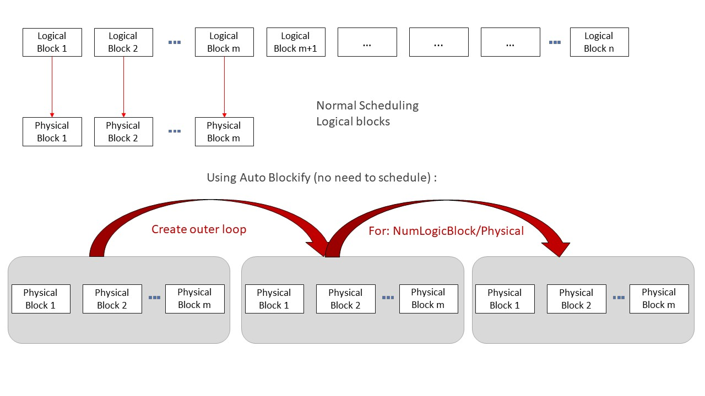

# Auto Blockify

## Background

The Auto Blockify Pass is a core optimization technique in the Ascend-compatible operator execution pipeline, achieved by efficiently mapping logical blocks to hardware physical blocks. Under the current architecture, scheduling efficiency directly determines operator performance, and a one-to-one mapping between logical blocks and physical blocks eliminates scheduling overhead, thereby improving performance.

In practice with the AscendNPU IR architecture, the number of available physical blocks is usually far smaller than the number of logical blocks required for computation (physical blocks < 50, while logical blocks may reach 500+). In such a scenario with a 10-fold gap, the acceleration can exceed twice the original speed.

When running Triton kernels (via triton-ascend), the Auto Blockify logic is activated by adding the following flag: `TRITON_ALL_PARALLEL`.

For AscendNPU IR developers, the following flag can be added to the `bishengir-compile` command: `--enable-auto-blockify-loop`.



## SIMD Mode

### Algorithm Principle

The Auto Blockify Pass (**AutoBlockifyParallelLoop**) transforms the IR by introducing an additional loop layer. The specific logic is as follows:

```plaintext
for outer from 0,...,ceildiv(logical_block_dim, physical_block_dim)
    for inner from 0,...,physical_block_dim  <- Used as block.idx.
        use(min(outer * physical_block_dim + inner, logical_block_dim))
```

**Logical description**:

1. Original scheduling

    The original mode is typically as follows:

    ```plaintext
    block.idx = hivm.get_block_idx
    use(block.idx)
    -------Equivalent to--------------
    for block.idx from 0,...,logical_block_num
        use(block.idx)
    ```

2. Example using `TRITON_ALL_PARALLEL`

    When the user adds the `TRITON_ALL_PARALLEL` flag in the triton adapter, the kernel is restricted to launch with only the maximum number of physical blocks (assuming the number of logical blocks > the number of physical blocks). Therefore, execution is restricted to:

    ```plaintext
    for block.idx from 0,...,physical_block_num   <- From get_block_idx
        use(block.idx)
    ```

    Relying solely on this loop logic cannot cover all computation indices, resulting in missing indices. This is also the reason for introducing the Auto Blockify Pass to complete the logic: it automatically adds an outer loop/blockification layer to fill the gap.

    > Note: If you do not integrate through the Triton Adapter, you must ensure that the block dimension settings are consistent with the above.

3. Final logic after using Auto Blockify

    After the Auto Blockify Pass automatically completes the loop structure, the final execution logic is as follows:

    ```plaintext
    for outer from 0,...,ceildiv(logical_block_dim, physical_block_dim)
        for inner from 0,...,physical_block_dim  <- used as block.idx
            use(min(outer * physical_block_dim + inner, logical_block_dim))
    ```

**Interface description**:

This feature is controlled by the `--enable-auto-blockify-loop` flag in bishengir-compile, and can also be invoked directly through the `--auto-blockify-parallel-loop` flag of bishengir-opt.

To use this feature correctly, note the following points:

- The Pass obtains the number of logical blocks by looking up the value marked with the `kLogicalBlockNumAttr` attribute (`logical_block_num` in the IR). You must ensure that this value is available; otherwise, the Pass invocation will fail.

- The Pass also needs to find a `hivm get_block_idx` operation, which returns the block index from 0 to the block dimension. When using Auto Blockify, you need to modify the block dimension when invoking the device kernel (launching with the maximum physical block dimension, consistent with the algorithm above), so that the `blockidx` operation returns a value in the range from 0 to `physical_block_num`.

**Triton Adapter**:

This pass has been widely used in the triton adapter pipeline. In this case, the correct way to use the AutoBlockify feature is to enable it from the frontend (triton) via `TRITON_ALL_PARALLEL=1`. This environment variable also completes the preparation work (locking the number of blocks), and then automatically invokes the corresponding compiler command with the correct flags. In the triton pipeline, there is a pass named `TritonGlobalKernelArgsToHIVMOpPass` that automatically ensures the existence of a value marked with `logical_block_num` and creates the required `get_block_idx` operation.

Input example:

```mlir
module attributes {dlti.target_system_spec = #dlti.target_system_spec<"NPU" : #hacc.target_device_spec<#dlti.dl_entry<"AI_CORE_COUNT", 20 : i32>, #dlti.dl_entry<"CUBE_CORE_COUNT", 20 : i32>, #dlti.dl_entry<"VECTOR_CORE_COUNT", 40 : i32>, #dlti.dl_entry<"UB_SIZE", 1572864 : i32>, #dlti.dl_entry<"L1_SIZE", 4194304 : i32>, #dlti.dl_entry<"L0A_SIZE", 524288 : i32>, #dlti.dl_entry<"L0B_SIZE", 524288 : i32>, #dlti.dl_entry<"L0C_SIZE", 1048576 : i32>, #dlti.dl_entry<"UB_ALIGN_SIZE", 256 : i32>, #dlti.dl_entry<"L1_ALIGN_SIZE", 256 : i32>, #dlti.dl_entry<"L0C_ALIGN_SIZE", 4096 : i32>>>, hivm.module_core_type = #hivm.module_core_type<AIV>} {
  func.func @add_kernel(%arg0: i64 {hacc.arg_type = #hacc.arg_type<ffts_base_address>}, %arg1: memref<?xi8> {hacc.arg_type = #hacc.arg_type<workspace>}, %arg2: memref<?xf32> {tt.divisibility = 16 : i32}, %arg3: memref<?xf32> {tt.divisibility = 16 : i32}, %arg4: memref<?xf32> {tt.divisibility = 16 : i32}, %arg5: i32 {tt.divisibility = 16 : i32}, %arg6: i32, %arg7: i32, %arg8: i32) attributes {WorkspaceArgIdx = 0 : i64, func_dyn_memref_args = dense<[false, true, true, true, true, false, false, false, false]> : vector<9xi1>, hacc.entry, hacc.function_kind = #hacc.function_kind<DEVICE>, hivm.func_core_type = #hivm.func_core_type<AIV>} {
    %c1024 = arith.constant 1024 : index
    %c1024_i32 = arith.constant 1024 : i32
    %c0 = arith.constant 0 : index
    hivm.hir.set_mask_norm
    %0 = arith.muli %arg6, %arg7 : i32
    %1 = arith.muli %0, %arg8 : i32
    annotation.mark %1 {logical_block_num} : i32 // This logical_block_num is the original large value.
    %2 = hivm.hir.get_block_idx -> i64   // for block.idx from 0,...,block_num
    %3 = arith.trunci %2 : i64 to i32
    %4 = arith.muli %arg8, %arg7 : i32
    %5 = arith.divsi %3, %4 : i32
    %6 = arith.remsi %5, %arg6 : i32
    %7 = arith.muli %6, %c1024_i32 : i32
    %8 = arith.index_cast %7 : i32 to index
    %reinterpret_cast = memref.reinterpret_cast %arg2 to offset: [%8], sizes: [1024], strides: [1] : memref<?xf32> to memref<1024xf32, strided<[1], offset: ?>>
    %alloc = memref.alloc() : memref<1024xf32>
    %9 = arith.addi %8, %c1024 : index
    %10 = arith.index_cast %arg5 : i32 to index
    %11 = arith.maxsi %8, %10 : index
    %12 = arith.minsi %9, %11 : index
    %13 = arith.subi %12, %8 : index
    %subview = memref.subview %reinterpret_cast[0] [%13] [1] : memref<1024xf32, strided<[1], offset: ?>> to memref<?xf32, strided<[1], offset: ?>>
    %subview_0 = memref.subview %alloc[0] [%13] [1] : memref<1024xf32> to memref<?xf32, strided<[1]>>
    hivm.hir.load ins(%subview : memref<?xf32, strided<[1], offset: ?>>) outs(%subview_0 : memref<?xf32, strided<[1]>>) left_padding_num = %c0 : index init_out_buffer = false
    %14 = bufferization.to_tensor %alloc restrict writable : memref<1024xf32>
    %reinterpret_cast_1 = memref.reinterpret_cast %arg3 to offset: [%8], sizes: [1024], strides: [1] : memref<?xf32> to memref<1024xf32, strided<[1], offset: ?>>
    %alloc_2 = memref.alloc() : memref<1024xf32>
    %subview_3 = memref.subview %reinterpret_cast_1[0] [%13] [1] : memref<1024xf32, strided<[1], offset: ?>> to memref<?xf32, strided<[1], offset: ?>>
    %subview_4 = memref.subview %alloc_2[0] [%13] [1] : memref<1024xf32> to memref<?xf32, strided<[1]>>
    hivm.hir.load ins(%subview_3 : memref<?xf32, strided<[1], offset: ?>>) outs(%subview_4 : memref<?xf32, strided<[1]>>) left_padding_num = %c0 : index init_out_buffer = false
    %15 = bufferization.to_tensor %alloc_2 restrict writable : memref<1024xf32>
    %16 = tensor.empty() : tensor<1024xf32>
    %17 = hivm.hir.vadd ins(%14, %15 : tensor<1024xf32>, tensor<1024xf32>) outs(%16 : tensor<1024xf32>) -> tensor<1024xf32>
    %reinterpret_cast_5 = memref.reinterpret_cast %arg4 to offset: [%8], sizes: [1024], strides: [1] : memref<?xf32> to memref<1024xf32, strided<[1], offset: ?>>
    %extracted_slice = tensor.extract_slice %17[0] [%13] [1] : tensor<1024xf32> to tensor<?xf32>
    %subview_6 = memref.subview %reinterpret_cast_5[0] [%13] [1] : memref<1024xf32, strided<[1], offset: ?>> to memref<?xf32, strided<[1], offset: ?>>
    hivm.hir.store ins(%extracted_slice : tensor<?xf32>) outs(%subview_6 : memref<?xf32, strided<[1], offset: ?>>)
    return
  }
}
```

Output example:

```mlir
module attributes {dlti.target_system_spec = #dlti.target_system_spec<"NPU" : #hacc.target_device_spec<#dlti.dl_entry<"AI_CORE_COUNT", 20 : i32>, #dlti.dl_entry<"CUBE_CORE_COUNT", 20 : i32>, #dlti.dl_entry<"VECTOR_CORE_COUNT", 40 : i32>, #dlti.dl_entry<"UB_SIZE", 1572864 : i32>, #dlti.dl_entry<"L1_SIZE", 4194304 : i32>, #dlti.dl_entry<"L0A_SIZE", 524288 : i32>, #dlti.dl_entry<"L0B_SIZE", 524288 : i32>, #dlti.dl_entry<"L0C_SIZE", 1048576 : i32>, #dlti.dl_entry<"UB_ALIGN_SIZE", 256 : i32>, #dlti.dl_entry<"L1_ALIGN_SIZE", 256 : i32>, #dlti.dl_entry<"L0C_ALIGN_SIZE", 4096 : i32>>>, hivm.module_core_type = #hivm.module_core_type<AIV>} {
  func.func @add_kernel(%arg0: i64 {hacc.arg_type = #hacc.arg_type<ffts_base_address>}, %arg1: memref<?xi8> {hacc.arg_type = #hacc.arg_type<workspace>}, %arg2: memref<?xf32> {tt.divisibility = 16 : i32}, %arg3: memref<?xf32> {tt.divisibility = 16 : i32}, %arg4: memref<?xf32> {tt.divisibility = 16 : i32}, %arg5: i32 {tt.divisibility = 16 : i32}, %arg6: i32, %arg7: i32, %arg8: i32) attributes {WorkspaceArgIdx = 0 : i64, func_dyn_memref_args = dense<[false, true, true, true, true, false, false, false, false]> : vector<9xi1>, hacc.entry, hacc.function_kind = #hacc.function_kind<DEVICE>, hivm.func_core_type = #hivm.func_core_type<AIV>} {
    %0 = arith.muli %arg6, %arg7 : i32
    %1 = arith.muli %0, %arg8 : i32
    annotation.mark %1 {logical_block_num} : i32  // This logical_block_num is the original large value.
    %c0_i32 = arith.constant 0 : i32
    %c40_i32 = arith.constant 40 : i32 // 40 is the number of physical blocks here.
    %2 = arith.ceildivsi %1, %c40_i32 : i32 // ceildiv(logical_block_num, physical_block_dim)
    %c1_i32 = arith.constant 1 : i32
    scf.for %arg9 = %c0_i32 to %2 step %c1_i32  : i32 { // Outer loop
      %c1024 = arith.constant 1024 : index
      %c1024_i32 = arith.constant 1024 : i32
      %c0 = arith.constant 0 : index
      hivm.hir.set_mask_norm
      %3 = hivm.hir.get_block_idx -> i64 // Inner loop (locked to physical blocks)
      %4 = arith.trunci %3 : i64 to i32
      %5 = arith.muli %arg9, %c40_i32 : i32 // outer_i * physical_block_num
      %6 = arith.addi %5, %4 : i32 // outer_i * physical_block_num + inner
      %7 = arith.minsi %6, %1 : i32 // (min(outer*physical_block_dim + inner, logical_block_num))
      %8 = arith.extsi %7 : i32 to i64
      %9 = arith.trunci %8 : i64 to i32
      %10 = arith.muli %arg8, %arg7 : i32
      %11 = arith.divsi %9, %10 : i32
      %12 = arith.remsi %11, %arg6 : i32
      %13 = arith.muli %12, %c1024_i32 : i32
      %14 = arith.index_cast %13 : i32 to index
      %reinterpret_cast = memref.reinterpret_cast %arg2 to offset: [%14], sizes: [1024], strides: [1] : memref<?xf32> to memref<1024xf32, strided<[1], offset: ?>>
      %alloc = memref.alloc() : memref<1024xf32>
      %15 = arith.addi %14, %c1024 : index
      %16 = arith.index_cast %arg5 : i32 to index
      %17 = arith.maxsi %14, %16 : index
      %18 = arith.minsi %15, %17 : index
      %19 = arith.subi %18, %14 : index
      %subview = memref.subview %reinterpret_cast[0] [%19] [1] : memref<1024xf32, strided<[1], offset: ?>> to memref<?xf32, strided<[1], offset: ?>>
      %subview_0 = memref.subview %alloc[0] [%19] [1] : memref<1024xf32> to memref<?xf32, strided<[1]>>
      hivm.hir.load ins(%subview : memref<?xf32, strided<[1], offset: ?>>) outs(%subview_0 : memref<?xf32, strided<[1]>>) left_padding_num = %c0 : index
      %20 = bufferization.to_tensor %alloc restrict writable : memref<1024xf32>
      %reinterpret_cast_1 = memref.reinterpret_cast %arg3 to offset: [%14], sizes: [1024], strides: [1] : memref<?xf32> to memref<1024xf32, strided<[1], offset: ?>>
      %alloc_2 = memref.alloc() : memref<1024xf32>
      %subview_3 = memref.subview %reinterpret_cast_1[0] [%19] [1] : memref<1024xf32, strided<[1], offset: ?>> to memref<?xf32, strided<[1], offset: ?>>
      %subview_4 = memref.subview %alloc_2[0] [%19] [1] : memref<1024xf32> to memref<?xf32, strided<[1]>>
      hivm.hir.load ins(%subview_3 : memref<?xf32, strided<[1], offset: ?>>) outs(%subview_4 : memref<?xf32, strided<[1]>>) left_padding_num = %c0 : index
      %21 = bufferization.to_tensor %alloc_2 restrict writable : memref<1024xf32>
      %22 = tensor.empty() : tensor<1024xf32>
      %23 = hivm.hir.vadd ins(%20, %21 : tensor<1024xf32>, tensor<1024xf32>) outs(%22 : tensor<1024xf32>) -> tensor<1024xf32>
      %reinterpret_cast_5 = memref.reinterpret_cast %arg4 to offset: [%14], sizes: [1024], strides: [1] : memref<?xf32> to memref<1024xf32, strided<[1], offset: ?>>
      %extracted_slice = tensor.extract_slice %23[0] [%19] [1] : tensor<1024xf32> to tensor<?xf32>
      %subview_6 = memref.subview %reinterpret_cast_5[0] [%19] [1] : memref<1024xf32, strided<[1], offset: ?>> to memref<?xf32, strided<[1], offset: ?>>
      hivm.hir.store ins(%extracted_slice : tensor<?xf32>) outs(%subview_6 : memref<?xf32, strided<[1], offset: ?>>)
    }
    return
  }
}
```

### Constraints

- **Parallelizability**: The **Auto Blockify** algorithm applies only to fully parallelizable code. This means that the computation and access of each logical block must be safely executable in parallel, with no dependencies between blocks.

- **Use scenario**: If the number of logical blocks is very small, this pass provides no benefit.

## SIMT Mode

Automatic blockification in SIMT mode is essentially the same as in SIMD mode in terms of functionality and usage. This document mainly describes the features specific to the SIMT path.

### Algorithm Principle

Similar to the SIMD mode, this scheduling automatically adds one loop layer and replaces the SIMT-version logical core ID instruction (`tt.get_program_id x/y/z`) with the logical core ID computed from the new loop IV and the physical core ID. The computation logic is as follows:

```mlir
Original kernel:
   pid_x = tt.get_program_id x
   pid_y = tt.get_program_id y
   pid_z = tt.get_program_id z
   <kernel body>

After rewriting:
   logical = grid_x * grid_y * grid_z // Compute logical_block_num.
   chunk   = ceildiv(logical, physical_block_dim)
   hw_idx  = gpu.linear_block_id // Inner loop (locked to the physical block).
   start   = hw_idx * chunk // The first logical block processed by this physical block.
   upper   = min(start + chunk, logical) // The last logical block processed by this physical block.
   for iv in [start, upper) step 1:
       pid_x = iv % grid_x // Compute the 3D logical core ID.
       pid_y = (iv / grid_x) % grid_y
       pid_z = iv / (grid_x * grid_y)
       <kernel body, with the original tt.get_program_id instruction replaced by the pid_* resolved above>
```

**Interface description**:

In SIMT mode, this feature is controlled by the `--enable-auto-blockify-loop` flag in bishengir-compile, and it can also be invoked directly through the `--simt-auto-blockify` flag of bishengir-opt.

### Optional Performance Extension: Super-blocking

In GPU SIMT programming, a small workload is often configured for a single kernel function, and a large number of logical cores are launched. In this scenario, the Vector core computing power is not fully utilized, and peak performance cannot be achieved. Based on automatic blockification, this extension processes several adjacent logical cores in parallel on one physical core to improve computing power utilization.

**Interface description**:

This feature is controlled by the `--super-block-factor=N` flag in bishengir-compile, where `N` represents the number of logical cores to be processed in parallel. The default value is 1, which disables super-blocking and performs only conventional automatic blockification. It can also be invoked directly through the pass option `-simt-auto-blockify="superblock-factor=N` of bishengir-opt.

**Logic description**:

The step of the loop introduced by conventional automatic blockification is changed to `N`, indicating that `N` adjacent logical blocks are processed simultaneously. If the original function launches `W` warps per logical block, the scheduled function launches `NxW` warps and calculates the new logical core ID based on the warp ID. The calculation logic is as follows:

```mlir
for iv in [start, upper) step N:
    warp_id = thread_id_x / 32 // Calculate the warp ID.
    local   = warp_id % N // Calculate the ID of the logical core processed in parallel within the core.
    linear  = iv + local // Calculate the one-dimensional logical core ID.
    if linear < upper: // Ensure that the logical core ID does not go out of bounds.
      <kernel body, compute the 3D logical core ID using linear and replace the original tt.get_program_id>
```

### Constraints

- **Number of warps**: Ascend supports a maximum of 64 warps, so the value of `NxW` must be less than or equal to 64.

- **Shared memory**: After super-blocking is enabled, the `N` parallel logical cores divide the shared memory of the physical core into `N` equal parts. Pay attention to the memory usage of each logical core to avoid overflow.

- **Use cases**: If the number of logical blocks is very small, this pass provides no benefit. If the workload of each logical core is large, the performance gain of the super-blocking feature is limited.
