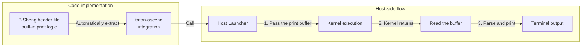

# Debugging Module DFX

## Hardware Background

**device_print**:

**device_print** is a device-side debugging tool provided by the Triton framework on Ascend NPUs. It allows developers to directly print scalar/vector information during operator kernel execution. The core flow is as follows:



**Key hardware resource constraints**:

- UB print buffer: Each aicore is allocated a fixed 16 KB space for temporary data storage, and all print operations within the same aicore share this 16 KB buffer. When the buffer is full, new data triggers a warning, and data exceeding the maximum buffer size is discarded.

- Multi-core concurrency: Each aicore executes the kernel code independently, and the Host side ultimately presents the print results of each core.

## Algorithm Principles

The implementation involves the collaboration of three components: **Triton Ascend**, **AscendNPU IR**, and the **Bisheng Compiler**. The description of this feature focuses primarily on **AscendNPU IR**.

### Triton Ascend

During the generation of the initial `.ttadapter` IR, the `tl.device_print` on the Triton side is converted into the `func.call @triton_print_*` interface.

### AscendNPU IR

After receiving the `.ttadapter` IR, the AscendNPU IR stage mainly undergoes the following transformations:

#### AdaptTritonKernel

Converts the `func.call @triton_print_*` interface into the `hfusion.print` interface.

```mlir
// Before AdaptTritonKernel
%reinterpret_cast = memref.reinterpret_cast %arg2 to offset: [0], sizes: [8], strides: [1] : memref<?xi64> to memref<8xi64, strided<[1]>>
%alloc = memref.alloc() : memref<8xi64>
memref.copy %reinterpret_cast, %alloc : memref<8xi64, strided<[1]>> to memref<8xi64>
%0 = bufferization.to_tensor %alloc restrict writable : memref<8xi64>
call @triton_print_0(%0) : (tensor<8xi64>) -> ()

// After AdaptTritonKernel
%reinterpret_cast = memref.reinterpret_cast %arg2 to offset: [0], sizes: [8], strides: [1] : memref<?xi64> to memref<8xi64, strided<[1]>>
%alloc = memref.alloc() : memref<8xi64>
memref.copy %reinterpret_cast, %alloc : memref<8xi64, strided<[1]>> to memref<8xi64>
%0 = bufferization.to_tensor %alloc restrict writable : memref<8xi64>
hfusion.print " x: " {hex = false} %0 : tensor<8xi64>
```

#### HFusionToHIVM

Converts the `hfusion.print` interface into the `hivm.hir.debug` interface.

```mlir
// Before ConvertHFusionToHIVM
%reinterpret_cast = memref.reinterpret_cast %arg3 to offset: [0], sizes: [8], strides: [1] : memref<?xi64> to memref<8xi64, strided<[1]>>
%alloc = memref.alloc() : memref<8xi64>
memref.copy %reinterpret_cast, %alloc : memref<8xi64, strided<[1]>> to memref<8xi64>
%0 = bufferization.to_tensor %alloc restrict writable : memref<8xi64>
hfusion.print " x: " {hex = false} %0 : tensor<8xi64>

// After ConvertHFusionToHIVM
%reinterpret_cast = memref.reinterpret_cast %arg3 to offset: [0], sizes: [8], strides: [1] : memref<?xi64> to memref<8xi64, strided<[1]>>
%alloc = memref.alloc() : memref<8xi64>
memref.copy %reinterpret_cast, %alloc : memref<8xi64, strided<[1]>> to memref<8xi64>
%0 = bufferization.to_tensor %alloc restrict writable : memref<8xi64>
hivm.hir.debug {debugtype = "print", hex = false, prefix = " x: ", tcoretype = #hivm.tcore_type<CUBE_OR_VECTOR>} %0 : tensor<8xi64>
```

#### InlineFixpipe

Inserts a fixpipe for `hivm.print`, where `hivm.print` prints the `mmad` result, and the `mmad` result is the `yield` in `scf.for`.

```mlir
// Before InlineFixpipe
%init = tensor.empty()
%res = scf.for iter_arg(%arg = %init) {
    %t = hivm.mmadL1 ins() outs(%arg)
    hivm.print %t
    scf.yield %t
}

// After InlineFixpipe
%init = tensor.empty()
%res = scf.for iter_arg(%arg = %init) {
    %t = hivm.mmadL1 ins() outs(%arg)
    %fixpipe = hivm.fixpipe int(%t)
    hivm.print %fixpipe
    scf.yield %t
}
```

#### InsertNZ2NDForDebug

`device_print` supports printing data only on UB/GM. Therefore, when printing data on L1, the data must first be moved from L1 to GM. The purpose of this Pass is as follows: when `hivm::MmadL1Op` is recognized, the inputs of this op are checked; if an input is used by `hivm::DebugOp`, a `workspace` of the required size is allocated, and then an `NZ2ND` op is inserted to ensure that the data is moved to GM for printing.

```mlir
// Before InsertNZ2NDForDebug
%12 = bufferization.to_tensor %alloc restrict writable : memref<1x4xf32>
%13 = arith.index_cast %arg8 : i32 to index
%14 = arith.index_cast %5 : i32 to index
%reinterpret_cast_0 = memref.reinterpret_cast %arg4 to offset: [%14], sizes: [4, 1], strides: [%13, 1] : memref<?xf32> to memref<4x1xf32, strided<[?, 1], offset: ?>>
%alloc_1 = memref.alloc() : memref<4x1xf32>
hivm.hir.load ins(%reinterpret_cast_0 : memref<4x1xf32, strided<[?, 1], offset: ?>>) outs(%alloc_1 : memref<4x1xf32>) init_out_buffer = false may_implicit_transpose_with_last_axis = false
%15 = bufferization.to_tensor %alloc_1 restrict writable : memref<4x1xf32>
%16 = arith.muli %8, %arg8 : i32
%17 = arith.index_cast %16 : i32 to index
%18 = arith.addi %17, %14 : index
%19 = tensor.empty() : tensor<1x1xf32>
%c1 = arith.constant 1 : index
%c4 = arith.constant 4 : index
%c1_2 = arith.constant 1 : index
%20 = hivm.hir.mmadL1 {fixpipe_already_inserted = true} ins(%12, %15, %true, %c1, %c4, %c1_2 : tensor<1x4xf32>, tensor<4x1xf32>, i1, index, index, index) outs(%19 : tensor<1x1xf32>) -> tensor<1x1xf32>
hivm.hir.debug {debugtype = "print", hex = false, prefix = " a_vals: ", tcoretype = #hivm.tcore_type<CUBE_OR_VECTOR>} %12 : tensor<1x4xf32>

// After InsertNZ2NDForDebug
%12 = bufferization.to_tensor %alloc restrict writable : memref<1x4xf32>
%13 = memref_ext.alloc_workspace() : memref<1x4xf32>
%14 = bufferization.to_tensor %13 restrict writable : memref<1x4xf32>
%15 = hivm.hir.nz2nd ins(%12 : tensor<1x4xf32>) outs(%14 : tensor<1x4xf32>) -> tensor<1x4xf32>
%16 = arith.index_cast %arg8 : i32 to index
%17 = arith.index_cast %5 : i32 to index
%reinterpret_cast_0 = memref.reinterpret_cast %arg4 to offset: [%17], sizes: [4, 1], strides: [%16, 1] : memref<?xf32> to memref<4x1xf32, strided<[?, 1], offset: ?>>
%alloc_1 = memref.alloc() : memref<4x1xf32>
hivm.hir.load ins(%reinterpret_cast_0 : memref<4x1xf32, strided<[?, 1], offset: ?>>) outs(%alloc_1 : memref<4x1xf32>) init_out_buffer = false may_implicit_transpose_with_last_axis = false
%18 = bufferization.to_tensor %alloc_1 restrict writable : memref<4x1xf32>
%19 = arith.muli %8, %arg8 : i32
%20 = arith.index_cast %19 : i32 to index
%21 = arith.addi %20, %17 : index
%22 = tensor.empty() : tensor<1x1xf32>
%23 = hivm.hir.mmadL1 {fixpipe_already_inserted = true} ins(%12, %18, %true, %c1, %c4, %c1 : tensor<1x4xf32>, tensor<4x1xf32>, i1, index, index, index) outs(%22 : tensor<1x1xf32>) -> tensor<1x1xf32>
hivm.hir.debug {debugtype = "print", hex = false, prefix = " a_vals: ", tcoretype = #hivm.tcore_type<CUBE_OR_VECTOR>} %15 : tensor<1x4xf32>
```

#### SplitMixKernel

For `mix`-type use cases, the `Debug` op first performs `InferCoreType` in this Pass to infer the precise `coretype` (VECTOR/CUBE), which defaults to CUBE_OR_VECTOR, and then splits the `mix` function to generate a pure `cube` function and a pure `vector` function. This determines whether the `Debug` op ultimately runs on the `cube` core or the `vector` core.

#### InsertInitAndFinishForDebug

If a `Debug` op exists, the `hivm.hir.init_print` call is added to the beginning of each function, and `hivm.hir.finish_print` is added after each `hivm.hir.print`. `hivm.hir.init_print` is used for the preparation work before printing, and `hivm.hir.finish_print` is used for the work after printing. Currently they have no particularly specific function, and they reserve an interface for future extension of `device_print`.

```mlir
// Before InsertInitAndFinishForDebug
hivm.hir.mmadL1 {fixpipe_already_inserted = true} ins(%cast, %cast_1, %true, %c1, %c4, %c1 : memref<?x?x?x?xf32, #hivm.address_space<cbuf>>, memref<?x?x?x?xf32, #hivm.address_space<cbuf>>, i1, index, index, index) outs(%cast_2 : memref<?x?x?x?xf32, #hivm.address_space<cc>>) sync_related_args(%c1_i64, %c0_i64, %c-1_i64, %c-1_i64, %c-1_i64, %c-1_i64, %c-1_i64 : i64, i64, i64, i64, i64, i64, i64)
hivm.hir.set_flag[<PIPE_M>, <PIPE_FIX>, <EVENT_ID0>]
%16 = arith.index_cast %2 : i64 to index
%17 = affine.apply affine_map<()[s0] -> (s0 * 4)>()[%16]
%view = memref.view %arg2[%17][] : memref<?xi8, #hivm.address_space<gm>> to memref<1x1xf32, #hivm.address_space<gm>>
hivm.hir.wait_flag[<PIPE_M>, <PIPE_FIX>, <EVENT_ID0>]
hivm.hir.fixpipe {enable_nz2nd} ins(%cast_2 : memref<?x?x?x?xf32, #hivm.address_space<cc>>) outs(%view : memref<1x1xf32, #hivm.address_space<gm>>)
hivm.hir.pipe_barrier[<PIPE_ALL>]
hivm.hir.sync_block_set[<CUBE>, <PIPE_FIX>, <PIPE_S>] flag = 0 ffts_base_addr = %arg0
hivm.hir.debug {debugtype = "print", hex = false, prefix = " acc_11: ", tcoretype = #hivm.tcore_type<CUBE_OR_VECTOR>} %view : memref<1x1xf32, #hivm.address_space<gm>>

// After InsertInitAndFinishForDebug
hivm.hir.init_debug
hivm.hir.mmadL1 {fixpipe_already_inserted = true} ins(%cast, %cast_1, %true, %c1, %c4, %c1 : memref<?x?x?x?xf32, #hivm.address_space<cbuf>>, memref<?x?x?x?xf32, #hivm.address_space<cbuf>>, i1, index, index, index) outs(%cast_2 : memref<?x?x?x?xf32, #hivm.address_space<cc>>) sync_related_args(%c1_i64, %c0_i64, %c-1_i64, %c-1_i64, %c-1_i64, %c-1_i64, %c-1_i64 : i64, i64, i64, i64, i64, i64, i64)
hivm.hir.set_flag[<PIPE_M>, <PIPE_FIX>, <EVENT_ID0>]
%14 = arith.index_cast %0 : i64 to index
%15 = affine.apply affine_map<()[s0] -> (s0 * 4)>()[%14]
%view = memref.view %arg2[%15][] : memref<?xi8, #hivm.address_space<gm>> to memref<1x1xf32, #hivm.address_space<gm>>
hivm.hir.wait_flag[<PIPE_M>, <PIPE_FIX>, <EVENT_ID0>]
hivm.hir.fixpipe {enable_nz2nd} ins(%cast_2 : memref<?x?x?x?xf32, #hivm.address_space<cc>>) outs(%view : memref<1x1xf32, #hivm.address_space<gm>>)
hivm.hir.pipe_barrier[<PIPE_ALL>]
hivm.hir.sync_block_set[<CUBE>, <PIPE_FIX>, <PIPE_S>] flag = 0 ffts_base_addr = %arg0
hivm.hir.debug {debugtype = "print", finishInserted = 0 : i32, hex = false, prefix = " acc_11: ", tcoretype = #hivm.tcore_type<CUBE_OR_VECTOR>} %view : memref<1x1xf32, #hivm.address_space<gm>>
hivm.hir.finish_debug
```

#### ConvertHIVMToStandard

Converts `hivm.hir.init_print`/`hivm.hir.print`/`hivm.hir.finish_print` into library function calls.

#### ConvertHIVMToLLVM

`ConvertHIVMToLLVM` introduces the actual library functions and sets the linkage of the print-related functions to `ExternWeak` (allowing duplicate definitions across multiple llvm modules).

#### Debug op Library Implementation

The current implementation of the `op` library performs scalar printing by hoisting the print calls out of the `for` loop and invoking the `cce::printf` interface provided by the Bisheng Compiler.

### Bisheng Compiler

The host-side launcher generated by **triton-ascend** invokes the kernel compiled by the **bisheng** compiler and passes the print buffer to the kernel. After the kernel returns, the host launcher reads the buffer and performs the actual printing. This part of the code is implemented in the header file bundled with the **bisheng** compiler and is automatically extracted by **triton-ascend** from the **bisheng** compiler path.

## Interface Description

Enable this feature by setting the environment variable `TRITON_DEVICE_PRINT=1`. After it is enabled, the triton-ascend side sets the related macro `__CCE_ENABLE_PRINT__`, which affects whether printing is enabled on the Bisheng Compiler side. In addition, when compiling the `meta op` library, `--cce-enable-print` must be enabled (currently it is always enabled by default) to ensure that printing is enabled.

```mlir
// hfusion op interface
// dtype - Data type corresponding to the tensor/scalar to be printed.
hfusion.print " prefix = xxx " {hex = xxx} %args : dtype

// hivm op interface
// tcoretype - Indicates whether to run on the core or the vector core (default initial value: CUBE_OR_VECTOR).
hivm.hir.debug {debugtype = "print", hex = xxx, prefix = " xxx: ", tcoretype = #hivm.tcore_type<CUBE_OR_VECTOR>} %args : dtype
```

## Constraints

| Applicable Hardware | Constraints |
|--------|--------|
| <ul><li>Ascend 950PR/Ascend 950DT</li><li>Atlas A3 training products/Atlas A3 inference products</li><li>Atlas A2 training products/Atlas A2 inference products</li></ul> | 1. Only tensors and scalars are supported as print objects.<br>2. The print buffer of `device_print` is fixed at 16 KB.<br>3. The Triton memory checking tool sanitizer is mutually exclusive with `device_print` and cannot be enabled at the same time.<br>4. Coding conventions: Print a single tensor separately, and place the print instruction immediately after the target tensor to prevent runtime exceptions caused by changes in the tensor lifecycle.<br>5. Kernel restrictions: The operator to be printed must not be the sole input of `device_print`.<br>6. Loop restrictions: Printing operands defined outside a `while` loop is prohibited inside the loop.<br>7. Timeout restrictions: The timeout for waiting for kernel completion during printing is 10 minutes. Enabling printing for long-running test cases triggers a timeout failure. |
| <ul><li>Atlas A3 training products/Atlas A3 inference products</li><li>Atlas A2 training products/Atlas A2 inference products</li></ul> | Supported print data types: `bool`, `int8`, `uint8`, `int16`, `uint16`, `int32`, `uint32`, `int64`, `bfloat16`, `half`, `float32`. |
| <ul><li>Ascend 950PR/Ascend 950DT</li></ul> | 1. Data type compatibility: Compatible with all types of Atlas A3 training products/Atlas A3 inference products, with additional support for `fp8`.<br>2. Fusion scheduling constraints: Inserting `device_print` may cause UB overflow when it breaks the VF fusion boundary, in which case the tiling block size must be reduced.<br>3. Cache resource constraints: Printing `fp8` tensors or tensors at L1 boundaries may cause UB overflow, in which case the tiling block size must be reduced to avoid cache overflow. |
