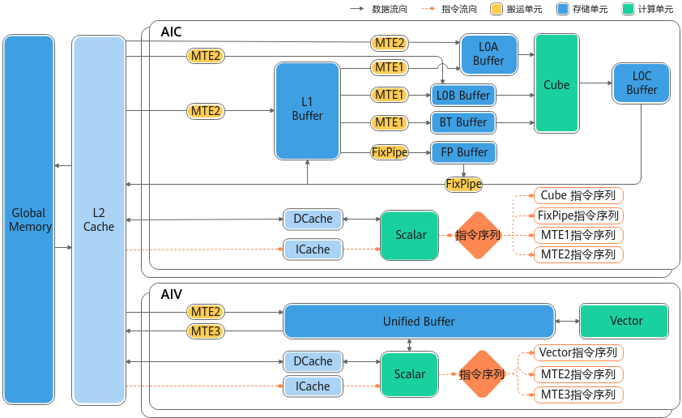
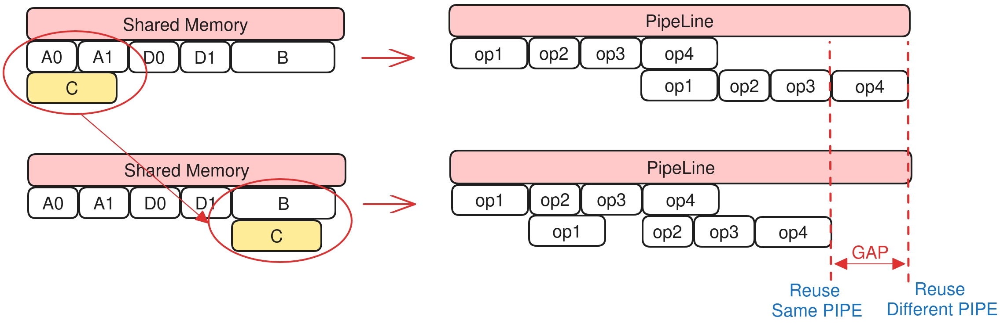
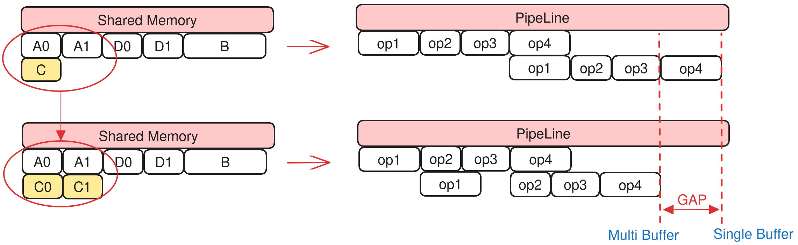

# Memory Management

This document introduces the **PlanMemoryPass** transformation in HIVM, including its hardware background, algorithm principles, interface description, and usage constraints.

## Hardware Background

The on-chip memory of Ascend hardware uses the Buffer mechanism, which mainly involves the storage units used by the Cube (matrix) compute unit and the Vector compute unit. The software needs to explicitly control memory addresses and ensure the alignment of operation addresses.

Taking Atlas A2 training products/Atlas A2 inference products as an example, the hardware architecture diagram is as follows:


The alignment requirements and functions of each type of Buffer are as follows:

| Buffer | Alignment | Function |
|-----|-----|-----|
| Unified Buffer (UB) | 32-byte alignment | General-purpose cache space, mainly used for vector and scalar operations |
| L1 Buffer | 32-byte alignment | Temporarily stores data used by convolution, such as feature maps |
| L0A Buffer | 512-byte alignment | Temporarily stores the left matrix (feature map) of matrix operations |
| L0B Buffer | 512-byte alignment | Temporarily stores the right matrix (weight) of matrix operations |
| L0C Buffer | 512-byte alignment | Temporarily stores the intermediate results and output matrix of matrix operations |
| BT Buffer | 64-byte alignment | BiasTable Buffer, stores the bias in matrix operations |
| FP Buffer | 64-byte alignment | Fixpipe Buffer, stores quantization parameters, ReLU parameters, and so on |

## Algorithm Principles

### Software Background

For Ascend on-chip memory, the Buffer of `memref.alloc` in the input IR contains only the variable name and the required memory space size, without address information. Therefore, the AscendNPU IR memory management module (PlanMemory) needs to allocate appropriate memory addresses based on the lifetime intervals of Buffers, so as to avoid memory overwrites during computation that would cause precision issues.

In order to allocate all Buffers within the limited memory space, PlanMemory performs memory reuse based on IR semantics and hardware constraints. Meanwhile, to avoid unnecessary data dependencies affecting performance, PlanMemory provides a three-level memory allocation algorithm that improves memory utilization while preserving performance as much as possible.

On-chip memory allocation covers the storage resources corresponding to the Cube and Vector computation units (including UB, L1, L0C, and so on):

- Cube unit related storage: L0A stores the left matrix and L0B stores the right matrix, both of which are moved in from the L1 Buffer; L0C stores the results and intermediate results of matrix multiplication. Memory allocation is mainly performed in the L1 and L0C spaces.
- Vector unit related storage: UB (Unified Buffer) stores the inputs and outputs of vector computation. Memory allocation needs to allocate memory for each Buffer in the UB space.

In addition to on-chip memory, PlanMemory also allocates a small amount of Workspace memory (`memref_ext.alloc_workspace`), which is mainly used in CV scenarios. If the Cube computation result needs to be further processed by the Vector unit, the Cube computation result must first be moved out of L0C, temporarily stored in the Workspace space, and then moved into UB for Vector computation. The off-chip space is applied for and managed by the framework Runtime, so the operator needs to report the required Workspace space size.

### Related Terms

- **BufferLife**: The lifetime interval of a buffer, referring to the execution interval from the first write (generation point, gen) to the last read (destruction point, kill) of a single buffer. If the lifetime intervals of two buffers do not overlap, they can share the same memory. PlanMemory computes the address offset of each `alloc` buffer based on its lifetime interval to implement memory sharing among non-overlapping buffers.
- **Alias**: When two pieces of data essentially originate from the same data, they are in an alias relationship, for example, the data before and after executing `subview`.
- **Inplace reuse**: The output of an op can be written to the storage location of its input (overwrite), thereby reducing one alloc. For example, `vcast` converting from `f16` to `i16` (equal width) can reuse the input buffer for its output. PlanMemory identifies such ops and assigns the output the same address offset as the input (or a rule that satisfies the hardware inplace constraint).
- **Address offset / pointer_cast**: After memory allocation, an independent `alloc` is no longer generated; instead, `hivm.hir.pointer_cast(offset)` is generated, where `offset` is the byte offset of the buffer in the corresponding memory space.

### Core Process Overview

Source file path: `bishengir/lib/Dialect/HIVM/Transforms/PlanMemory.cpp`

The main process includes:

1. Lifetime interval analysis: performs gen and kill analysis on each **Buffer** in the IR;
2. Memory allocation: allocates memory addresses for each **Buffer** based on the lifetime interval analysis above;
3. OP transformation: replaces the original `alloc` with `hivm.hir.pointer_cast(offset)`, and writes the allocated memory start address back to the corresponding **Buffer**.

#### Lifetime Interval Analysis

The main execution flow of lifetime interval analysis is as follows:

1. Analyze the liveness of each node using the community `Liveness` class.
2. Traverse the IR (including `scf.for`, `scf.if`, and `scf.while`) to collect the gen (generated Buffer) and kill (last-read Buffer) information of each op, which is used to compute the lifetime interval of each Buffer.
3. Compute the lifetime of each Buffer based on gen and kill, that is, the interval from the first write to the last read. If the lifetimes of two Buffers do not overlap, they can share memory.
4. Based on the Alias relationship, identify Buffers that can perform inplace reuse and assign them the same memory start address.

#### Memory Allocation Modes

Memory allocation includes two modes: sequential allocation and reusable allocation. When the total memory footprint of all Buffers can be accommodated within the corresponding Memory Scope (memory space, such as UB and L1), simple sequential allocation is sufficient. When the total footprint exceeds the size of the corresponding memory space, an algorithm is required to analyze Buffers whose memory can be reused, so as to complete memory reuse while ensuring no memory conflicts and no impact on computation precision.

Reusable allocation includes two types: Inplace reuse and three-level allocation reuse.

**Inplace Reuse**:

Inplace reuse can be performed when all of the following conditions are met:

- They belong to the same Memory Scope, for example, both in the UB space.
- The dependency relationship is satisfied: for example, in the `A = B + C` scenario, the kill node of A is the gen node of C.
- The hardware-level constraint requirements are met.

**Three-Level Allocation Reuse**:

The three-level allocation strategy is attempted in descending order of priority. When a higher-priority allocation fails, it automatically degrades, rolls back, and retries.

- **Level 2: Same-pipeline priority reuse strategy**

  Ascend hardware adopts a multi-pipeline-unit architecture, and parallelizing PIPE is the key. Memory reuse across different pipelines introduces additional data dependencies, causing pipeline conflicts and reducing pipeline execution efficiency.

  The Level 2 strategy prioritizes memory reuse within the same pipeline type, so that buffers in the same non-DMA pipeline are reused first (e.g., buffers for Vector instructions are preferentially reused with those of other Vector instructions).

  Example:

  ```text
  Shared A [A0, A1]
  Shared B [B]
  Shared C [C]
  Shared D [D0, D1]
  Loop i:
    // sync
    op1(A0, A1) // DMA OP, Double Buffer
    op2(B)      // Vector OP
    op3(C)      // Vector OP
    op4(D0, D1) // DMA OP, Double Buffer
  ```

  With Double Buffer enabled, the memory involved in A/D as DMA PIPE is allocated two buffers each. When shared memory resources are limited, reusing memory between C and A introduces an additional dependency between `op1` (DMA PIPE) and `op4` (Vector PIPE), preventing `MTE_PIPE` and `V_PIPE` from computing in parallel and degrading pipeline performance.

  After adopting the Level 2 memory allocation strategy, C reuses memory with B, both of which are Vector instructions. Since `V_PIPE` can only execute serially in the first place, reuse between Vector instructions does not impose additional impact on pipeline efficiency.

  Pipeline effect comparison of the Level 2 strategy:
  

    - Advantage: Reuse within the same pipeline does not introduce additional dependencies between PIPEs, resulting in better overall operator performance.
    - Disadvantage: The reusable solution space is smaller, so the probability of successful memory reuse is relatively lower.

- **Level 1: Double Buffer protection strategy**

DoubleBuffer significantly improves computational performance and reduces waiting time by parallelizing data loading and computation, making it a core means of operator performance optimization. In complex scenarios where memory resources are tight, if a Single Buffer reuses a Double Buffer, the Double Buffer cannot be parallelized, the operator pipeline is interrupted, and operator performance degrades.

The Level1 strategy specifies that, within the same loop, if a SingleBuffer reuses a DoubleBuffer, the SingleBuffer is automatically converted to a DoubleBuffer.

For example:

  ```text
  Shared A [A0, A1]
  Shared B [B]
  Shared C [C]
  Shared D [D0, D1]
  Loop i:
    // sync
    op1(A0, A1) // DMA OP, Double Buffer
    op2(B)      // Vector OP
    op3(C)      // Vector OP
    op4(D0, D1) // DMA OP, Double Buffer
  ```

With Double Buffer enabled, the memory involved in A/D as DMA PIPE is allocated two buffer spaces each. When shared memory resources are limited, if C's Single Buffer aliases one of A's buffers, `op1` must wait for `op3` to release the C(A0) memory before it can use the A0 memory. This interrupts the pipeline and ultimately degrades operator performance.

After the Level1 strategy is adopted, Double Buffer is automatically enabled when C reuses the Double Buffer space. When `op1` uses the A0 memory, `op3` uses the C1 (that is, A1) memory. Therefore, `op1` does not need to wait for `op3`, and the pipeline can still run in parallel.

Pipeline effect comparison of the Level1 strategy:
  

    - Advantage: It avoids pipeline interruption in Double Buffer scenarios and ensures pipeline performance.
    - Disadvantage: Enabling an additional Double Buffer requires occupying an additional memory space, which reduces the overall success rate of memory reuse.

- **Level 0: Full lifetime reuse strategy**

The Level0 strategy does not consider pipeline parallelism constraints. As long as the lifetime intervals of two Buffers do not overlap, their memory can be directly reused.

  Memory usage comparison of the Level0 strategy:
  

    - Advantage: It reuses memory as much as possible, achieving the highest memory reuse success rate.
    - Disadvantage: It does not consider hardware pipeline parallelism constraints at all, and unreasonable reuse may degrade operator performance.

#### OP Transformation

After the address calculation for all Buffers is completed, replace `memref_ext.alloc_workspace` (`GLOBAL_WORKSPACE_PLAN`) and `memref.alloc` (`LOCAL_MEM_PLAN`) with `hivm.hir.pointer_cast(offset)`, which indicates the memory start address of the Buffer.

### Test Cases

File: `bishengir/test/Dialect/HIVM/plan-memory.mlir`

Typical CHECK:

```mlir
// CHECK-NOT: memref.alloc()
// CHECK: %[[CONST0:.*]] = arith.constant 0 : i64
// CHECK: {{.*}} = hivm.hir.pointer_cast(%[[CONST0]])
```

## Interface Description

| Option | Default Value | Description |
|--------|--------|--------|
| `-mem-plan-mode=global-work-space-plan` | false | Uses `GLOBAL_WORKSPACE_PLAN` in the CV pipeline. |
| `enable-global-workspace-reuse` | false | Enables Buffer reuse within the Workspace. |
| `restrict-inplace-as-isa` | false | Restricts the inplace rules to match ISA behavior. |

## Usage Constraints

Users must ensure that the total size of all Buffers requested at the same time does not exceed the actual size of the corresponding hardware memory space.

> Note: The actual occupied space of each Buffer is automatically byte-aligned. For the alignment size, see [Hardware Background](#hardware-background).

If the total memory requirement exceeds the hardware space limit, the PlanMemory Pass fails to compile and reports the corresponding Memory Scope overflow error, for example, UB overflow:

```bash
loc("/tmp/tmp0h121237/kernel.ttadapter.mlir":2:3): error: ub overflow,
requires 3219456 bits while 1572864 bits available! (possible reason:
tiling basic block is too large or block number is more than what user
expect due to multi-buffer feature is enabled and some ops need extra local buffer.)
```
