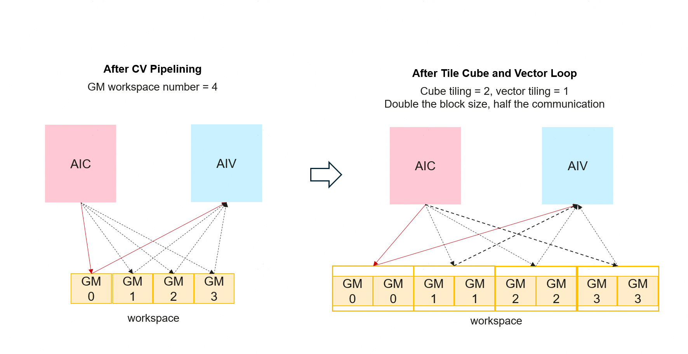

# Cube and Vector Loop Tiling

This document introduces the TileCubeVectorLoop Pass in HIVM. This pass optimizes CV-type kernels. Before reading this document, it is recommended to read [CV Optimization](./cv_optimization.md) to understand the CV compilation terminology.

## Hardware Background

Contemporary Ascend AI accelerator chips adopt a separated AIC/AIV mode, in which data exchange between AIC and AIV cores must go through Global Memory. When data dependencies exist between AIC and AIV cores, inter-core synchronization instructions are required to ensure data correctness. However, frequent inter-core synchronization leads to performance degradation. To improve operator execution performance, the synchronization frequency between AIC and AIV cores should be reduced as much as possible.

## Function Description



For the Cube loop and Vector loop in a MIX operator that have already completed software pipelining (CV Pipelining), Tiling is performed once more to split the entire block of computation originally completed in one iteration into multiple iterations, each processing a smaller block. The design goals of this approach are as follows:

- Reduce inter-core synchronization: The data processed in each iteration is smaller and is more likely to be confined within local buffers (L0C, UB, etc.), thereby reducing the overhead of cross-core synchronization.
- Increase the tiling granularity: Under the premise of satisfying hardware constraints, there is an opportunity to use a larger tile size, which is beneficial to memory access and computation efficiency:
    - Cube side: The result of matrix multiplication is stored in the L0C Buffer. If the total data size of a single iteration exceeds the L0C capacity, it cannot be placed into L0C at once.
    - Vector side: If a single iteration is too large, it may cause UB (Unified Buffer) buffer overflow.

## Algorithm Principle

By traversing the IR, the `CopyOut` operations corresponding to the Cube and Vector loops are located and split. Using them as anchors, the data producers are split accordingly and fused into the loops.

Before transformation:

```mlir
scf.for {
  hivm.load A
  hivm.load B
  hivm.hir.mmadL1
  hivm.hir.fixpipe
} {cube_loop}

```

After transformation:

```mlir
scf.for {
  for {
    hivm.load slice_A
    hivm.load slice_B
    hivm.hir.mmadL1
    hivm.hir.fixpipe
  } {sub_tile}
} {cube_loop}

```

## Compilation Options

| Option | Default Value | Meaning |
|------|--------|------|
| `tile-mix-cube-loop` | 1 | Target trip count of the Cube loop; no tiling is performed when it is 1. |
| `tile-mix-vector-loop` | 1 | Target trip count of the Vector loop; no tiling is performed when it is 1. |

## Constraints

- Only `scf.for` loops carrying the `hivm.loop_core_type` attribute are processed, and the value of this attribute must be:
    - `#hivm.tcore_type<CUBE>`: Cube loop
    - `#hivm.tcore_type<VECTOR>`: Vector loop

- For Vector computation, if the tile size after Tiling is smaller than the UB alignment size, Tiling is not performed.

- For Cube computation, if the tile size before Tiling is smaller than the total L0C size, Tiling is not performed.

    Note: The L1 space size constraint is not yet considered. In some scenarios, an L1 Memory Overflow error may be reported. In the future, the Cube-side Tiling will be determined in combination with lifetime analysis.
