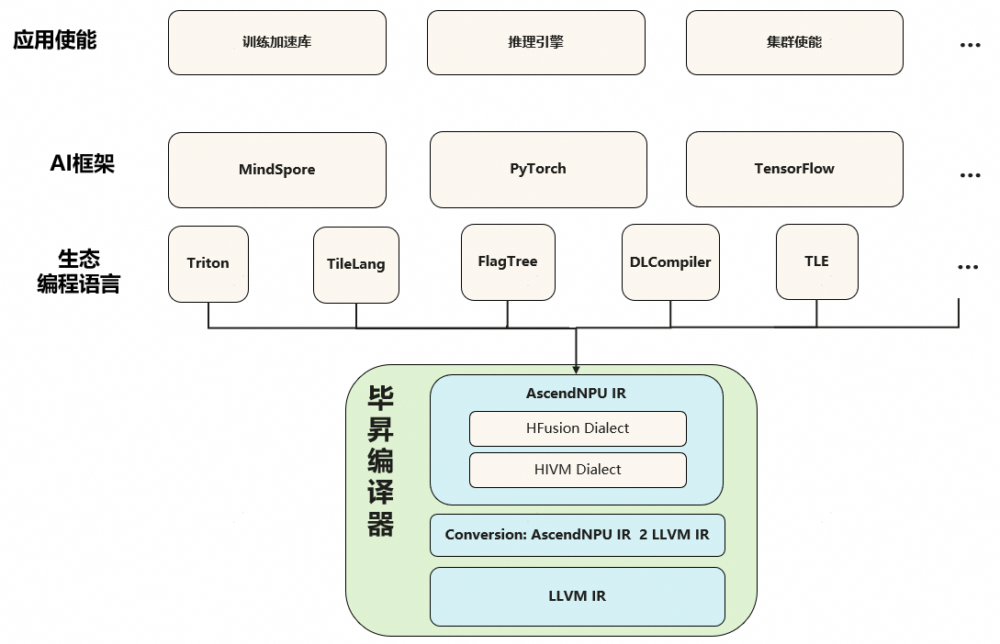
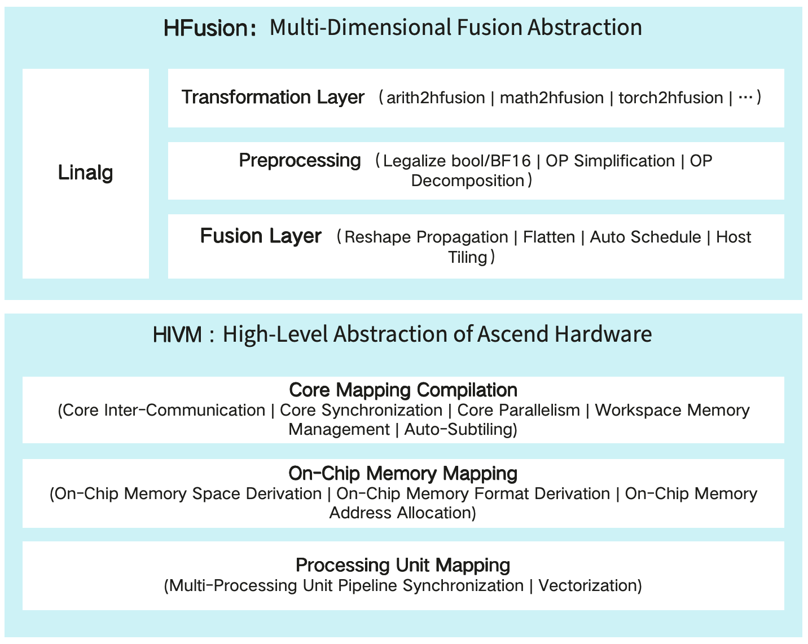
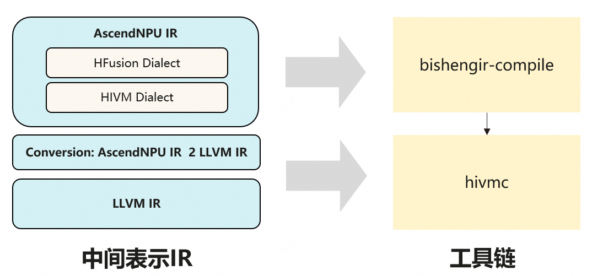

# Architecture design

## Overview

BiSheng AscendNPU IR is a high-level abstraction of Ascend hardware built on the MLIR ecosystem. It performs abstraction and compilation optimization from bottom to top over Ascend low-level instructions, intra-core resources, inter-core resources, and SoC resources. The multiple abstraction layers are decoupled and open-source; they allow ecosystem programming and third-party frameworks to connect flexibly according to their trade-offs between performance and ease of use, and provide a unified compilation entry and complete hardware expression and optimization for Ascend-oriented ecosystem frameworks.



## Logical architecture

The dialects designed in-house in AscendNPU IR are HFusion, HIVM, HACC, Annotation, and Scope. Among them, the HFusion dialect is responsible for hardware-relatively-independent optimization; HIVM is responsible for fine-grained awareness of NPU hardware details and for converting high-level programming languages into NPU low-level instructions; the HACC dialect is responsible for heterogeneous hardware abstraction; Annotation and Scope are responsible for marking compiler hint information for specific Operands or Operations.



### HFusion dialect

The HFusion (Hybrid Fusion) dialect is an extension set based on the MLIR community Linalg dialect. The HFusion dialect inherits all operations of the Linalg dialect and extends with operations not yet supported by the Linalg community. Note that the operations handled by the HFusion dialect are all named operations, so that high-level semantics are preserved as much as possible for the compiler to process. The HFusion dialect mainly includes three layers of capability: conversion layer, preprocessing, and fusion:

1. **Conversion layer**: The HFusion dialect is a key layer for ecosystem integration. It currently supports conversion with key operations of Arith, Math, Torch and other dialects; ecosystem integration will be gradually completed and extended.

2. **Preprocessing**: Hardware-detail–agnostic optimization layer, supporting tensor expression simplification, BF16/Bool data type legalization, composite OP implementation, and other common device function optimizations.

3. **Fusion**: Automatically fuses and generates Device Kernel operators and Host Tiling functions.

### HIVM dialect

HIVM (Hybrid ISA Virtual Machine): Abstracts computation, data movement, synchronization and other operations for Ascend hardware, and provides tile-level operations supporting Tensor or Memref of arbitrary dimensions and sizes, shielding the parameters of Ascend low-level instructions. HIVM compilation and optimization is mainly divided into the following three layers:

1. **CV kernel mapping compilation**: Aware of the NPU CV core-separation hardware architecture, it automatically performs CV fusion compilation and optimization for Mix Kernel (kernel functions that include both cube and vector operations). By analyzing data dependencies between cube and vector operations, it automatically inserts store and load for CV core data exchange, derives the workspace global memory size required for intermediate exchange and generates the Host-side size-derivation function, inserts inter-core synchronization at CV data dependencies to guarantee dependency order, and finally splits MixKernel into separate AIC and AIV kernel functions, thus realizing CV fusion compilation. For performance, the CVPipeline pass automatically adjusts the order of Cube and Vector code to enable CV core pipeline parallelism, and AutoSubTiling automatically implements the CV 1:2 subtiling ratio.

2. **Intra-core on-chip memory mapping**: Aware of the NPU intra-core on-chip memory structure, compilation and optimization automatically implement on-chip memory space derivation, on-chip memory data layout derivation, on-chip memory access alignment, OP temporary space allocation, and on-chip memory address assignment.

3. **Intra-core execution unit mapping**: Aware of the NPU intra-core multi-stage pipeline execution units, it automatically inserts pipeline synchronization so that different pipelines execute in order while enabling parallel pipeline optimization; aware of NPU instruction details, it automatically completes strategy-based instruction mapping and enables efficient NPU SIMD instructions.

## Code architecture

AscendNPU IR is built on the MLIR ecosystem; MLIR upstream community code is introduced as third-party. The code structure is as follows: the bishengir (i.e. AscendNPU IR) directory contains AscendNPU IR–related implementation, and the build-tools directory contains scripts and patches required to build AscendNPU IR. Enhancements to MLIR upstream by AscendNPU IR are preferably placed under bishengir/Dialect in separate dialect directories; capability is extended by adding files in these directories to avoid invasive changes to the community code. Modifications that cannot be isolated are applied via separate patch files; each patch has its own commit information for future integration with the MLIR community.

```text
.
├── bishengir // AscendNPU IR related implementation
├── build-tools // Directory for AscendNPU IR build scripts
│   ├── patches // Patches for invasive modifications to third-party ecosystem projects
│   │   ├── llvm-project
│   │   │   ├── 0001-[Huawei][MLIR]-xxx.patch
│   │   │   └── ...
│   │   └── torch-mlir
│   ├── apply_patches.sh
│   └── build.sh
└── third-party
    ├── llvm-project
    └── torch-mlir 
```

The bishengir directory structure is aligned with the MLIR directory structure. The include directory holds declaration files, including C++ headers (.h, .hpp) and TableGen definition files (.td); the include directory under the build directory also contains code generated by TableGen (.h.inc, .cpp.inc). The lib directory holds implementation code, including source files (.cpp) and private headers (for AscendNPU IR internal use only); the lib directory structure is largely consistent with include.

```text
.
├── bishengir // AscendNPU IR related implementation
│   ├── include
│   │   └── bishengir
│   │       ├── Conversion
│   │       └── Dialect
│   │           ├── Community dialects // Extensions to community dialects
│   │           └── In-house dialects // Custom dialects
├── lib
└── tools
    ├── bishengir-compile // AscendNPU IR compiler command-line driver
    └── bishengir-opt  
```

The IR is mainly composed of Conversion, Dialect, and tools. Conversion carries the conversion capability between dialects; Dialect contains the definitions and implementations of dialects; the tools directory defines the compilation toolchain. Conversion includes both third-party ecosystem conversions (e.g. TorchToHFusion) and internal AscendNPU IR dialect conversions (e.g. HFusionToHIVM). Under Dialect there are both in-house dialects and community dialects (internally extending and enhancing community dialects). Under tools, bishengir-compile is the command-line driver of the AscendNPU IR compiler.

## Compilation flow

The AscendNPU IR toolchain is bishengir-compile, which compiles high-level tile-level OPs into NPU-hardware–aware low-level ops; both input and output of this toolchain are MLIR. The hivmc tool is responsible for converting low-level MLIR into LLVM IR and for low-level instruction compilation and optimization on LLVM IR, finally producing the operator binary.


