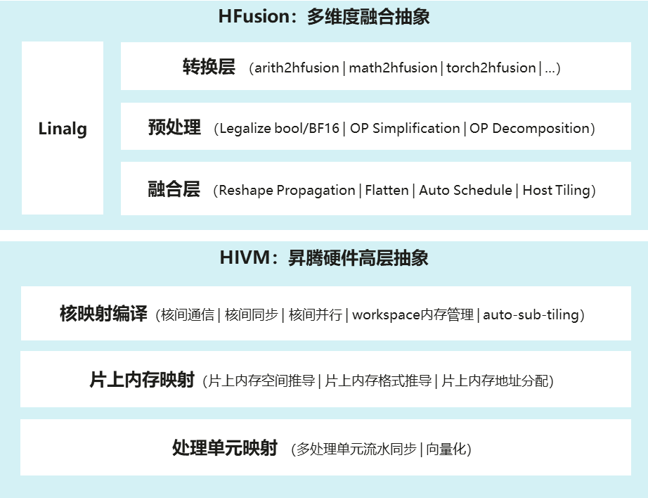
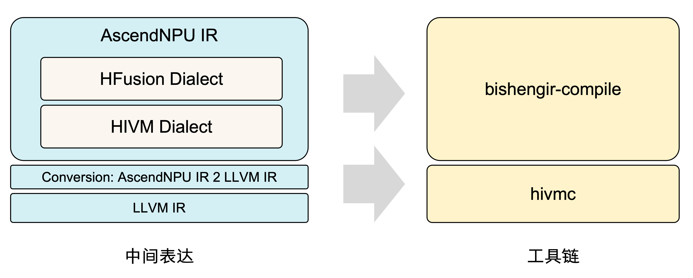

# Architecture Design

## Objectives

The AscendNPU IR of the Bisheng Compiler is a high-level abstraction of Ascend hardware built on the MLIR (Multi-Level Intermediate Representation) ecosystem. It abstracts and optimizes, from the bottom up, the low-level instructions, intra-core resources, inter-core resources, and SOC resources of Ascend hardware layer by layer. The multiple abstraction layers are decoupled and open source, so ecosystem programming and third-party frameworks can balance performance and ease of use as needed for flexible integration. It provides ecosystem frameworks with a unified compilation access layer for Ascend and complete hardware expression and optimization capabilities.


## Logical Architecture

The dialects independently designed in AscendNPU IR include **HFusion**, **HIVM**, **HACC**, **Annotation**, and **Scope**. The **HFusion** dialect is responsible for hardware-independent optimization, while **HIVM** is responsible for fine-grained perception of NPU hardware details, converting high-level programming languages into low-level NPU instructions. The **HACC** dialect is responsible for heterogeneous hardware abstraction, and **Annotation** and **Scope** are responsible for marking `compiler hint` information on specific **Operand** or **Operation** objects.



### HFusion Dialect

The HFusion (Hybrid Fusion) dialect is an extension set based on the Linalg dialect of the MLIR community. The HFusion dialect inherits all operations of the Linalg dialect and additionally extends operations that the Linalg community does not yet support. Note that the operations processed by the HFusion dialect are all `named operations`, which maximizes the preservation of high-level semantics for compiler processing. The HFusion dialect mainly provides three layers of capabilities: conversion layer, preprocessing, and fusion processing:

- **Conversion layer**: The HFusion dialect is a key layer for ecosystem integration. It currently supports conversion with key operations of dialects such as Arith, Math, and Torch, and will gradually improve and complete the ecosystem integration capabilities in the future.

- **Preprocessing**: A hardware-detail-independent optimization layer that supports common device function optimizations such as tensor expression simplification, legalization of the `BF16`/`Bool` data types, and implementation of complex Op combinations.

- **Fusion processing**: It can automatically fuse and generate Device Kernel operators and Host Tiling functions.

### HIVM Dialect

HIVM (Hybrid ISA Virtual Machine): It abstracts computation, data movement, synchronization, and other operations for Ascend hardware, provides Tile-level Operation to support Tensor or `Memref` operation types of arbitrary dimensions and sizes, and shields the underlying instruction parameters of Ascend hardware. The compilation optimization at the HIVM layer is mainly divided into the following three layers:

- **CV core mapping compilation**: With awareness of the NPU CV core separation hardware architecture, it automatically performs CV fusion compilation optimization on Mix Kernels (kernel functions that include both `cube` operations and `vector` operations). By analyzing the data dependency between `cube` and `vector` operations, it automatically inserts `store` and `load` to perform CV core data interaction, calculates the workspace global memory size required for intermediate interaction, and generates a Host-side function for deriving the size. At the same time, it inserts inter-core synchronization at locations with CV data dependency to ensure the dependency order, and finally automatically splits the MixKernel into separate AIC kernel functions and AIV kernel functions, thereby implementing CV fusion compilation. In terms of performance optimization, the CVPipeline pass automatically adjusts the order of Cube code and Vector code to ensure CV core pipeline parallelism, and AutoSubTiling automatically implements the CV 1:2 ratio splitting feature.

- **Intra-core on-chip memory mapping**: With awareness of the NPU intra-core on-chip memory structure, the compilation optimization automatically implements on-chip memory space derivation, on-chip memory data format derivation, automatic on-chip memory access alignment, Op temporary space application, and on-chip memory address allocation.

- **Intra-core processing unit mapping**: With awareness of the NPU intra-core multi-level pipeline processing units, it automatically inserts pipeline synchronization operations to ensure that different pipelines execute in an orderly manner while optimizing parallel pipelines. With awareness of NPU instruction details, it automatically completes policy-based automatic instruction mapping, enabling efficient NPU SIMD instructions.

### Features on Ascend 950PR/Ascend 950DT Chips and AscendNPU IR Support Optimization

The Ascend 950PR/Ascend 950DT chips inherit the RegBase (Register-based) programming model of the 310B chip. Compared with the Memory-based programming model of the Atlas A2 series products/Atlas A3 series products, the hardware adds a register layer; adds a data path between the Cube and Vector cores to provide more optimization space for CV fusion; adds components such as the Warp Scheduler to introduce SIMT capability; and adds new hardware instructions such as `ND-DMA`.

AscendNPU IR provides support for the new hardware features in the HIVM dialect, including the Arith and Vector dialects supporting computation and reduction Ops. For pure SIMD compilation, VF fusion, vectorization, mask optimization, and Combine optimization are added. On Ascend 950PR/Ascend 950DT, SIMT compilation support is newly added, connecting the community's TritonGPU dialect to HIVM and building Ascend-affinity algorithms for layout optimization, shared memory allocation, and core instruction mapping optimization. In addition to supporting pure SIMD mode and pure SIMT mode, AscendNPU IR also supports SIMD/SIMT hybrid compilation on Ascend 950PR/Ascend 950DT.


## Code Architecture

AscendNPU IR is built on the MLIR (Multi-Level Intermediate Representation) ecosystem. The native MLIR community code is introduced as a third-party dependency. The code structure is shown below. The `bishengir` directory (that is, AscendNPU IR) contains the AscendNPU IR-related implementation, and the `build-tools` directory contains the scripts required for building AscendNPU IR. For enhancements to the native MLIR community, AscendNPU IR preferentially creates a corresponding dialect directory under the independent `include/bishengir/Dialect` directory, extending capabilities by adding files in the independent directory to avoid intrusive modifications to the community. For modifications that cannot be isolated, they have been directly committed to the corresponding Ascend-maintained branches under `third-party` (for example, the corresponding branch of `llvm-project` is `Ascend/AscendNPU-IR/llvmorg-19.1.7`, and the corresponding branch of torch-mlir is `Ascend/AscendNPU-IR/main-20250716`). Each modification has a separate `commit` message to facilitate subsequent upstreaming to the MLIR community. The approach used in historical versions, which applied patch files from the `build-tools/patches` directory at build time, has been deprecated.

```text
.
├── bishengir // AscendNPU IR-related implementation
├── build-tools // Directory containing AscendNPU IR build scripts
│   └── build.sh
└── third-party
    ├── llvm-project // Ascend-maintained branch: Ascend/AscendNPU-IR/llvmorg-19.1.7
    ├── shmem
    └── torch-mlir   // Ascend-maintained branch: Ascend/AscendNPU-IR/main-20250716
```

The directory structure of `bishengir` is consistent with that of `mlir`: the `include` directory stores declaration files, including C++ header files (`.h`, `.hpp`) and TableGen definition files (`.td`), and the build directory `build/include` contains files automatically generated by TableGen (`.h.inc`, `.cpp.inc`). The `lib` directory stores implementation code (`.cpp`), and its directory structure is basically consistent with that of `include`.

```text
.
├── bishengir // AscendNPU IR-related implementation
│   ├── include
│   │   └── bishengir
│   │       ├── Conversion
│   │       └── Dialect
│   │           ├── Community dialects // Extensions and enhancements to community dialects
│   │           └── Self-developed dialects // Custom dialects
├── lib
└── tools
    ├── bishengir-compile // Command-line driver of the AscendNPU IR compiler.
    └── bishengir-opt
```

The IR mainly consists of three parts: `Conversion`, `Dialect`, and `tools`. `Conversion` provides the capability of conversion between different dialects; `Dialect` contains the definitions and implementations of different dialects; and the `tools` directory defines the compilation toolchain.

`Conversion` includes both third-party ecosystem integration conversions (such as TorchToHFusion) and conversions between internal dialects of AscendNPU IR (such as HFusionToHIVM). `Dialect` includes both self-developed dialects and community dialects. In `tools`, `bishengir-compile` is the command-line driver of the AscendNPU IR compiler.

## Compilation Process

The toolchain corresponding to AscendNPU IR is `bishengir-compile`, which is responsible for compiling high-abstraction Tile-level Ops into low-level ops with awareness of the NPU hardware architecture. Both the input and output of this toolchain are MLIR. The `hivmc` tool is responsible for converting the low-level MLIR into LLVM IR and performing low-level instruction compilation optimization based on LLVM IR, ultimately generating the operator binary.

