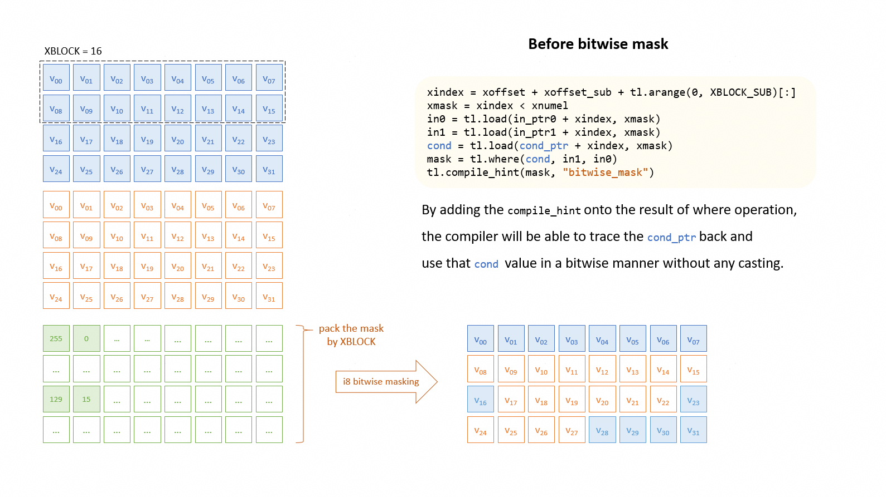
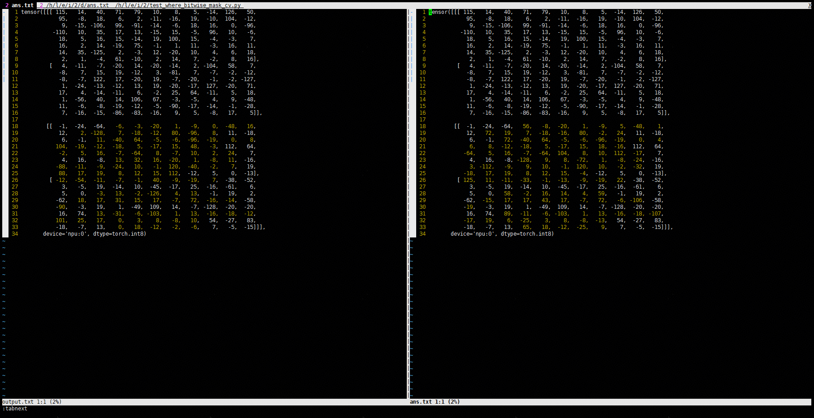
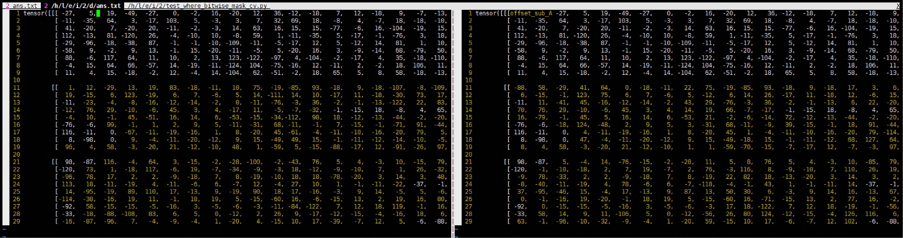

# Best Practices

## Performance Optimization Cases

### Tiling Strategy

**Case description**:

When a GPU-based Triton operator is migrated to the NPU, the number of logical cores launched is usually far greater than the number of physical cores, resulting in severe launch and scheduling overhead. It is recommended that, during migration, the Tiling strategy be adjusted to reduce the number of cores, so that the number of logical cores launched is as close as possible to the number of physical cores, thereby improving performance. This case is implemented using Triton.

```python
out = torch.gather(x, dim=1, index=idx)
```

**Input**:

| Input | Shape  |
|-------|--------|
| `x`   | `(B, C)` |
| `idx` | `(B, K)` |

**Output**:

| Input | Shape  |
|-------|--------|
| `out` | `(B, K)` |

**Detailed explanation of case differences**:

```diff
@triton.jit
def gather_dim1_kernel(
        x_ptr,  # *x  [B, C]
        idx_ptr,  # *idx[B, K]
        out_ptr,  # *out[B, K]
        stride_xb, stride_xc,
        stride_ib, stride_ik,
        stride_ob, stride_ok,
        B, K,
        BLOCK_B: tl.constexpr,
        BLOCK_K: tl.constexpr,
):
    pid_b = tl.program_id(0)  # 1 block per batch row
-   # GPU implementation
-   pid_k = tl.program_id(1)  # 1 block per K-tile

-   k_off = pid_k * BLOCK_K + tl.arange(0, BLOCK_K)
-   mask = k_off < K

-   idx = tl.load(idx_ptr + pid_b * stride_ib + k_off * stride_ik, mask=mask)  # [BLOCK_K]

-   x_val = tl.load(x_ptr + pid_b * stride_xb + idx * stride_xc, mask=mask)

-   tl.store(out_ptr + pid_b * stride_ob + k_off * stride_ok, x_val, mask=mask)

+   # NPU implementation
+   b_idx = pid_b * BLOCK_B + tl.arange(0, BLOCK_B)
+   b_mask = b_idx < B

+   # Loop over the K dimension.
+   for k_start in range(0, K, BLOCK_K):
+       ks = tl.arange(0, BLOCK_K)
+       k_mask = ks < K - k_start

+       idx_off = (b_idx[:, None] * stride_ib +
+                  (k_start + ks)[None, :] * stride_ik)
+       col_idx = tl.load(idx_ptr + idx_off, mask=b_mask[:, None] & k_mask)

+       x_off = (b_idx[:, None] * stride_xb +
+                col_idx * stride_xc)
+       x_val = tl.load(x_ptr + x_off, mask=b_mask[:, None] & k_mask)

+       out_off = (b_idx[:, None] * stride_ob +
+                  (k_start + ks)[None, :] * stride_ok)
+       tl.store(out_ptr + out_off, x_val, mask=b_mask[:, None] & k_mask)

# Call.
B = 128  # batch dim
K = 64  

BLOCK_B = 4
BLOCK_K = 128

- # GPU  
- grid = (B, triton.cdiv(K, BLOCK_K))
+ # NPU
+ grid = (triton.cdiv(B, BLOCK_B),)
```

### Ascend-Affinity Kernel Rewrite

**Case Description**:

In the original GPU computation flow, the `i64`/`i32` `cmp` operation cannot enable `vector` on NPU devices and degrades to scalar computation, reducing efficiency. By converting to `fp32`, `vec_cast` and `vec_cmp` are leveraged to implement `vector` operation acceleration. Note that when the `mask` in `tl.load` and `tl.save` uses the `cmp` function, the compiler can automatically optimize it into a `vec` operation in most cases. In this case, `tl.where` requires manual conversion. This case uses **layerNorm** as an example to illustrate the implementation of vectorized `cmp` to accelerate the NPU computation flow. The `cmp` operation is used to handle tail blocks in **layerNorm**.

**Detailed Explanation of Case Differences**:

```diff
    cols = tl.arange(0, BLOCK_N)  # cols is int64
    x = tl.load(X + cols, mask=cols < N, other=0.0).to(tl.float32)

    # calculate mean & rstd
    mean = tl.sum(x, axis=0) / N
    tl.store(Mean + row, mean)
    
-   xbar = tl.where(cols < N, X - mean, 0.0)
+   # change cols(i64) into cols_cmp(f32) to enable vector processing
+   cols_cmp = cols.to(tl.float32)
+   xbar = tl.where(cols_cmp < N, x - mean, 0.0)

    var = tl.sum(xbar * xbar, axis=0) / N
```

## Function or Precision Cases

This section introduces common function or precision cases.

### Hang Issues

**Symptom**:

The operator option reports a timeout error. Some operator hang issues are related to hardware synchronization, which may involve intra-core/inter-core synchronization or pipeline synchronization. If an operator hang occurs, you can try passing the following input parameters when invoking the Kernel to modify the binary synchronization logic and work around the operator hang issue.

**Code example**:

| Compilation option | Value | Description |
|--------|------|------|
| `inject_barrier_all` | `false` (default) | The frontend attempts to enable it as `true`. If the hang issue disappears, it indicates an intra-core synchronization problem. This option applies to `mix`/`aic`/`aiv` kernels. |
| `inject_block_all` | `false` (default) | The frontend attempts to enable it as `true`. If the hang issue disappears, it indicates an inter-core synchronization problem. This option applies to `mix` kernels. |

Taking the `chunk_gated_delta_rule_fwd_kernel_h_blockdim64` operator of the GDN network as an example, the original code example is invoked as follows:

```python
chunk_gated_delta_rule_fwd_kernel_h_blockdim64[grid](
    k=k,
    v=u,
    w=w,
    v_new=v_new,
    g=g,
    gk=gk,
    h=h,
    h0=initial_state,
    ht=final_state,
    cu_seqlens=cu_seqlens,
    chunk_offsets=chunk_offsets,
    T=T,
    H=H,
    K=K,
    V=V,
    BT=BT,
)
```

The code example after enabling full CV pipelining is as follows:

```python
chunk_gated_delta_rule_fwd_kernel_h_blockdim64[grid](
    k=k,
    v=u,
    w=w,
    v_new=v_new,
    g=g,
    gk=gk,
    h=h,
    h0=initial_state,
    ht=final_state,
    cu_seqlens=cu_seqlens,
    chunk_offsets=chunk_offsets,
    T=T,
    H=H,
    K=K,
    V=V,
    BT=BT,
    inject_block_all = True, # Enable inter-core synchronization.
    inject_barrier_all = True # Enable intra-core synchronization.
)
```

**Unreasonable parameter input**:

For `varlen`-type operators, `indice` is usually randomly sampled from `seqlen`, and the validity of the `indice` input must be ensured. For example, it must be strictly increasing and within the range `[0, seqlen]`.

### UB Overflow Issues

#### Triton argmax op performs 32B alignment before merging axes, wasting a large amount of UB space

**The MLIR code is as follows**:

```mlir
%reinterpret_cast = memref.reinterpret_cast %arg3 to offset: [0], sizes: [256, 9, 11], strides: [99, 11, 1] : memref<?xi8, #hivm.address_space<gm>> to memref<256x9x11xi8, strided<[99, 11, 1]>, #hivm.address_space<gm>>
%2 = hivm.hir.pointer_cast(%c0_i64) : memref<256x32x11x1xi8, #hivm.address_space<ub>>
%subview = memref.subview %2[0, 0, 0, 0] [256, 9, 11, 1] [1, 1, 1, 1] : memref<256x32x11x1xi8, #hivm.address_space<ub>> to memref<256x9x11xi8, strided<[352, 11, 1]>, #hivm.address_space<ub>>
%collapse_shape = memref.collapse_shape %reinterpret_cast [[0], [1, 2]] : memref<256x9x11xi8, strided<[99, 11, 1]>, #hivm.address_space<gm>> into memref<256x99xi8, strided<[99, 1]>, #hivm.address_space<gm>>
%collapse_shape_0 = memref.collapse_shape %subview [[0], [1, 2]] : memref<256x9x11xi8, strided<[352, 11, 1]>, #hivm.address_space<ub>> into memref<256x99xi8, strided<[352, 1]>, #hivm.address_space<ub>>
hivm.hir.load ins(%collapse_shape : memref<256x99xi8, strided<[99, 1]>, #hivm.address_space<gm>>) outs(%collapse_shape_0 : memref<256x99xi8, strided<[352, 1]>, #hivm.address_space<ub>>) init_out_buffer = false may_implicit_transpose_with_last_axis = false
```

**Analysis**:

Line 1: The original data size is `256x9x11xi8`, stored in GM (the kernel parameter `%arg3`);

Line 2: A UB space of size `256x32x11x1xi8` is allocated for copying data from GM to UB. Here, 32-byte alignment is applied to axis 1, and an extra dimension is added to the last axis;

Line 3: For the UB shape `256×32×11×1xi8` allocated in line 2, a subview of `256x9x11xi8` is extracted via `subview`;

Line 4: Via `collapse_shape`, the dimensions of the GM view `256x9x11xi8` in line 1 are merged into the type `256x99xi8`;

Line 5: Via `collapse_shape`, the dimensions of the UB view `256x9x11xi8` in line 3 are merged into the type `256x99xi8`;

Line 6: The data of shape `256x99xi8` in GM from line 4 is copied into the `256x99xi8` shape in UB from line 5.

**Summary**:

The original data `256x9x11xi8` is 25344B in size; after being `load`ed from GM to UB, the size occupied in UB (`256x32x11x1xi8`) is 90112B, which is more than 3.5 times the size of the original data.

#### Unreasonable implementation of the triton not op, causing extra memory usage

In NPU-IR, the implementation of the Triton Not OP is converted into a series of operations such as `VOR`, `VAND`, `VNOT`, and `VAND`. In fact, only the `VNOT` operation needs to be executed:

**The MLIR code is as follows**:

```mlir
  %2 = hivm.hir.pointer_cast(%c0_i64) : memref<65536xi8, #hivm.address_space<ub>>
  hivm.hir.load ins(%reinterpret_cast : memref<65536xi8, strided<[1]>, #hivm.address_space<gm>>) outs(%2 : memref<65536xi8, #hivm.address_space<ub>>) init_out_buffer = false may_implicit_transpose_with_last_axis = false
  %3 = hivm.hir.pointer_cast(%c131072_i64) : memref<65536xi8, #hivm.address_space<ub>>
  hivm.hir.vbrc ins(%c-1_i8 : i8) outs(%3 : memref<65536xi8, #hivm.address_space<ub>>)
  %4 = hivm.hir.pointer_cast(%c65536_i64) : memref<65536xi8, #hivm.address_space<ub>>
  hivm.hir.vor ins(%2, %3 : memref<65536xi8, #hivm.address_space<ub>>, memref<65536xi8, #hivm.address_space<ub>>) outs(%4 : memref<65536xi8, #hivm.address_space<ub>>)
  %5 = hivm.hir.pointer_cast(%c0_i64) : memref<65536xi8, #hivm.address_space<ub>>
  hivm.hir.vand ins(%2, %3 : memref<65536xi8, #hivm.address_space<ub>>, memref<65536xi8, #hivm.address_space<ub>>) outs(%5 : memref<65536xi8, #hivm.address_space<ub>>)
  hivm.hir.vnot ins(%5 : memref<65536xi8, #hivm.address_space<ub>>) outs(%5 : memref<65536xi8, #hivm.address_space<ub>>)
  %6 = hivm.hir.pointer_cast(%c65536_i64) : memref<65536xi8, #hivm.address_space<ub>>
  hivm.hir.vand ins(%5, %4 : memref<65536xi8, #hivm.address_space<ub>>, memref<65536xi8, #hivm.address_space<ub>>) outs(%6 : memref<65536xi8, #hivm.address_space<ub>>)
```

**Analysis**:

Line 1: The original data size is `65536xi8`, which is stored in GM (the kernel parameter `%arg3`);

Line 2: Allocate a UB space of size `65536xi8`;

Line 3: Copy the data of shape `65536xi8` in GM on line 1 to the UB space of shape `65536xi8` on line 2;

Line 4: Allocate a UB space of size `65536xi8`;

Line 5: Fill the `65536xi8` UB space allocated on line 4 entirely with -1;

Line 6: Allocate a UB space of size `65536xi8`;

Line 7: The input data is ORed with -1, and the result is stored in the UB space allocated on line 6.

Line 8: A UB space of size `65536xi8` is allocated.

Line 9: The input data is ANDed with -1, and the result is stored in the UB space allocated on line 8.

Line 10: A `not` operation is then performed on the result of line 9, and the result is stored in the UB space allocated on line 8.

Line 11: A UB space of size `65536xi8` is allocated.

Line 12: An `and` operation is performed on the result of line 7 and the result of line 10, and the result is stored in the UB space allocated on line 11.

**Summary**:

When the `not` operation is performed on the input data `input_data`, `mlir` translates it into the following operation: `(input_data|(-1))&(!(input_data&(-1)))`.

The original data size is 65536B. To complete the `(input_data|(-1))&(!(input_data&(-1)))` operation, a UB space of `5*65536B` is allocated.

#### triton max_dim0 op wastes a large amount of UB space when PlanMemory is executed before HIVMLowerToLoops for int64 input

**The MLIR code is as follows**:

```mlir
%2 = hivm.hir.pointer_cast(%c0_i64) : memref<2x4912xi64, #hivm.address_space<ub>>
%3 = hivm.hir.pointer_cast(%c78592_i64) : memref<1x4912xi64, #hivm.address_space<ub>>
%4 = hivm.hir.pointer_cast(%c117888_i64) : memref<9824xi64, #hivm.address_space<ub>>
hivm.hir.vreduce {already_initialize_init} <max> ins(%2 : memref<2x4912xi64, #hivm.address_space<ub>>) outs(%3 : memref<1x4912xi64, #hivm.address_space<ub>>) temp_buffer(%4 : memref<9824xi64, #hivm.address_space<ub>>) reduce_dims = [0]
```

**Analysis**:

Line 1: The input data size is `2x4912xi64`, allocated in UB, with the data sourced from GM.

Line 2: The output data size is `1x4912xi64`, allocated in UB to store the computation result, which is finally stored to GM.

Line 3: A UB space of size `9824xi64` is allocated as the temporary node for the `vreduce` operation.

Line 4: For `int64` input, the `vreduce` operation is later lowered to a `loop scalar` operation, and the `temp_buffer` is removed.

**Summary**:

The `temp_buffer` considered during PlanMemory is not used in the final computation, which causes a false `ub overflow` report. The temporary node allocation rule needs to be modified in the step of allocating `temp_buffer` before PlanMemory.

### D-cache Category

#### Invalid Address Access

**Symptom**:

The operator inputs are valid and all belong to the same `deviceID`, but the actual `deviceID` of the operator is set incorrectly, causing the data to be inaccessible and resulting in D-cache read/write errors.

**Code example**:

Incorrect example:

```python
A=torch.empty(shape, dtype)
```

Correct example:

```python
A=torch.empty(shape, dtype).npu()
```

Or:

```python
DEVICE="npu:0"
A=torch.empty(shape, dtype, device=DEVICE).npu()
```

#### Using a Non-negative Iter Arg as the Memory Access Index

**Symptom**:

Because the compilation process analyzes memory access operations and optimizes the compilation result, if the index of a memory access operation involves complex control flow (such as out-of-bounds access introduced by a `for` loop index), the compiler may not be able to fully cover it at present. Therefore, it is recommended to use a non-negative `for` loop `iter` parameter as the memory access index.

**Code example**:

Taking the `causal_conv1d_fwd_kernel` of the GDN network as an example, `i_w` in the source code may be a negative number.

Incorrect example:

```python
for i_w in tl.static_range(-W+1, 1):
    p_yi = tl.make_block_ptr(x + bos * D, (T, D), (D, 1), (i_t * BT + i_w, i_d * BD), (BT, BD), (1, 0))
```

Correct example:

```python
for i_w in tl.static_range(W):
    p_yi = tl.make_block_ptr(x + bos * D, (T, D), (D, 1), (i_t * BT + i_w - W + 1, i_d * BD), (BT, BD), (1, 0))
```

### Memory Access

#### Load Implicit Transpose

**Symptom**:

"Implicit transpose" refers to completing the matrix transpose operation while loading or storing data, avoiding a separate transpose kernel or additional explicit data rearrangement. It is typically implemented by adjusting the strides and shapes of pointers, so that the memory access pattern implicitly performs the dimension swap. This technique can save global memory bandwidth, reduce kernel launch overhead, and improve computational efficiency.

`tl.make_block_ptr(base, shape, strides, offsets, block_shape, order)`

The `order` parameter specifies the iteration order of elements in memory and can be used to implement transposition. Alternatively, the `strides` parameter can be set to indicate the transposed strides. In practice, for matrix transposition, if we have an input matrix `A (M, K)` and an output matrix `B (K, M)`, we can let each thread block process a block of `B` and load the corresponding transposed block from `A`. When loading, `make_block_ptr` can be used to load from `A`, but with strides set to cause transposed loading. Or, more commonly, a normal `A` block is loaded, then transposed using `tl.trans` before being stored to `B`.

```python
import torch
import triton
import triton.language as tl

@triton.jit
def transpose_kernel(
    x_ptr, y_ptr,
    M, N,
    stride_xm, stride_xn,
    stride_ym, stride_yn,
    BLOCK_M: tl.constexpr, BLOCK_N: tl.constexpr
):
    """
    Matrix transpose kernel: Y = X^T, where X has shape (M, N) and Y has shape (N, M).
    Each program block processes a (BLOCK_N, BLOCK_M) sub-block of Y.
    Implement implicit transposed loading by swapping the strides of the input pointers.
    """
    pid_n = tl.program_id(0)  # Row block index of the output matrix (original column block).
    pid_m = tl.program_id(1)  # Column block index of the output matrix (original row block).

    bn = pid_n * BLOCK_N  # Row start of the output matrix = original column start.
    bm = pid_m * BLOCK_M  # Column start of the output matrix = original row start.

    # Build the input pointer: use swapped strides with shape (N, M) to match transposed access.
    x_ptr_t = tl.make_block_ptr(
        base=x_ptr,
        shape=(N, M),
        strides=(stride_xn, stride_xm),
        offsets=(bn, bm),
        block_shape=(BLOCK_N, BLOCK_M),
        order=(1, 0)
    )

    # Build the output pointer: normal row-major strides with shape (N, M).
    y_ptr_b = tl.make_block_ptr(
        base=y_ptr,
        shape=(N, M),
        strides=(stride_ym, stride_yn),
        offsets=(bn, bm),
        block_shape=(BLOCK_N, BLOCK_M),
        order=(1, 0)
    )

    # Load the input block (implicitly transposed), with boundary checks to prevent out-of-bounds access.
    x_tile = tl.load(x_ptr_t, boundary_check=(0, 1))

    # Store to the output matrix.
    tl.store(y_ptr_b, x_tile, boundary_check=(0, 1))


def transpose(x, y=None, BLOCK_M=64, BLOCK_N=32):
    """
    Compute the matrix transpose using a Triton kernel.
    Args:
        x: torch.Tensor of shape (M, N)
        y: Optional output tensor of shape (N, M); created automatically if None.
        BLOCK_M: block size (along the M dimension).
        BLOCK_N: block size (along the N dimension)
    Returns:
        y: transposed tensor
    """
    M, N = x.shape
    if y is None:
        y = torch.empty(N, M, dtype=x.dtype, device=x.device)
    else:
        assert y.shape == (N, M), f"y's shape should be ({N}, {M}), but got {y.shape}"

    # Compute the grid size.
    grid = (triton.cdiv(N, BLOCK_N), triton.cdiv(M, BLOCK_M))

    # Invoke the kernel.
    transpose_kernel[grid](
        x, y,
        M, N,
        x.stride(0), x.stride(1),
        y.stride(0), y.stride(1),
        BLOCK_M=BLOCK_M, BLOCK_N=BLOCK_N
    )
    return y

# Create a random matrix.
x = torch.randn(512, 1024, device='npu')

# Invoke the transpose function.
y = transpose(x)
```

The execution completes without errors, which indicates that the run is successful.

#### Using **mayDiscretememaccess** to Avoid UB Overflow

**Symptom**:

The causes of UB overflow vary. In addition to the tensor data type itself being too large, which causes it to exceed the 192 KB UB limit, another possible cause is that non-contiguous data movement leads to axis expansion within the UB. Taking the `<Nx1xf32>` data type as an example, because the hardware requires 32B alignment on the last axis while `1xf32` is only 4B in size, the actual size of `<Nx1xf32>` on the hardware is expanded to `<Nx8xf32>` to ensure 32B alignment. Regardless of the cause of UB overflow, it can be avoided by adding the `mayDiscretememaccess` compilation hint, which degrades tensor operations into scalar operations.

**Code example**:

When rewriting the operator, you only need to add `compile_hint` to the data of the `load`/`store` operation. Refer to the following code snippet:

For versions earlier than `triton-ascend 3.2.0`:

```python
# If this is a load operation, add compile_hint to the loaded value.
value = tl.load(pointer)
tl.compile_hint(value, "mayDiscretememaccess")

# If this is a store operation, add compile_hint to the value being stored.
tl.compile_hint(value, "mayDiscretememaccess")
tl.store(pointer, value)
```

For versions later than `triton-ascend 3.4.0`, change it to:

```python
# If this is a load operation, add compile_hint to the loaded value.
value = tl.load(pointer)
tl.extra.cann.extension.compile_hint(value, "mayDiscretememaccess")

# If this is a store operation, add the compile_hint to the value being stored.
tl.extra.cann.extension.compile_hint(value, "mayDiscretememaccess")
tl.store(pointer, value)
```

- **Code example 1**:

    ```python
    b_x = tl.load(x + o_t * D + o_d[:, None], mask=(m_t & m_d[:, None]), other=0)
    ```

    By adding a compilation hint, tensor memory access is degraded to scalar memory access, thereby avoiding UB overflow. Refer to the following code snippet:

    ```python
    b_x = tl.load(x + o_t * D + o_d[:, None], mask=(m_t & m_d[:, None]), other=0)
    tl.extra.cann.extension.compile_hint(b_x, "mayDiscretememaccess")
    ```

- **Code example 2**:

    ```diff
    import triton
    import triton.language as tl
    + import triton.language.extra.cann.extension as extension
    
    @triton.jit
    def copy_column_major_to_row_major(
        A_ptr, B_ptr,
        M, N,
        BLOCK_SIZE_M: tl.constexpr, BLOCK_SIZE_N: tl.constexpr,
    ):
        # Obtain the program ID.
        pid_m = tl.program_id(0)
        pid_n = tl.program_id(1)
    
        # Compute the block start position.
        start_m = pid_m * BLOCK_SIZE_M
        start_n = pid_n * BLOCK_SIZE_N
    
        # Create the block pointer of A (column-major: strides=(1, M)). The last dimension is non-contiguous, so it is automatically expanded.
        A_block_ptr = tl.make_block_ptr(
            base=A_ptr,
            shape=(M, N),
            strides=(1, M),
            offsets=(start_m, start_n),
            block_shape=(BLOCK_SIZE_M, BLOCK_SIZE_N),
            order=(0, 1),  # The innermost dimension is the row (index 0) because of column-major order.
        )
    
        # Create the block pointer of B (row-major: strides=(N, 1)).
        B_block_ptr = tl.make_block_ptr(
            base=B_ptr,
            shape=(M, N),
            strides=(N, 1),
            offsets=(start_m, start_n),
            block_shape=(BLOCK_SIZE_M, BLOCK_SIZE_N),
            order=(1, 0),  # The innermost dimension is the column (index 1) because of row-major order.
        )
    
        # Load the block of A and perform boundary check (fill 0 for out-of-range parts).
        a = tl.load(A_block_ptr, boundary_check=(0, 1))
    +   # npu
    +   extension.compile_hint(a, "mayDiscretememaccess")
    
        # Store to B.
        tl.store(B_block_ptr, a, boundary_check=(0, 1))
    ```

**IR comparison of Example 2 before and after using `compile hint`**:

```mlir
// before using tl.compile_hint(a, "mayDiscretememaccess")
module attributes {hacc.target = #hacc.target<"Ascend910B3">} {
  func.func @copy_column_major_to_row_major(%arg0: memref<?xi8> , %arg1: memref<?xi8> , %arg2: memref<?xf32> {tt.divisibility = 16 : i32, tt.tensor_kind = 0 : i32} , %arg3: memref<?xf32> {tt.divisibility = 16 : i32, tt.tensor_kind = 1 : i32} , %arg4: i32 {tt.divisibility = 16 : i32} , %arg5: i32 {tt.divisibility = 16 : i32} , %arg6: i32 , %arg7: i32 , %arg8: i32 , %arg9: i32 , %arg10: i32 , %arg11: i32 ) attributes {SyncBlockLockArgIdx = 0 : i64, WorkspaceArgIdx = 1 : i64, global_kernel = "local", mix_mode = "aiv", parallel_mode = "simd"} {
    %c64 = arith.constant 64 : index 
    %c0 = arith.constant 0 : index 
    %c0_i32 = arith.constant 0 : i32 
    %c64_i32 = arith.constant 64 : i32 
    %0 = arith.muli %arg9, %c64_i32 : i32 
    %1 = arith.muli %arg10, %c64_i32 : i32 
    %2 = arith.maxsi %0, %c0_i32 : i32 
    %3 = arith.index_cast %2 : i32 to index 
    %4 = arith.maxsi %1, %c0_i32 : i32 
    %5 = arith.index_cast %4 : i32 to index 
    %6 = arith.index_cast %arg5 : i32 to index 
    %7 = arith.muli %3, %6 : index 
    %8 = arith.index_cast %arg4 : i32 to index 
    %9 = arith.addi %7, %5 : index 
    %reinterpret_cast = memref.reinterpret_cast %arg3 to offset: [%9], sizes: [64, 64], strides: [%6, 1] : memref<?xf32> to memref<64x64xf32, strided<[?, 1], offset: ?>> 
    %10 = arith.muli %5, %8 : index 
    %11 = arith.addi %10, %3 : index 
    %reinterpret_cast_0 = memref.reinterpret_cast %arg2 to offset: [%11], sizes: [64, 64], strides: [%8, 1] : memref<?xf32> to memref<64x64xf32, strided<[?, 1], offset: ?>> 
    %alloc = memref.alloc() : memref<64x64xf32> 
    %12 = arith.divsi %11, %8 : index 
    %13 = arith.subi %6, %12 : index 
    %14 = arith.maxsi %13, %c0 : index 
    %15 = arith.minsi %14, %c64 : index 
    %16 = arith.remsi %11, %8 : index 
    %17 = arith.subi %8, %16 : index 
    %18 = arith.maxsi %17, %c0 : index 
    %19 = arith.minsi %18, %c64 : index 
    %20 = arith.subi %c0_i32, %1 : i32 
    %21 = arith.maxsi %20, %c0_i32 : i32 
    %22 = arith.index_cast %21 : i32 to index 
    %23 = arith.minsi %22, %15 : index 
    %24 = arith.subi %15, %23 : index 
    %25 = arith.subi %c0_i32, %0 : i32 
    %26 = arith.maxsi %25, %c0_i32 : i32 
    %27 = arith.index_cast %26 : i32 to index 
    %28 = arith.minsi %27, %19 : index 
    %29 = arith.subi %19, %28 : index 
    %subview = memref.subview %reinterpret_cast_0[0, 0] [%24, %29] [1, 1] : memref<64x64xf32, strided<[?, 1], offset: ?>> to memref<?x?xf32, strided<[?, 1], offset: ?>> 
    %subview_1 = memref.subview %alloc[%23, %28] [%24, %29] [1, 1] : memref<64x64xf32> to memref<?x?xf32, strided<[64, 1], offset: ?>> 
    memref.copy %subview, %subview_1 : memref<?x?xf32, strided<[?, 1], offset: ?>> to memref<?x?xf32, strided<[64, 1], offset: ?>> 
    %30 = bufferization.to_tensor %alloc restrict writable : memref<64x64xf32> 
    %31 = tensor.empty() : tensor<64x64xf32> 
    %transposed = linalg.transpose ins(%30 : tensor<64x64xf32>) outs(%31 : tensor<64x64xf32>) permutation = [1, 0]  
    %32 = arith.divsi %9, %6 : index 
    %33 = arith.subi %8, %32 : index 
    %34 = arith.maxsi %33, %c0 : index 
    %35 = arith.minsi %34, %c64 : index 
    %36 = arith.remsi %9, %6 : index 
    %37 = arith.subi %6, %36 : index 
    %38 = arith.maxsi %37, %c0 : index 
    %39 = arith.minsi %38, %c64 : index 
    %40 = arith.minsi %27, %35 : index 
    %41 = arith.subi %35, %40 : index 
    %42 = arith.minsi %22, %39 : index 
    %43 = arith.subi %39, %42 : index 
    %extracted_slice = tensor.extract_slice %transposed[%40, %42] [%41, %43] [1, 1] : tensor<64x64xf32> to tensor<?x?xf32> 
    %subview_2 = memref.subview %reinterpret_cast[0, 0] [%41, %43] [1, 1] : memref<64x64xf32, strided<[?, 1], offset: ?>> to memref<?x?xf32, strided<[?, 1], offset: ?>> 
    bufferization.materialize_in_destination %extracted_slice in writable %subview_2 : (tensor<?x?xf32>, memref<?x?xf32, strided<[?, 1], offset: ?>>) -> () 
    return 
  } 
} 
```

```mlir
// after using tl.compile_hint(a, "mayDiscretememaccess")
module attributes {hacc.target = #hacc.target<"Ascend910B3">} {
  func.func @copy_column_major_to_row_major(%arg0: memref<?xi8> , %arg1: memref<?xi8> , %arg2: memref<?xf32> {tt.divisibility = 16 : i32, tt.tensor_kind = 0 : i32} , %arg3: memref<?xf32> {tt.divisibility = 16 : i32, tt.tensor_kind = 1 : i32} , %arg4: i32 {tt.divisibility = 16 : i32} , %arg5: i32 {tt.divisibility = 16 : i32} , %arg6: i32 , %arg7: i32 , %arg8: i32 , %arg9: i32 , %arg10: i32 , %arg11: i32 ) attributes {SyncBlockLockArgIdx = 0 : i64, WorkspaceArgIdx = 1 : i64, global_kernel = "local", mix_mode = "aiv", parallel_mode = "simd"} {
    %c0_i32 = arith.constant 0 : i32
    %c64 = arith.constant 64 : index
    %c1 = arith.constant 1 : index
    %c0 = arith.constant 0 : index
    %c64_i32 = arith.constant 64 : i32
    %0 = arith.muli %arg9, %c64_i32 : i32
    %1 = arith.muli %arg10, %c64_i32 : i32
    %2 = arith.extsi %arg5 : i32 to i64
    %3 = arith.maxsi %1, %c0_i32 : i32
    %4 = arith.index_cast %3 : i32 to index
    %5 = arith.maxsi %0, %c0_i32 : i32
    %6 = arith.index_cast %5 : i32 to index
    %7 = arith.index_cast %arg4 : i32 to index
    %8 = arith.muli %4, %7 : index
    %9 = arith.index_cast %arg5 : i32 to index
    %10 = arith.addi %8, %6 : index
    %reinterpret_cast = memref.reinterpret_cast %arg2 to offset: [%10], sizes: [64, 64], strides: [%7, 1] : memref<?xf32> to memref<64x64xf32, strided<[?, 1], offset: ?>>
    %alloc = memref.alloc() : memref<64x64xf32>
    %11 = arith.divsi %10, %7 : index
    %12 = arith.subi %9, %11 : index
    %13 = arith.maxsi %12, %c0 : index
    %14 = arith.minsi %13, %c64 : index
    %15 = arith.remsi %10, %7 : index
    %16 = arith.subi %7, %15 : index
    %17 = arith.maxsi %16, %c0 : index
    %18 = arith.minsi %17, %c64 : index
    %19 = arith.subi %c0_i32, %1 : i32
    %20 = arith.maxsi %19, %c0_i32 : i32
    %21 = arith.index_cast %20 : i32 to index
    %22 = arith.minsi %21, %14 : index
    %23 = arith.subi %14, %22 : index
    %24 = arith.subi %c0_i32, %0 : i32
    %25 = arith.maxsi %24, %c0_i32 : i32
    %26 = arith.index_cast %25 : i32 to index
    %27 = arith.minsi %26, %18 : index
    %28 = arith.subi %18, %27 : index
    %subview = memref.subview %reinterpret_cast[0, 0] [%23, %28] [1, 1] : memref<64x64xf32, strided<[?, 1], offset: ?>> to memref<?x?xf32, strided<[?, 1], offset: ?>>
    %subview_0 = memref.subview %alloc[%22, %27] [%23, %28] [1, 1] : memref<64x64xf32> to memref<?x?xf32, strided<[64, 1], offset: ?>>
    memref.copy %subview, %subview_0 : memref<?x?xf32, strided<[?, 1], offset: ?>> to memref<?x?xf32, strided<[64, 1], offset: ?>>
    %29 = bufferization.to_tensor %alloc restrict writable : memref<64x64xf32>
    %30 = tensor.empty() : tensor<64x64xf32>
    %transposed = linalg.transpose ins(%29 : tensor<64x64xf32>) outs(%30 : tensor<64x64xf32>) permutation = [1, 0] 
    %31 = arith.index_cast %arg4 : i32 to index
    %32 = arith.minsi %31, %c64 : index
    scf.for %arg12 = %c0 to %32 step %c1 {
      %33 = arith.index_cast %arg5 : i32 to index
      %34 = arith.minsi %33, %c64 : index
      scf.for %arg13 = %c0 to %34 step %c1 {
        %35 = arith.index_cast %arg12 : index to i64
        %36 = arith.extsi %0 : i32 to i64
        %37 = arith.muli %2, %36 : i64
        %38 = arith.muli %2, %35 : i64
        %39 = arith.addi %37, %38 : i64
        %40 = arith.index_cast %arg13 : index to i64
        %41 = arith.extsi %1 : i32 to i64
        %42 = arith.addi %39, %41 : i64
        %43 = arith.addi %42, %40 : i64
        %44 = arith.index_cast %43 : i64 to index
        %extracted = tensor.extract %transposed[%arg12, %arg13] {DiscreteMemAccess} : tensor<64x64xf32>
        %45 = tensor.empty() : tensor<1xf32>
        %inserted = tensor.insert %extracted into %45[%c0] : tensor<1xf32>
        %reinterpret_cast_1 = memref.reinterpret_cast %arg3 to offset: [%44], sizes: [1], strides: [1] : memref<?xf32> to memref<1xf32, strided<[1], offset: ?>>
        bufferization.materialize_in_destination %inserted in writable %reinterpret_cast_1 : (tensor<1xf32>, memref<1xf32, strided<[1], offset: ?>>) -> ()
      } {ExtractedLoadOrStore}
    } {ExtractedLoadOrStore}
    return
  }
}
```

## Scenario-Based Debugging Examples

This section introduces the performance optimization guide for Triton NPU operators.

### Using bitwise_mask to Optimize Memory Access Masks

**Note:**

This section applies only to Atlas A3/A2 series products.

**Problem description**:

On Ascend hardware, tensors of the Boolean type (`i1`) are actually stored as `i8` (one byte) in global memory (GM). When Triton Ascend processes operations that take an `i1` tensor as input, it loads the `i1` as `i8`; however, in certain cases (for example, when used as the condition mask of `tl.where`), the result must be converted back to `i1`, causing unnecessary type conversions and performance loss.

To address this issue, `compile_hint: "bitwise_mask"` is provided. With this hint, the compiler can recognize that the `i1` tensor is used as a bitmask and thus perform bitwise operations directly, avoiding intermediate type conversions and improving performance.

To use it, simply add `compile_hint("bitwise_mask")` to the result of `where`, as shown in the following code snippet:

```python
mask = tl.where(cond, value1, value2)
tl.compile_hint(cond, "bitwise_mask")
```

Note that because `mask` is expressed in the form of a `bitmask`, the corresponding `mask` pointer offset must also be computed correctly.




> **Description**:
>
> When using `compile_hint`, pay attention to the local `TA` version.
>
> Versions before `triton-ascend 3.2.0`: `tl.compile_hint(cond, "bitwise_mask")`
>
> Versions after `triton-ascend 3.4.0` need to be changed to: `tl.extra.cann.extension.compile_hint(cond, "bitwise_mask")`
>
> The `bitmask` feature is available only in versions after `cann9.0`; therefore, a version after `cann.9.0` must be downloaded.

**Operator example**:

Rewrite it by referring to the [Ascend where operator](https://gitcode.com/Ascend/triton-ascend/blob/master/ascend/examples/pytest_ut/test_where_lt.py). If you need to pass the `i8` mask of `bitwise` as an operator input parameter, simply add `compile_hint` to the result of `tl.where`.

For the dependent code script, download it from the link and place it in the same directory as the test script, then run `python3 test_bitmask.py`.

[triton testcommon script](https://gitcode.com/Ascend/triton-ascend/blob/master/ascend/examples/pytest_ut/test_common.py)

```python
# test_bitmask.py
import triton
import triton.language as tl
import torch 
import torch_npu
import test_common

@triton.jit
def triton_where_lt_case1(in_ptr0, in_ptr1, cond_ptr, out_ptr0, xnumel, XBLOCK: tl.constexpr, XBLOCK_SUB: tl.constexpr):
    xoffset = tl.program_id(0) * XBLOCK
    for xoffset_sub in range(0, XBLOCK, XBLOCK_SUB):
        xindex = xoffset + xoffset_sub + tl.arange(0, XBLOCK_SUB)[:]
        xmask = xindex < xnumel
        in0 = tl.load(in_ptr0 + xindex, xmask)
        in1 = tl.load(in_ptr1 + xindex, xmask)
        cond = tl.load(cond_ptr + xindex, xmask)
        res = tl.where(cond, in1, in0)
        # versions after triton-ascend 3.4.0
        # tl.extra.cann.extension.compile_hint(cond, "bitwise_mask")
        # versions before triton-ascend 3.2.0
        tl.compile_hint(cond, "bitwise_mask")
        tl.store(out_ptr0 + (xindex), res, xmask)

def test_where_lt_case1():
       dtype = "float32"
       shape = (1, 1024, 8) 
       ncore = 1 
       xblock = 8192
       xblock_sub = 1024
       if shape[-1] %8 != 0:
           raise ValueError("The last dimension should be a multiple of 8")
       x0 = test_common.generate_tensor(shape, dtype).npu()
       x1 = test_common.generate_tensor(shape, dtype).npu()
       # Run triton with i8 bitwise mask
       cond_i8 = test_common.generate_tensor(shape, 'uint8').npu()
       y_cal = test_common.generate_tensor(shape, dtype).npu()
       triton_where_lt_case1[ncore, 1, 1](x0, x1, cond_i8, y_cal, x0.numel(), xblock, xblock_sub)
       
test_where_lt_case1()
```

If the execution completes without errors, the run is considered successful.

**Tiling logic**:

`bitmask` is bound to the tiling logic. The operator itself has different tiling logic in different scenarios, mainly covering the following scenarios:

- Enabling the 1:2 performance optimization in CV scenarios
- Axis fusion
- The `broadcast` scenario
- Data types not supported by hardware
- Triton operators with a non-1 grid tiling input

Because the scenario-specific tiling logic is not unified, a generalized group `mask` example is provided here: an `i1` benchmark `mask` is composed through an `i8 bitmask`. This group `mask` logic does not consider the scenario; instead, it is derived from the error of the `bitmask` result.

Assume that the following is the original group `mask` logic:

```python
for i in range(numel // 8):
    byte_value = flatten_cond_i8[i]
    for bit in range(8):
        flatten_cond_i1[..., i*8 + bit] = (byte_value & (1 << bit)) != 0
```

Assume that in a certain scenario, when the shape is `(2, X, X, X)`, the vimdiff result is:


In the same scenario, when the shape is `(3, X, X, X)`, the vimdiff result is:


From this, it can be perceived that when the shape is `(A, X, X, X)`, the tiling logic of the above scenario processes along the first axis (that is, `A`). The incorrect group `mask` logic causes only the first tiling of the first axis to achieve precision alignment, while the remaining `(A-1)/A` of the data is biased. Therefore, the benchmark group `mask` logic for precision verification needs to take `A` into account, as shown in the following code:

```python
for sub_A in range(A):
    # The offset calculation depends on the logic of the kernel
    offset_sub_A = D * B * sub_A
    for i in range(min(numel, B * D) // 8):
        byte_value = flatten_cond_i8[offset_sub_A + i]
        for bit in range(8):
            flatten_cond_i1[..., offset_sub_A + i*8 + bit] = (byte_value & (1 << bit)) != 0
```

Through the best practice described above, the `bitmask` feature can be correctly implemented in a highly generalized manner.

In addition, the following provides the logic for multiple tiling for reference:

```python
# test_bitmask_tile.py
import triton
import triton.language as tl
import torch
import torch_npu
import pytest
import test_common
from itertools import product

def torch_where_lt_case1(x0, x1, cond):
    res = torch.where(cond, x0, x1)
    return res

@triton.jit
def triton_bitmask(in_ptr0, in_ptr1, cond_ptr, out_ptr0,
                          X_BLOCK_SIZE: tl.constexpr, Y_BLOCK_SIZE: tl.constexpr, Z_BLOCK_SIZE: tl.constexpr,
                          X_STRIDE: tl.constexpr, Y_STRIDE: tl.constexpr, Z_STRIDE: tl.constexpr):
    # Calculate the offset according to the grid
    xoffset = tl.program_id(0) * X_BLOCK_SIZE
    yoffset = tl.program_id(1) * Y_BLOCK_SIZE
    zoffset = tl.program_id(2) * Z_BLOCK_SIZE
    xindex = X_STRIDE * (xoffset + tl.arange(0, X_BLOCK_SIZE))[:, None, None]
    yindex = Y_STRIDE * (yoffset + tl.arange(0, Y_BLOCK_SIZE))[None, :, None]
    zindex = Z_STRIDE * (zoffset + tl.arange(0, Z_BLOCK_SIZE))[None, None, :]
    offset = xindex + yindex + zindex
    # Load in0 and in1
    in0 = tl.load(in_ptr0 + offset)
    in1 = tl.load(in_ptr1 + offset)
    cond = tl.load(cond_ptr + offset)
    # bitwise where and store
    mask = tl.where(cond, in0, in1)
    # versions after triton-ascend 3.4.0
    # tl.extra.cann.extension.compile_hint(mask, "bitwise_mask")
    # versions before triton-ascend 3.2.0
    tl.compile_hint(mask, "bitwise_mask")
    tl.store(out_ptr0 + offset, mask)

@pytest.mark.parametrize('param_list',
                         [
                            ['float32', (16, 16, 32), (2, 2, 2)],
                            ['int32', (16, 32, 16), (2, 2, 2)],
                            ['int16', (32, 16, 16), (2, 2, 2)],
                            ['float16', (8, 8, 64), (8, 8, 8)],
                            ['float32', (8, 8, 24), (4, 4, 3)],
                            ['int32', (1, 1, 1024), (1, 1, 16)],
                            ['int16', (1, 1, 16), (1, 1, 2)],
                            ['float16', (8, 80, 16), (1, 80, 2)],
                         ]
                        )
def test_where_lt_case1(param_list):
    # Checking and constant value creation
    dtype, shape, grid = param_list
    if shape[0] % shape[0] != 0 or \
       shape[1] % shape[1] != 0 or \
       shape[2] % shape[2] != 0 :
        raise ValueError("Shape is not divisible by grid")

    x_block_size = shape[0] // grid[0]
    y_block_size = shape[1] // grid[1]
    z_block_size = shape[2] // grid[2]
    if z_block_size%8 != 0:
        raise ValueError("The last dimension should be a multiple of 8")

    if grid[-1] == 1:
        raise ValueError("Please tile the last dim")

    if(dtype in ["bool", "int8", "uint8", "int64"]):
        raise ValueError(f"The torch mask tiling logic is not applicable with {dtype} type")

    x_stride = shape[-1] * shape[-2]
    y_stride = shape[-1]
    z_stride = 1

    # Run triton with i8 bitwise mask
    x0 = test_common.generate_tensor(shape, dtype).npu()
    x1 = test_common.generate_tensor(shape, dtype).npu()
    cond_i8 = test_common.generate_tensor(shape, 'uint8').npu()
    y_cal = test_common.generate_tensor(shape, dtype).npu()
    triton_bitmask[grid](x0, x1, cond_i8, y_cal, x_block_size, y_block_size, z_block_size, x_stride, y_stride, z_stride)

    # Run torch with i1 mask
    flatten_cond_bool = torch.zeros(cond_i8.flatten().shape, dtype=torch.bool).npu()
    for x_block_id, y_block_id, z_block_id in product(range(grid[0]), range(grid[1]), range(grid[2])):
        flatten_subview_cond_i8 = cond_i8[x_block_id * x_block_size: (x_block_id+1) * x_block_size,
                                  y_block_id * y_block_size: (y_block_id+1) * y_block_size,
                                  z_block_id * z_block_size: (z_block_id+1) * z_block_size].flatten()
        for i in range(flatten_subview_cond_i8.shape[-1]// 8):
            # Get the corresponding i8 value
            i8_z_block_offset = i % (z_block_size // 8)
            i8_y_block_offset = i // (z_block_size // 8) % y_block_size * z_block_size
            i8_x_block_offset = i // (z_block_size // 8) // y_block_size * y_block_size * z_block_size
            i8_offset = i8_z_block_offset + i8_y_block_offset + i8_x_block_offset
            byte_value = flatten_subview_cond_i8[i8_offset]
            # Set the corresponding i1 value
            i1_z_block_offset = (z_block_id * z_block_size + (i * 8) % z_block_size) * z_stride
            i1_y_block_offset = (y_block_id * y_block_size + (i * 8) // z_block_size % y_block_size) * y_stride
            i1_x_block_offset = (x_block_id * x_block_size + (i * 8) // z_block_size // y_block_size) * x_stride
            i1_offset = i1_x_block_offset + i1_y_block_offset + i1_z_block_offset
            for bit in range(8):
                flatten_cond_bool[..., i1_offset + bit] = (byte_value & (1 << bit)) != 0
    cond_bool = flatten_cond_bool.view(shape)
    y_ref = torch_where_lt_case1(x0, x1, cond_bool)
    # Precision test
    print("y_cal: ", y_cal)
    print("y_ref: ", y_ref)
    test_common.validate_cmp(dtype, y_cal, y_ref)
```

> **Note**:
>
> Because the Triton frontend converts `i1` to `i8`, performing a `bitwise_mask` operation on other types such as `i16`/`i32` would instead incur performance loss. Therefore, this feature supports only `i8`-type `mask`.

### Using Manual Alignment to Improve Compiler Optimization Efficiency in Tail-Axis Misalignment Scenarios

**Problem description**:

In Triton operator development, when the tail-axis dimension of a tensor is small (for example, 4) and is not aligned to the hardware-recommended 32 bytes (corresponding to 8 `float32` elements), the compiler backend often struggles to generate optimal contiguous memory access and vectorization instructions for such misaligned shapes, preventing full performance from being achieved. To obtain better compiler optimization results, developers are recommended to explicitly align the tail-axis dimension of the data to an appropriate width in the frontend kernel through manual padding or mask loading, thereby providing the compiler with an alignment-friendly data layout. This simplifies the backend optimization decisions and significantly improves execution efficiency.

**Operator example**:

The following shows two kernel implementations with a tail axis of 4: Version 1 directly uses 4 as the tail-axis dimension without alignment handling, resulting in poor performance; Version 2 aligns the tail-axis dimension to 8 through `mask` loading, which is the recommended optimization approach.

- Version 1: Tail axis not aligned (with an optimization bottleneck)

    ```python
    @triton.jit
    def kernel(in_ptr, out_ptr, batch_size,
                D: tl.constexpr, iters: tl.constexpr,
                eps: tl.constexpr, group: tl.constexpr):
        lin = tl.arange(0, D * D)
        pid0 = tl.program_id(0) * group
        pids = pid0 + tl.arange(0, group)
        mask = pids < batch_size
        off = pids[:, None] * (D * D)

        # Load the D×D matrix directly without alignment padding.
        mat = tl.load(in_ptr + off + lin[None, :], mask=mask[:, None])
        mat = mat.reshape(group, D, D)

        row_max = tl.max(mat, axis=2)
        mat = tl.exp(mat - row_max[:, :, None])
        for _ in range(iters):
            row_sum = tl.sum(mat, axis=2)
            mat = mat / (row_sum[:, :, None] + eps)
            col_sum = tl.sum(mat, axis=1)
            mat = mat / (col_sum[:, None, :] + eps)

        mat_flat = tl.reshape(mat, (group, D * D))
        tl.store(out_ptr + off + lin[None, :], mat_flat, mask=mask[:, None])
    ```

- Version 2: Manual alignment (recommended)

    ```python
    @triton.jit
    def kernel_opt(in_ptr, out_ptr, batch_size,
                    D: tl.constexpr, iters: tl.constexpr,
                    eps: tl.constexpr, group: tl.constexpr,
                    ALIGN: tl.constexpr = 8):
        pid0 = tl.program_id(0) * group
        pids = pid0 + tl.arange(0, group)
        p_mask = pids < batch_size
    
        # Load ALIGN elements at a time based on the original D×D shape.
        off_base = pids[:, None, None] * (D * D)
        row_idx = tl.arange(0, D)[:, None]
        col_idx = tl.arange(0, ALIGN)[None, :]
        offs = row_idx * D + col_idx
        valid_cols = col_idx < D
    
        # Fill invalid columns with -inf through the mask to implement manual alignment.
        # Shape (group, D, ALIGN).
        mat = tl.load(
            in_ptr + off_base + offs[None, :, :],
            mask=p_mask[:, None, None] & valid_cols[None, :, :],
            other=float('-inf')
        )
    
        # Normalization computation (invalid columns become 0 after exp, which does not affect the result).
        row_max = tl.max(mat, axis=2)
        mat = tl.exp(mat - row_max[:, :, None])
        for _ in range(iters):
            row_sum = tl.sum(mat, axis=2)
            mat = mat / (row_sum[:, :, None] + eps)
            col_sum = tl.sum(mat, axis=1)
            mat = mat / (col_sum[:, None, :] + eps)
    
        # Write back with the width aligned to ALIGN.
        out_flat = tl.reshape(mat, (group, D * ALIGN))
        tl.store(out_ptr + pids[:, None] * (D * ALIGN)
                + tl.arange(0, D * ALIGN)[None, :],
                out_flat, mask=p_mask[:, None])
    ```

    In version 2, by manually aligning the last-axis dimension to 8, the compiler can directly leverage contiguous, aligned memory access patterns to generate efficient instructions, avoiding the additional processing overhead that may be introduced by last-axis misalignment, thereby improving overall performance.

    > **Note**:
    >
    > - Manual alignment requires **ALIGN** to be a compile-time constant and equal to the alignment width recommended by the hardware.
    >
    > - The padding value (such as `-inf`) must be compatible with subsequent computations to ensure that it does not affect the final result (for example, `exp(-inf) = 0`).

### CV Category

#### Using hivm.tile_mix_cube_num to Avoid L1 Out-of-Bounds

**Problem description**:

Because the compiler currently can only perform tiling requirement analysis on a single `matmul` and does not consider the lifecycle of other `matmul` operations, when `matmul` is triggered multiple times (for example, when the execution logic is `cube -> vector -> cube`), if the lifecycle of the previous `matmul` overlaps with that of the current `matmul`, the operator may cause L1 out-of-bounds at runtime. The compiler will enhance the lifecycle analysis of tiling in the future. Currently, the `hivm.tile_mix_cube_num` compilation hint must be added so that the compiler can perceive whether sub tiling is required for the related `matmul` operations.

**Operator example**:

When rewriting the operator, you only need to add the `hivm.tile_mix_cube_num` compilation hint to the result of the `dot` operation. Refer to the following code snippet:

```python
res = tl.dot(lhs, rhs)
tl.compile_hint(res, "hivm.tile_mix_cube_num", 2)
```

Taking the `_attn_fwd_inner` operator of Flash Attention as an example, the `QKV` matrix multiplication logic of the original code is roughly as follows:

```python
qk = tl.dot(q, trans_k)
# softmax calculation in between
qk = ...
p = tl.math.exp(qk)
pv = tl.dot(p, v)
```

Referring to the code above, `qk` is a `cube` operation, while computations such as `softmax` belong to `vector` operations. Finally, the result computed by the `vector` operation is fed into the second `cube` operation to perform matrix multiplication. In the above scenario, the compiler cannot monitor the tiling logic in the second `cube` operation, and the code may go out of bounds in the L1 cache. Therefore, the `tile_mix_cube_num` compilation hint must be added to the result of the second `dot` operation so that the compiler performs sub tiling on that operation. See the following code snippet:

```python
qk = tl.dot(q, trans_k)
# softmax calculation in between
qk = ...
p = tl.math.exp(qk)
pv = tl.dot(p, v)
tl.compile_hint(pv, "hivm.tile_mix_cube_num", 2)
```

**Compilation optimization option reference**:

| Compilation option | Meaning | Value range |
| --- | --- | --- |
| `multibuffer` | Sets whether to enable ping-pong pipelining. | `False` (default), `True` |
| `limit_auto_multi_buffer_of_local_buffer` | Sets the scope of ping-pong pipelining within the tile (L1, L0, and UB). "no-limit" means no restriction on the ping-pong pipelining scope. "no-l0c" means ping-pong pipelining is enabled only outside the L0 cache. | "no-limit", "no-l0c" (default) |
| `unit_flag` | Sets whether the `cube` is moved out by block, applicable only in data alignment scenarios. | `False` (default), `True` |
| `limit_auto_multi_buffer_only_for_local_buffer` | Sets whether to enable CV pipeline parallelism in the GM workspace. `False` means enabled. The interface will be revised later to provide more readable options. | `False` (default), `True` |
| `set_workspace_multibuffer` | Takes effect only when `limit_auto_multi_buffer_only_for_local_buffer=false`. Sets the parallelism of CV operations. When using it, ensure that the data has no dependencies. If set to `N`, `N` CV operations are executed in parallel. | 2 (default), 4 |
| `tile_mix_vector_loop` | Takes effect only when `limit_auto_multi_buffer_only_for_local_buffer=false`. Sets the number of tiles for the current `vector`. The value can be obtained through `autotuning`; any of the listed values may be optimal. | 1 (default), 2, 4 |
| `tile_mix_cube_loop` | Takes effect only when `limit_auto_multi_buffer_only_for_local_buffer=false`. Sets the number of tiles for the current `cube`. The value can be obtained through `autotuning`; any of the listed values may be optimal. | 1 (default), 2, 4 |

#### Workaround for Timeout Errors via Operator Options

**Problem description**:

Some causes of operator hang are related to hardware synchronization, which may involve intra-core/inter-core synchronization or pipeline synchronization. If an operator hang occurs, you can try passing the following input parameters when invoking the kernel to modify the binary synchronization logic and work around the operator hang issue.

```python
# Core synchronization options.
inject_block_all = True # Enable inter-core synchronization.
inject_barrier_all = True # Enable intra-core synchronization.
# Pipeline options.
limit_auto_multi_buffer_only_for_local_buffer = True # Disable the (GM space) CV pipeline.
multibuffer = False # Disable the ping-pong pipeline.
```

**Operator example**:

Taking the `chunk_gated_delta_rule_fwd_kernel_h_blockdim64` operator of the GDN network as an example, the original code invocation is as follows:

```python
chunk_gated_delta_rule_fwd_kernel_h_blockdim64[grid](
    k=k,
    v=u,
    w=w,
    v_new=v_new,
    g=g,
    gk=gk,
    h=h,
    h0=initial_state,
    ht=final_state,
    cu_seqlens=cu_seqlens,
    chunk_offsets=chunk_offsets,
    T=T,
    H=H,
    K=K,
    V=V,
    BT=BT,
)
```

After disabling the CV pipeline, the invocation becomes:

```python
chunk_gated_delta_rule_fwd_kernel_h_blockdim64[grid](
    k=k,
    v=u,
    w=w,
    v_new=v_new,
    g=g,
    gk=gk,
    h=h,
    h0=initial_state,
    ht=final_state,
    cu_seqlens=cu_seqlens,
    chunk_offsets=chunk_offsets,
    T=T,
    H=H,
    K=K,
    V=V,
    BT=BT,
    limit_auto_multi_buffer_only_for_local_buffer = True,
)
```
