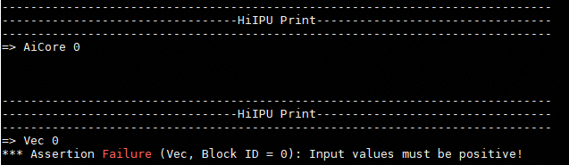
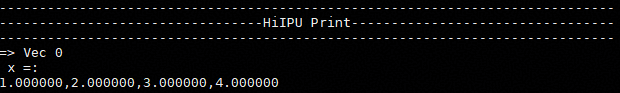
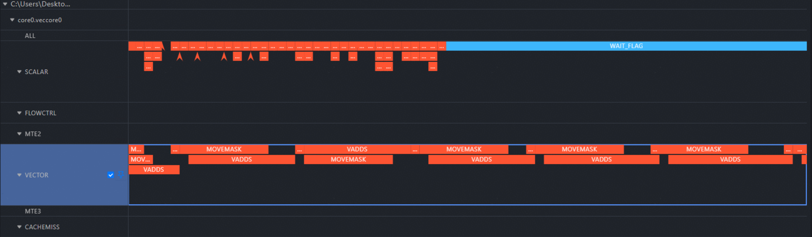

# Debugging and Tuning

## Debugging: DEBUG OP Class

During operator development and porting based on AscendNPU IR (for example, writing operators based on the Triton frontend and compiling and executing them based on AscendNPU IR), debugging is an indispensable step. To help developers locate issues at different abstraction levels, AscendNPU IR defines two types of core debugging operators:

- `PrintOp` at the hfusion layer: used during graph compilation and fusion to print intermediate computation results and tensor information.

- `DebugOp` at the hivm layer: used during execution at the lower-level HIVM layer to print intermediate computation results and tensor information.

The following sections introduce the interfaces and usage of these two types of debugging operators from the perspective of AscendNPU IR, and use the Triton frontend as an example to demonstrate how to inject and use these debugging capabilities throughout the operator development workflow.

### Introduction to AscendNPU IR Debug OPs

On the AscendNPU IR side, printing relies on the `cce::printf` interface provided by the BiSheng compiler. To enable printing, the following two conditions must be met:

1. The macro `__CCE_ENABLE_PRINT__` must be enabled (taking Triton as an example, this option is enabled via `export TRITON_DEVICE_PRINT=1`).
2. When compiling the AscendNPU IR meta OP library (the place where logical code is mapped to the corresponding hardware instructions), `--cce-enable-print` must be enabled (currently it is always enabled by default).

#### hfusion Layer Debugging: PrintOp

**Interface Description**:

```mlir
// hex: Whether to print all values in hexadecimal instead of decimal.
// %0: The tensor to be printed has a one-dimensional shape of size 8 and dtype=int64.
hfusion.print " x: " {hex = xxx} %0 : tensor<8xi64>
```

**Usage Description**:

You can explicitly add a `PrintOp` node during the hfusion Pass stage or when manually constructing the IR.

As shown below, when you want to print the result loaded by `load`, you can manually add `hfusion.print` to the IR at the hfusion stage to achieve this effect.

```mlir
func.func @vector_kernel(%arg0: memref<?xi8> {hacc.arg_type = #hacc.arg_type<sync_block_lock>}, %arg1: memref<?xi8> {hacc.arg_type = #hacc.arg_type<workspace>}, %arg2: memref<?xi64> {tt.divisibility = 16 : i32, tt.tensor_kind = 0 : i32}, %arg3: i32, %arg4: i32, %arg5: i32, %arg6: i32, %arg7: i32, %arg8: i32, %arg9: i32) attributes {SyncBlockLockArgIdx = 0 : i64, WorkspaceArgIdx = 1 : i64, hacc.entry, hacc.function_kind = #hacc.function_kind<DEVICE>, mix_mode = "aiv", parallel_mode = "simd"} {
  %reinterpret_cast = memref.reinterpret_cast %arg2 to offset: [0], sizes: [8], strides: [1] : memref<?xi64> to memref<8xi64, strided<[1]>>
  %alloc = memref.alloc() : memref<8xi64>
  memref.copy %reinterpret_cast, %alloc : memref<8xi64, strided<[1]>> to memref<8xi64>
  %0 = bufferization.to_tensor %alloc restrict writable : memref<8xi64>
  hfusion.print " x: " {hex = false} %0 : tensor<8xi64>
  return
}
```

#### hivm Layer Debugging: DebugOp

**Interface Description**:

```mlir
// debugtype: Indicates whether the current scenario is a print scenario or an assert scenario.
// hex: Whether to print all values in hexadecimal instead of decimal.
// prefix: The prefix printed before the values.
// tcoretype: Indicates whether the current debug op is executed on the cube core or the vector core.
// %0: The tensor to be printed, with a one-dimensional shape of size 8 and dtype=int64.
hivm.hir.debug {debugtype = "xxx", hex = xxx, prefix = " xxx: ", tcoretype = #hivm.tcore_type<xxx>} %0 : tensor<8xi64>
```

**Usage Description**:

You can explicitly add a Debug Op node during the hivm Pass phase or when manually constructing the IR.

As shown below: when we want to print the result loaded by `load`, we can manually add `hivm.hir.debug` to the IR at the hivm phase to achieve this effect.

```mlir
func.func @vector_kernel(%arg0: i64 {hacc.arg_type = #hacc.arg_type<ffts_base_address>}, %arg1: memref<?xi8> {hacc.arg_type = #hacc.arg_type<sync_block_lock>}, %arg2: memref<?xi8> {hacc.arg_type = #hacc.arg_type<workspace>}, %arg3: memref<?xi64> {tt.divisibility = 16 : i32, tt.tensor_kind = 0 : i32}, %arg4: i32, %arg5: i32, %arg6: i32, %arg7: i32) attributes {SyncBlockLockArgIdx = 0 : i64, WorkspaceArgIdx = 1 : i64, func_dyn_memref_args = dense<[false, true, true, true, false, false, false, false]> : vector<8xi1>, hacc.entry, hacc.function_kind = #hacc.function_kind<DEVICE>, mix_mode = "aiv", parallel_mode = "simd"} {
  %0 = arith.muli %arg5, %arg6 : i32
  %1 = arith.muli %0, %arg7 : i32
  annotation.mark %1 {logical_block_num} : i32
  %reinterpret_cast = memref.reinterpret_cast %arg3 to offset: [0], sizes: [8], strides: [1] : memref<?xi64> to memref<8xi64, strided<[1]>>
  %alloc = memref.alloc() : memref<8xi64>
  hivm.hir.load ins(%reinterpret_cast : memref<8xi64, strided<[1]>>) outs(%alloc : memref<8xi64>) init_out_buffer = false may_implicit_transpose_with_last_axis = false
  %2 = bufferization.to_tensor %alloc restrict writable : memref<8xi64>
  hivm.hir.debug {debugtype = "print", hex = false, prefix = " x: ", tcoretype = #hivm.tcore_type<CUBE_OR_VECTOR>} %2 : tensor<8xi64>
  return
}
```

### Triton Integration Description

Multiple ecosystem programming languages can interface with AscendNPU IR. This document uses Triton as an example; other approaches such as TileLang, FlagTree, DLCompiler, and TLE can be integrated by referring to Triton.

Currently, the Triton OPs related to debugging and tuning are mainly the following four types:

- `static_assert`: Compile-time static assertion
- `static_print`: Compile-time static printing
- `device_assert`: Runtime device assertion
- `device_print`: Runtime device printing

#### static_assert

**Interface Description**:

```python
# condition: bool - Boolean expression that can be evaluated at compile time.
# message: str - Optional. Message displayed when the assertion fails.
triton.language.static_assert(condition: bool, message: str = "") -> None
```

**Usage Example**:

You can run `python3 <file>.py` to verify the correctness of the function.

```python
import triton
import torch
import triton.language as tl

@triton.jit
def kernel_name(x_ptr, y_ptr, n_elements, BLOCK: tl.constexpr):
    tl.static_assert(BLOCK < 0, "BLOCK must > 0")
    pid = tl.program_id(0)
    offsets = pid * BLOCK + tl.arange(0, BLOCK)
    mask = offsets < n_elements
    x = tl.load(x_ptr + offsets, mask=mask)
    tl.store(y_ptr + offsets, x, mask=mask)

def vector(x, y):
    n = x.numel()
    grid = (triton.cdiv(n, 32),)
    kernel_name[grid](x, y, n, 32)

if __name__ == "__main__":
    x = torch.ones(8, device="npu")
    y = torch.empty_like(x)
    vector(x, y)
```

**Assertion Effect**:


#### static_print

**Interface Description**:

```python
# message: str - Message to print, which can contain compile-time constants.
triton.language.static_print(message: str) -> None
```

**Usage Example**:

You can run `python3 <file>.py` to verify the correctness of the function.

```python
import triton
import torch
import triton.language as tl

@triton.jit
def kernel_name(x_ptr, y_ptr, n_elements, BLOCK: tl.constexpr):
    tl.static_print(f" BLOCK = {BLOCK} ")
    pid = tl.program_id(0)
    offsets = pid * BLOCK + tl.arange(0, BLOCK)
    mask = offsets < n_elements
    x = tl.load(x_ptr + offsets, mask=mask)
    tl.store(y_ptr + offsets, x, mask=mask)

def vector(x, y):
    n = x.numel()
    grid = (triton.cdiv(n, 32),)
    kernel_name[grid](x, y, n, 32)

if __name__ == "__main__":
    x = torch.ones(8, device="npu")
    y = torch.empty_like(x)
    vector(x, y)
```

**Print Effect**:

```text
[warning]: tiling struct [GMMTilingData] is conflict with one in tiling grating tiling
BLOCK = 32
Dumping intermediate results to /root/.triton/dump/KHviKCdUEjStublnqGQietpeng6Sintejlr0t0SujtspD
```

#### device_assert

Note: To enable this feature, set the following environment variables in advance:

```bash
export TRITON_DEBUG=1
export TRITON_DEVICE_PRINT=1
```

**Interface Description**:

```python
# condition: bool - The condition to assert, which must be a boolean tensor.
# message: str - Optional. The message displayed when the assertion fails.

# Triton language interface.
triton.language.device_assert(condition: bool, message: str = "") -> None
```

**Usage Example**:

You can run `python3 <file>.py` to verify the correctness of the function.

```python
import triton
import torch
import triton.language as tl

@triton.jit
def assert_kernel(x_ptr, y_ptr, n_elements, BLOCK: tl.constexpr):
    pid = tl.program_id(0)
    offsets = pid * BLOCK + tl.arange(0, BLOCK)
    mask = offsets < n_elements
    x = tl.load(x_ptr + offsets, mask=mask)
    tl.device_assert(x > 0, "Input values must be positive!")
    tl.store(y_ptr + offsets, x, mask=mask)

def test_assert():
    x_valid = torch.tensor([1.0, 2.0, 3.0, 4.0], device="npu")
    y = torch.empty_like(x_valid)

    grid = (triton.cdiv(x_valid.numel(), 4),)
    assert_kernel[grid](x_valid, y, x_valid.numel(), 4)

    x_invalid = torch.tensor([1.0, -2.0, 3.0, 4.0], device="npu")
    assert_kernel[grid](x_invalid, y, x_invalid.numel(), 4)

if __name__ == "__main__":
    test_assert()
```

**Assertion Effect**:



#### device_print

Note: Before using this feature, set the environment variable `export TRITON_DEVICE_PRINT=1`.

**Interface Description**:

```python
# prefix: str - Prefix printed before the value. It must be a string.
# *args - Values to print. They can be any tensors or scalars.
# hex: bool - Whether to print all values in hexadecimal instead of decimal.

# Triton language interface.
triton.language.device_print(prefix, *args, hex=False) -> None
```

**Usage Example**:

You can run `python3 <file>.py` to verify the correctness of the function.

```python
import triton
import torch
import triton.language as tl

@triton.jit
def print_kernel(x_ptr, y_ptr, n_elements, BLOCK: tl.constexpr):
    pid = tl.program_id(0)
    offsets = pid * BLOCK + tl.arange(0, BLOCK)
    mask = offsets < n_elements
    x = tl.load(x_ptr + offsets, mask=mask)
    tl.device_print("x = ", x)
    tl.store(y_ptr + offsets, x, mask=mask)

def test_print():
    x_valid = torch.tensor([1.0, 2.0, 3.0, 4.0], device="npu")
    y = torch.empty_like(x_valid)

    grid = (triton.cdiv(x_valid.numel(), 4),)
    print_kernel[grid](x_valid, y, x_valid.numel(), 4)

if __name__ == "__main__":
    test_print()
```

**Printing Effect**:



## Debugging: Tool Classes

### mssanitizer

The command-line anomaly detection tool is used for Triton operator memory detection, race detection, uninitialized detection, and so on. Before using this feature, set the environment variable `export TRITON_ENABLE_SANITIZER=true`.

**Usage**:

```bash
# Directly launch the triton operator to run it.
mssanitizer python test.py
```

**Effect Demonstration**:

The following `triton add` example (in which `offsets` is incorrectly computed) demonstrates the detection effect of mssanitizer.

```python
import torch
import triton
import triton.language as tl

@triton.jit
def add_kernel(
    x_ptr,
    y_ptr,
    output_ptr,
    n_elements,
    BLOCK_SIZE: tl.constexpr,
):
    pid = tl.program_id(axis=0)
    block_start = pid * BLOCK_SIZE
    offsets = block_start + tl.arange(0, BLOCK_SIZE) - 10
    mask = offsets < n_elements
    x = tl.load(x_ptr + offsets, mask=mask)
    y = tl.load(y_ptr + offsets, mask=mask)
    output = x + y
    tl.store(output_ptr + offsets, output, mask=mask)

def add(x, y):
    output = torch.empty_like(x)
    n_elements = output.numel()
    BLOCK_SIZE = 1024
    grid = (triton.cdiv(n_elements, BLOCK_SIZE),)
    add_kernel[grid](
        x, y, output,
        n_elements,
        BLOCK_SIZE=BLOCK_SIZE
    )

    return output

if __name__ == "__main__":
    size = 1024
    x = torch.rand(size, device='npu:0')
    y = torch.rand(size, device='npu:0')
    output_triton = add(x, y)
```

Executing `mssanitizer python3 test_add.py` produces the following screen output. It can be seen that mssanitizer detects that, when execution reaches the `tl.load` node in the current `test_add.py` file, GM abnormally reads 40B (10 * float32) of space.


Note: For more information about mssanitizer detection, see [MindStudio Operator Development Tools](https://www.hiascend.com/document/detail/en/mindstudio/830/ODtools/Operatordevelopmenttools/atlasopdev_16_0039.html)

### msprof

The command-line model tuning tool is used to collect and parse performance data of Triton operators.

**Usage**:

```bash
# Whole-network on-board tuning
# --output - Storage path of the collected performance data. By default, the performance data is saved in the current directory.
# --application - Whole-network execution command
msprof --output=xxx --application=""

# Single-operator on-board tuning
# --output - Storage path of the collected performance data. By default, the performance data is saved in the current directory.
# --application - Single-operator execution command
# --kernel-name - Specifies the name of the operator to be collected. Fuzzy matching by operator name prefix is supported.
# --aic-metrics - Enables the collection of operator performance metrics and operator collection capability metrics (Roofline/Occupancy/MemoryDetail, etc.)
msprof op --output=xxx --application="" --kernel-name=xxx --aic-metrics=xxx

# Single-operator simulation tuning
# --core-id - Specifies the IDs of some logical cores to parse the simulation data of these cores
# --kernel-name - Specifies the name of the operator to be collected. Fuzzy matching by operator name prefix is supported.
# --soc-version - Specifies the simulator type
# --output - Storage path of the collected performance data. By default, the performance data is saved in the current directory.
msprof op simulator --core-id=xxx --kernel-name=xxx --soc-version=Ascendxxx --output=xxx
```

**Common performance analysis charts**:

- `trace.json`: Supports generating an instruction pipeline diagram on `chrome://tracing/`
    

- `visualize_data.bin`: Supports visualizing the execution of instructions on the Ascend AI Processor in Mind Studio Insight
    

Note: For more performance analysis charts, see [MindStudio Operator Development Tools](https://www.hiascend.com/document/detail/en/mindstudio/830/ODtools/Operatordevelopmenttools/atlasopdev_16_0136.html)

**Triton operator pipeline collection**:

Take the following `add kernel` as an example. To obtain the corresponding pipeline status:

```python
import torch
import triton
import triton.language as tl

@triton.jit
def add_kernel(
    x_ptr,
    y_ptr,
    output_ptr,
    n_elements,
    BLOCK_SIZE: tl.constexpr,
):
    pid = tl.program_id(axis=0)
    block_start = pid * BLOCK_SIZE
    offsets = block_start + tl.arange(0, BLOCK_SIZE)
    mask = offsets < n_elements
    x = tl.load(x_ptr + offsets, mask=mask)
    y = tl.load(y_ptr + offsets, mask=mask)
    output = x + y
    tl.store(output_ptr + offsets, output, mask=mask)

def add(x, y):
    output = torch.empty_like(x)
    n_elements = output.numel()
    BLOCK_SIZE = 1024
    grid = (triton.cdiv(n_elements, BLOCK_SIZE),)
    add_kernel[grid](
        x, y, output,
        n_elements,
        BLOCK_SIZE=BLOCK_SIZE
    )

    return output

if __name__ == "__main__":
    size = 1024
    x = torch.rand(size, device='npu:0')
    y = torch.rand(size, device='npu:0')
    output_triton = add(x, y)
```

Run `msprof op simulator --kernel-name="add_kernel" --soc-version=Ascend910B4 --core-id=0 --output=./ python3 test_add.py`. An `OPPROF` folder with a timestamp is generated in the current path.

Take the `visualize_data.bin` file under the simulator directory and open it with MindStudio Insight to obtain the pipeline chart corresponding to core 0. Both of the two commonly used performance pipeline charts described earlier (`trace.json/visualize_data.bin`) can be found in the `./OPPROF_<Timestamp>/simulator` directory.

