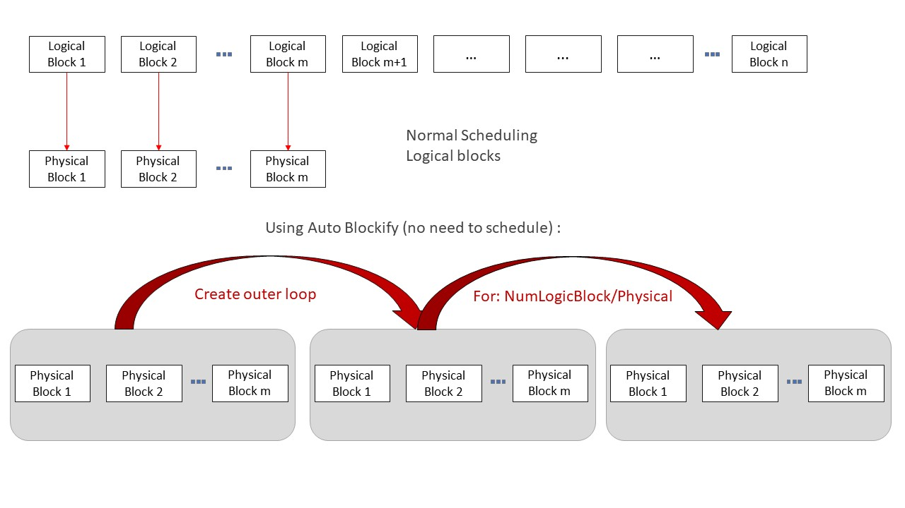

# 自动块化（Auto Blockify）

## 背景

**Auto Blockify** Pass 通过高效地将逻辑块映射到硬件物理块，对 Ascend 兼容算子的执行进行关键优化。在我们的架构中，高效调度对性能至关重要，因此当逻辑块与物理块进行一对一映射时，可以省去调度开销，从而提升性能。

根据我们在 AscendNPU IR 架构上的经验，可用物理块数量通常远少于计算所需的逻辑块数量（物理块 < 50，逻辑块可能达到 500+）。在这种 10 倍差距的场景下，加速效果可超过原始速度的两倍。

在运行 Triton 内核（通过 triton-ascend）时，**激活 Auto Blockify 逻辑**的方式是添加以下标志：`TRITON_ALL_PARALLEL`。

对于 AscendNPU-IR 用户，可在 bishengir-compile 命令中添加以下标志：`--enable-auto-blockify-loop`。



## 算法原理

Auto Blockify Pass（全名：AutoBlockifyParallelLoop）通过引入额外的循环层来变换 IR，具体逻辑如下：

```plaintext
for outer from 0,...,ceildiv(logical_block_dim, physical_block_dim)
    for inner from 0,...,physical_block_dim  <- 作为 block.idx 使用
        use(min(outer * physical_block_dim + inner, logical_block_dim))
```

### 逻辑说明

1. ​**原始调度**​：
    原始模式通常如下所示：

    ```plaintext
    block.idx = hivm.get_block_idx
    use(block.idx)
    -------等价于--------------
    for block.idx from 0,...,logical_block_num
        use(block.idx)
    ```

2. **使用 TRITON_ALL_PARALLEL 的示例**​：

    当用户在 triton adapter 中添加 TRITON_ALL_PARALLEL 标志时，内核将被限制为仅使用最大物理块数量启动（假设逻辑块数 > 物理块数）。因此执行被限制为：

    ```plaintext
    for block.idx from 0,...,physical_block_num   <- 来自 get_block_idx
        use(block.idx)
    ```

    仅有此逻辑是不完整的（部分索引会缺失），这正是需要 Auto Blockify Pass 来补全逻辑的原因——通过自动添加一层外部循环/块化来完善。

    （注：如果用户不通过 triton adapter，需要自行确保块维度的设置与上述一致。）

3. **使用 Auto Blockify 后的最终逻辑**​：

    ```plaintext
    for outer from 0,...,ceildiv(logical_block_dim, physical_block_dim)
        for inner from 0,...,physical_block_dim  <- 作为 block.idx 使用
            use(min(outer * physical_block_dim + inner, logical_block_dim))
    ```

### 接口说明

该功能通过 bishengir-compile 中的 `--enable-auto-blockify-loop` 标志控制，也可通过 bishengir-opt 的 `--auto-blockify-parallel-loop` 标志直接调用。

**使用要求** 要正确使用此功能，用户需注意以下几点：

1. Pass 获取逻辑块数量的方式是查找标有 `kLogicalBlockNumAttr` 属性（IR 中为 `logical_block_num`）的值，用户需确保该值可用，否则 Pass 调用时将失败。

2. Pass 还需要找到一个 `hivm get_block_idx` 操作，该操作返回从 0 到块维度的块索引。**使用 AutoBlockify 时**，用户需要在调用设备内核时修改块维度（以最大物理块维度启动，与上述算法一致），使得 blockidx 操作返回 0 到 physical_block_num 范围内的值。

#### Triton Adapter

该 Pass 已在 triton adapter 流水线中广泛使用。在此情况下正确使用 AutoBlockify 特性的方式是从前端（triton）通过 `TRITON_ALL_PARALLEL=1` 启用，该环境变量会同时完成准备工作（锁定块数量），然后自动以正确的标志调用相应的编译器命令。在 triton 流水线中有一个名为 `TritonGlobalKernelArgsToHIVMOpPass` 的 Pass，会自动确保存在标记了 `logical_block_num` 的值，并创建所需的 `get_block_idx` 操作。

输入示例：

```mlir
module attributes {dlti.target_system_spec = #dlti.target_system_spec<"NPU" : #hacc.target_device_spec<#dlti.dl_entry<"AI_CORE_COUNT", 20 : i32>, #dlti.dl_entry<"CUBE_CORE_COUNT", 20 : i32>, #dlti.dl_entry<"VECTOR_CORE_COUNT", 40 : i32>, #dlti.dl_entry<"UB_SIZE", 1572864 : i32>, #dlti.dl_entry<"L1_SIZE", 4194304 : i32>, #dlti.dl_entry<"L0A_SIZE", 524288 : i32>, #dlti.dl_entry<"L0B_SIZE", 524288 : i32>, #dlti.dl_entry<"L0C_SIZE", 1048576 : i32>, #dlti.dl_entry<"UB_ALIGN_SIZE", 256 : i32>, #dlti.dl_entry<"L1_ALIGN_SIZE", 256 : i32>, #dlti.dl_entry<"L0C_ALIGN_SIZE", 4096 : i32>>>, hivm.module_core_type = #hivm.module_core_type<AIV>} {
  func.func @add_kernel(%arg0: i64 {hacc.arg_type = #hacc.arg_type<ffts_base_address>}, %arg1: memref<?xi8> {hacc.arg_type = #hacc.arg_type<workspace>}, %arg2: memref<?xf32> {tt.divisibility = 16 : i32}, %arg3: memref<?xf32> {tt.divisibility = 16 : i32}, %arg4: memref<?xf32> {tt.divisibility = 16 : i32}, %arg5: i32 {tt.divisibility = 16 : i32}, %arg6: i32, %arg7: i32, %arg8: i32) attributes {WorkspaceArgIdx = 0 : i64, func_dyn_memref_args = dense<[false, true, true, true, true, false, false, false, false]> : vector<9xi1>, hacc.entry, hacc.function_kind = #hacc.function_kind<DEVICE>, hivm.func_core_type = #hivm.func_core_type<AIV>} {
    %c1024 = arith.constant 1024 : index
    %c1024_i32 = arith.constant 1024 : i32
    %c0 = arith.constant 0 : index
    hivm.hir.set_mask_norm
    %0 = arith.muli %arg6, %arg7 : i32
    %1 = arith.muli %0, %arg8 : i32
    annotation.mark %1 {logical_block_num} : i32 // 此 logical_block_num 是原始的大数值
    %2 = hivm.hir.get_block_idx -> i64   // for block.idx from 0,...,block_num
    %3 = arith.trunci %2 : i64 to i32
    %4 = arith.muli %arg8, %arg7 : i32
    %5 = arith.divsi %3, %4 : i32
    %6 = arith.remsi %5, %arg6 : i32
    %7 = arith.muli %6, %c1024_i32 : i32
    %8 = arith.index_cast %7 : i32 to index
    %reinterpret_cast = memref.reinterpret_cast %arg2 to offset: [%8], sizes: [1024], strides: [1] : memref<?xf32> to memref<1024xf32, strided<[1], offset: ?>>
    %alloc = memref.alloc() : memref<1024xf32>
    %9 = arith.addi %8, %c1024 : index
    %10 = arith.index_cast %arg5 : i32 to index
    %11 = arith.maxsi %8, %10 : index
    %12 = arith.minsi %9, %11 : index
    %13 = arith.subi %12, %8 : index
    %subview = memref.subview %reinterpret_cast[0] [%13] [1] : memref<1024xf32, strided<[1], offset: ?>> to memref<?xf32, strided<[1], offset: ?>>
    %subview_0 = memref.subview %alloc[0] [%13] [1] : memref<1024xf32> to memref<?xf32, strided<[1]>>
    hivm.hir.load ins(%subview : memref<?xf32, strided<[1], offset: ?>>) outs(%subview_0 : memref<?xf32, strided<[1]>>) left_padding_num = %c0 : index init_out_buffer = false
    %14 = bufferization.to_tensor %alloc restrict writable : memref<1024xf32>
    %reinterpret_cast_1 = memref.reinterpret_cast %arg3 to offset: [%8], sizes: [1024], strides: [1] : memref<?xf32> to memref<1024xf32, strided<[1], offset: ?>>
    %alloc_2 = memref.alloc() : memref<1024xf32>
    %subview_3 = memref.subview %reinterpret_cast_1[0] [%13] [1] : memref<1024xf32, strided<[1], offset: ?>> to memref<?xf32, strided<[1], offset: ?>>
    %subview_4 = memref.subview %alloc_2[0] [%13] [1] : memref<1024xf32> to memref<?xf32, strided<[1]>>
    hivm.hir.load ins(%subview_3 : memref<?xf32, strided<[1], offset: ?>>) outs(%subview_4 : memref<?xf32, strided<[1]>>) left_padding_num = %c0 : index init_out_buffer = false
    %15 = bufferization.to_tensor %alloc_2 restrict writable : memref<1024xf32>
    %16 = tensor.empty() : tensor<1024xf32>
    %17 = hivm.hir.vadd ins(%14, %15 : tensor<1024xf32>, tensor<1024xf32>) outs(%16 : tensor<1024xf32>) -> tensor<1024xf32>
    %reinterpret_cast_5 = memref.reinterpret_cast %arg4 to offset: [%8], sizes: [1024], strides: [1] : memref<?xf32> to memref<1024xf32, strided<[1], offset: ?>>
    %extracted_slice = tensor.extract_slice %17[0] [%13] [1] : tensor<1024xf32> to tensor<?xf32>
    %subview_6 = memref.subview %reinterpret_cast_5[0] [%13] [1] : memref<1024xf32, strided<[1], offset: ?>> to memref<?xf32, strided<[1], offset: ?>>
    hivm.hir.store ins(%extracted_slice : tensor<?xf32>) outs(%subview_6 : memref<?xf32, strided<[1], offset: ?>>)
    return
  }
}
```

输出示例：

```mlir
module attributes {dlti.target_system_spec = #dlti.target_system_spec<"NPU" : #hacc.target_device_spec<#dlti.dl_entry<"AI_CORE_COUNT", 20 : i32>, #dlti.dl_entry<"CUBE_CORE_COUNT", 20 : i32>, #dlti.dl_entry<"VECTOR_CORE_COUNT", 40 : i32>, #dlti.dl_entry<"UB_SIZE", 1572864 : i32>, #dlti.dl_entry<"L1_SIZE", 4194304 : i32>, #dlti.dl_entry<"L0A_SIZE", 524288 : i32>, #dlti.dl_entry<"L0B_SIZE", 524288 : i32>, #dlti.dl_entry<"L0C_SIZE", 1048576 : i32>, #dlti.dl_entry<"UB_ALIGN_SIZE", 256 : i32>, #dlti.dl_entry<"L1_ALIGN_SIZE", 256 : i32>, #dlti.dl_entry<"L0C_ALIGN_SIZE", 4096 : i32>>>, hivm.module_core_type = #hivm.module_core_type<AIV>} {
  func.func @add_kernel(%arg0: i64 {hacc.arg_type = #hacc.arg_type<ffts_base_address>}, %arg1: memref<?xi8> {hacc.arg_type = #hacc.arg_type<workspace>}, %arg2: memref<?xf32> {tt.divisibility = 16 : i32}, %arg3: memref<?xf32> {tt.divisibility = 16 : i32}, %arg4: memref<?xf32> {tt.divisibility = 16 : i32}, %arg5: i32 {tt.divisibility = 16 : i32}, %arg6: i32, %arg7: i32, %arg8: i32) attributes {WorkspaceArgIdx = 0 : i64, func_dyn_memref_args = dense<[false, true, true, true, true, false, false, false, false]> : vector<9xi1>, hacc.entry, hacc.function_kind = #hacc.function_kind<DEVICE>, hivm.func_core_type = #hivm.func_core_type<AIV>} {
    %0 = arith.muli %arg6, %arg7 : i32
    %1 = arith.muli %0, %arg8 : i32
    annotation.mark %1 {logical_block_num} : i32  // 此 logical_block_num 是原始的大数值
    %c0_i32 = arith.constant 0 : i32
    %c40_i32 = arith.constant 40 : i32 // 40 为此处的物理块数
    %2 = arith.ceildivsi %1, %c40_i32 : i32 // ceildiv(logical_block_num, physical_block_dim)
    %c1_i32 = arith.constant 1 : i32
    scf.for %arg9 = %c0_i32 to %2 step %c1_i32  : i32 { // 外层循环
      %c1024 = arith.constant 1024 : index
      %c1024_i32 = arith.constant 1024 : i32
      %c0 = arith.constant 0 : index
      hivm.hir.set_mask_norm
      %3 = hivm.hir.get_block_idx -> i64 // 内层循环（锁定到物理块）
      %4 = arith.trunci %3 : i64 to i32
      %5 = arith.muli %arg9, %c40_i32 : i32 // outer_i * physical_block_num
      %6 = arith.addi %5, %4 : i32 // outer_i * physical_block_num + inner
      %7 = arith.minsi %6, %1 : i32 // (min(outer*physical_block_dim + inner, logical_block_num))
      %8 = arith.extsi %7 : i32 to i64
      %9 = arith.trunci %8 : i64 to i32
      %10 = arith.muli %arg8, %arg7 : i32
      %11 = arith.divsi %9, %10 : i32
      %12 = arith.remsi %11, %arg6 : i32
      %13 = arith.muli %12, %c1024_i32 : i32
      %14 = arith.index_cast %13 : i32 to index
      %reinterpret_cast = memref.reinterpret_cast %arg2 to offset: [%14], sizes: [1024], strides: [1] : memref<?xf32> to memref<1024xf32, strided<[1], offset: ?>>
      %alloc = memref.alloc() : memref<1024xf32>
      %15 = arith.addi %14, %c1024 : index
      %16 = arith.index_cast %arg5 : i32 to index
      %17 = arith.maxsi %14, %16 : index
      %18 = arith.minsi %15, %17 : index
      %19 = arith.subi %18, %14 : index
      %subview = memref.subview %reinterpret_cast[0] [%19] [1] : memref<1024xf32, strided<[1], offset: ?>> to memref<?xf32, strided<[1], offset: ?>>
      %subview_0 = memref.subview %alloc[0] [%19] [1] : memref<1024xf32> to memref<?xf32, strided<[1]>>
      hivm.hir.load ins(%subview : memref<?xf32, strided<[1], offset: ?>>) outs(%subview_0 : memref<?xf32, strided<[1]>>) left_padding_num = %c0 : index
      %20 = bufferization.to_tensor %alloc restrict writable : memref<1024xf32>
      %reinterpret_cast_1 = memref.reinterpret_cast %arg3 to offset: [%14], sizes: [1024], strides: [1] : memref<?xf32> to memref<1024xf32, strided<[1], offset: ?>>
      %alloc_2 = memref.alloc() : memref<1024xf32>
      %subview_3 = memref.subview %reinterpret_cast_1[0] [%19] [1] : memref<1024xf32, strided<[1], offset: ?>> to memref<?xf32, strided<[1], offset: ?>>
      %subview_4 = memref.subview %alloc_2[0] [%19] [1] : memref<1024xf32> to memref<?xf32, strided<[1]>>
      hivm.hir.load ins(%subview_3 : memref<?xf32, strided<[1], offset: ?>>) outs(%subview_4 : memref<?xf32, strided<[1]>>) left_padding_num = %c0 : index
      %21 = bufferization.to_tensor %alloc_2 restrict writable : memref<1024xf32>
      %22 = tensor.empty() : tensor<1024xf32>
      %23 = hivm.hir.vadd ins(%20, %21 : tensor<1024xf32>, tensor<1024xf32>) outs(%22 : tensor<1024xf32>) -> tensor<1024xf32>
      %reinterpret_cast_5 = memref.reinterpret_cast %arg4 to offset: [%14], sizes: [1024], strides: [1] : memref<?xf32> to memref<1024xf32, strided<[1], offset: ?>>
      %extracted_slice = tensor.extract_slice %23[0] [%19] [1] : tensor<1024xf32> to tensor<?xf32>
      %subview_6 = memref.subview %reinterpret_cast_5[0] [%19] [1] : memref<1024xf32, strided<[1], offset: ?>> to memref<?xf32, strided<[1], offset: ?>>
      hivm.hir.store ins(%extracted_slice : tensor<?xf32>) outs(%subview_6 : memref<?xf32, strided<[1], offset: ?>>)
    }
    return
  }
}
```

## 约束

1. ​**可并行性**​：
   Auto Blockify 算法仅适用于完全可并行的代码。这意味着各逻辑块的计算与访问必须可以安全地并行执行，块间不存在依赖关系。

2. ​**使用场景**​：
   若逻辑块数量非常小，则此 Pass 不会带来任何优势。
