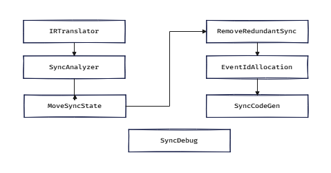

# 自动同步（Auto-Sync）

Auto-Sync 是 AscendNPU-IR（HIVM）编译器的自动同步插入功能，用于自动为共享数据或资源的生产者与消费者插入同步操作，确保正确的执行顺序。设计目标：**正确性**（避免数据竞争和顺序错误）与**最小开销**（仅插入必要的同步，安全时复用硬件事件）。

---

## 硬件背景

### AICore 架构

<https://www.hiascend.com/document/detail/zh/CANNCommunityEdition/83RC1/opdevg/Ascendcopdevg/atlas_ascendc_10_0008.html>

---

### HIVM 同步操作

同步操作定义于 `HIVMIR/HIVMSynchronizationOps.td`。以下从 **MLIR 使用角度**（操作数/属性）进行描述，而非汇编语法。

#### 核内同步（Normal-Sync）

- **`hivm.set_flag`**
  操作数/属性：`set_pipe`、`wait_pipe` 和 `flag_id`
  在 `set_pipe` 上执行：等该 pipe 上所有前序指令执行完毕后再执行。
  执行时触发 `flag_id`

- **`hivm.wait_flag`**
  操作数/属性：`set_pipe`、`wait_pipe` 和 `flag_id`
  在 `wait_pipe` 上执行
  阻塞其后所有指令，直到 `flag_id` 被触发

- **`hivm.pipe_barrier`**
  操作数/属性：`pipe`
  对指定 pipe 的屏障操作。
  阻塞 `pipe` 上的所有后续指令，直到所有前序指令执行完毕

#### 跨核同步（Block-Sync，块内）

- **`hivm.sync_block_set`**
  操作数/属性：
  - `tcore_type`：目标核类型（vector/cube）
  - `tpipe`、`pipe`：目标核上的 set/wait pipe
  - `sync_instr_mode`（默认 `INTRA_BLOCK_SYNCHRONIZATION`）
  - `event_id`

  在目标核的 `tpipe`（set_pipe）上执行：等同一核的 core.pipe 上所有前序指令执行完毕后再执行。
  设置 `event_id`

- **`hivm.sync_block_wait`**
  操作数/属性：
  - `tcore_type`：目标核类型（vector/cube）
  - `tpipe`、`pipe`：目标核上的 set/wait pipe
  - `sync_instr_mode`（默认 `INTRA_BLOCK_SYNCHRONIZATION`）
  - `event_id`

  在 `pipe`（pipe_wait）上执行：阻塞目标核 `tcore_type` 的 `pipe` 上所有后续指令，直到所有前序指令执行完毕。

---

## 算法原理

### AutoSync 解决方案概述

代码库提供 **两种** Auto-Sync 解决方案：

- **`Inject-Sync/Inject-Block-Sync`** Passes
  使用多个 Pass 插入所需同步操作、移除冗余同步，并使用活跃性分析分配 flag ID/event ID。它是默认启用的主要方案。

- **`Graph-Sync-Solver/Cross-Core-GSS`** Passes
  使用基于图的算法分析输入代码结构并插入所需同步操作。它仍是可选功能，可通过 `-hivm-enable-graph-sync-solver=true`（或 Triton-Ascend 中 `sync_solver=True`）启用。

---

### InjectSync

**目的：** 使用内存依赖分析、同步分析、event-id 分配以及冗余同步清理（移动/删除冗余同步）在核内插入同步（`set_flag` / `wait_flag`）。

**源码**：

- 头文件：`include/../InjectSync/`
- 实现：`lib/../InjectSync/`（例如 `InjectSync.cpp`、`MemoryDependentAnalyzer.cpp`、`SyncAnalysis.cpp`、`SyncEventIdAllocation.cpp`、`IRTranslator.cpp`、`SyncCodegen.cpp`、`MoveSyncState.cpp`、`RemoveRedundantSync.cpp`、`SyncCommon.cpp`）

**执行阶段**：

1. **IRTranslator：**
   从输入函数构建 Sync-IR（复合元素、循环、条件、内存操作）。
2. **SyncAnalyzer：**
   对每对冲突操作，插入一对 set_flag/wait_flag；若两操作属于同一 pipe，则插入 barrier(pipe)。
3. **MoveSyncState：**
   在保持语义的前提下，重新定位同步操作以减少停顿。
4. **RemoveRedundantSync：**
   删除冗余同步对。
5. **SyncEventIdAllocation：**
   分配静态或动态 event IDs；在安全时进行复用。
6. **SyncCodegen：**
   生成 `hivm.set_flag` / `hivm.wait_flag` / `hivm.barrier`

---

### InjectBlockSync

**目的：** 为 **MIX** 内核（cube 和 vector）插入块级（块内）跨核同步操作：`sync_block_set`、`sync_block_wait`。

**源码：** `InjectBlockSync.cpp` `InjectBlockSync.h`

**行为**：

- 仅在 **MIX** 内核（非 host、非纯 AIC/AIV）上运行。
- 当内核参数中存在 FFTS 基址时，插入 `SetFFTSBaseAddrOp`。
- 三种模式（由选项和融合类型控制）：
  - **InjectAllBlockSync** — 在每个 `LoadOp` 和 `StoreOp`（cube/vector 交接处）前后插入块同步。
  - **InjectBlockMixSync** — 完整 mix：通过 `SyncBlockIRTranslator` 构建块同步 IR，然后依次执行 SyncAnalyzer（BLOCKSYNC 模式）、MoveSyncState、RemoveRedundantSync、SyncEventIdAllocation、SyncCodegen。

---

### GraphSyncSolver

**目的：** 作为 Inject-Sync 方案的替代方案；使用基于图的算法判断何时插入 set/wait 成对操作，并分配 event IDs。

**源码**：

- 头文件：`include/../GraphSyncSolver/`
- 实现：`lib/../GraphSyncSolver/`（`GraphSyncSolver.cpp`、`SyncSolver.cpp`、`SyncSolverIR.cpp`、`SyncSolverIRTranslator.cpp`、`SyncSolverCodeGen.cpp`、`GraphSolver.cpp`、`EventIdSolver.cpp`、`Utility.cpp`、`SyncSolverTest.cpp`、`SyncSolverTester.cpp`）

**执行阶段**：

1. **IRTranslator：**
   从输入函数构建 Sync-IR（函数、作用域、循环、条件、读写操作）。
2. **Solver：**
   收集冲突对（生产者–消费者对），执行对选择与排序；可选地复用冲突对以节省 event IDs。
3. **CodeGenerator：**
   将求解结果转换回 MLIR：生成 `hivm.set_flag` / `hivm.wait_flag` / `hivm.barrier`

---

### CrossCoreGSS

**目的：** 为 **MIX** 内核（cube 和 vector）插入块级（块内）跨核同步操作：`sync_block_set`、`sync_block_wait`。

**源码：** `CrossCoreGSS.h` `CrossCoreGSS.cpp`；复用 GraphSyncSolver 中的 `IRTranslator`、`Solver` 和 `CodeGenerator`。

**工作原理**：

- 与核内 GSS Pass 相同，但它处理跨核内存操作。

---

## 接口说明

### 命令行选项

这些通常在编译器驱动中接入（例如 `bishengir-hivm-compile`）；具体映射关系请参见 `Passes.td` 以及 `bishengir/lib/Tools/` 下的工具。

<table>
  <thead>
    <tr>
      <th style="white-space: nowrap;">标志</th>
      <th>类型</th>
      <th>默认值</th>
      <th>说明</th>
    </tr>
  </thead>
  <tbody>
    <tr>
      <td style="white-space: nowrap;">`--disable-auto-inject-block-sync`</td>
      <td>bool</td>
      <td>false</td>
      <td>禁用自动块级 set/wait 插入（InjectBlockSync / CrossCoreGSS）。</td>
    </tr>
    <tr>
      <td style="white-space: nowrap;">`--disable-hivm-auto-inject-sync`</td>
      <td>bool</td>
      <td>false</td>
      <td>禁用 InjectSync（核内同步）。</td>
    </tr>
    <tr>
      <td style="white-space: nowrap;">`--enable-hivm-inject-barrier-all-sync`</td>
      <td>bool</td>
      <td>false</td>
      <td>使 InjectSync 插入 barrier(all) 指令（在自动同步失败时有用）</td>
    </tr>
    <tr>
      <td style="white-space: nowrap;">`--enable-hivm-inject-block-all-sync`</td>
      <td>bool</td>
      <td>false</td>
      <td>使 InjectBlockSync 插入 block(all) 指令（在自动同步失败时有用）</td>
    </tr>
    <tr>
      <td style="white-space: nowrap;">`--enable-hivm-unit-flag-sync`</td>
      <td>bool</td>
      <td>false</td>
      <td>启用 unit-flag 同步特性。</td>
    </tr>
    <tr>
      <td style="white-space: nowrap;">`--enable-hivm-graph-sync-solver`</td>
      <td>bool</td>
      <td>false</td>
      <td>使用 GraphSyncSolver/CrossCoreGSS 替代 InjectSync/InjectBlockSync 进行核内/跨核自动同步。</td>
    </tr>
  </tbody>
</table>

---

## 约束与能力

- **硬件顺序模型：** Auto-Sync 通过插入 HIVM 同步操作（`hivm.set_flag` / `hivm.wait_flag`、`hivm.pipe_barrier`，以及（如适用）`hivm.sync_block_set` / `hivm.sync_block_wait`）来组织执行顺序。该顺序用 **cores** 与 **pipes**，以及 event/flag id 来表示。
- **正确性基于可行性校验：** 对于求解器流程（Graph Sync Solver），只有当候选同步约束在基于图的可达性/顺序模型下仍保持可行时才会接受（避免死锁或过度约束导致调度失败）。
- **块级同步覆盖范围：** 跨核块级同步（`sync_block_set` / `sync_block_wait`）面向 **MIX** 内核（cube/vector handoff）；在非 MIX 流程（host 或纯 AIC/AIV）中不会应用 InjectBlockSync/CrossCoreGSS。
- **可选功能模式：** 当支持的操作具备适用条件时，可启用 unit-flag 同步作为替代方案；也可以通过编译选项选择基于图的求解器，而不是使用 InjectSync/InjectBlockSync。
- **验证需求：** 检查生成的操作是否满足方言验证规范；`set_flag` / `wait_flag` 必须共享相同的 event/flag id，并且 core/pipe 端点兼容。

---
