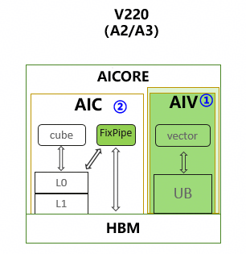

# Cube-Vector优化总览

## 1. 硬件背景

本文档从宏观角度介绍 AscendNPU IR 中 Cube-Vector（CV）优化的整体流程。CV 优化面向 Ascend 910B 等 NPU 硬件，针对 **Cube**（矩阵乘单元）和 **Vector**（向量运算单元）两类核心的协同工作，在 HIVM（华为中间表示虚拟机）层进行一系列变换，以提升混合内核（Mix Kernel）的执行效率。

### 1.1 术语与背景知识（阅读前必读）

以下术语在 CV 文档中反复出现，建议先建立基本概念后再阅读各 pass 细节。

| 术语 | 含义 | 补充说明 |
|------|------|----------|
| **HIVM** | Huawei Intermediate Virtual Machine，华为中间表示虚拟机 | AscendNPU IR 中的一种 dialect，承载面向 NPU 的算子（如 mmadL1、fixpipe、vadd）与控制流。 |
| **IR** | Intermediate Representation，中间表示 | 编译器在源码与机器码之间的抽象表示。本仓库使用 MLIR（Multi-Level IR），IR 以 SSA 形式组织。 |
| **Bufferization** | 将 tensor 抽象转换为具体内存（memref）的过程 | 在「预 bufferization」阶段，IR 仍以 **tensor** 为主（逻辑多维数组）；bufferization 之后会引入 **memref**（带地址/布局的内存引用）。CV 中多数 pass 在预 bufferization 阶段运行，因此文档中常见「tensor.empty」「tensor 的 slice」等表述。 |
| **tensor vs memref** | tensor：逻辑多维数组，无显式地址；memref：有基址、步长、形状的内存区域 | 在 CV 流程中，fixpipe 的「输出」常先以 tensor 表示，后续通过 workspace（memref）或 bufferization 落到具体内存。 |
| **Workspace** | 运行时在 GM 上分配的一块连续内存，作为 kernel 参数传入 | 用于存放 Cube-Vector 之间的中间结果（如 fixpipe 输出）。多个中间 buffer 可在同一块 workspace 上按**偏移**分配，由 PlanMemory 计算偏移，从而复用一块大 buffer，减少总占用。 |
| **Liveness** | 某个 buffer 从「被定义/首次使用」到「最后一次使用」的生命周期 | PlanMemory 根据 liveness 判断两个 buffer 是否可能同时存活；若不重叠，可分配相同基址、不同偏移，实现复用。 |
| **Inplace** | 操作的输出直接写在输入的存储位置上，复用同一块 buffer | 例如 vcast 从 f16 转到 i16（等宽），输出可覆盖输入，减少 alloc。PlanMemory 会识别可 inplace 的 op 并做相应偏移分配。 |
| **AIC / AIV** | AIC：以 **C**ube 为主的子内核；AIV：以 **V**ector 为主的子内核 | Mix 内核拆分后，AIC 主要在 Cube 核心执行，AIV 主要在 Vector 核心执行；二者通过 fixpipe、DMA 等传递数据，由 host 或调度器协调调用顺序。 |
| **Host / Device** | Host：在 CPU 上运行；Device：在 NPU 上运行 | Mix 内核属于 device 侧；文档中「Mix 只能被 host 调用」指：从 host 发起的 kernel 调用里，可以调用 mix entry，而 device 上的另一个 kernel 不能直接 call 一个 mix 函数（当前约定）。 |
| **CC / CV / VC / VV** | 两个字母分别表示「前一段计算单元」和「后一段计算单元」：C=Cube，V=Vector | 例如 CV 表示 Cube 算完经 fixpipe/load 后接 Vector 运算；CC 表示两段 Cube 之间通过 fixpipe+load 衔接。用于描述 InsertWorkSpaceForMixCV 的匹配模式。 |

**关于「预 bufferization」与「后 bufferization」**：  
CV 相关 pass 多数在 **预 bufferization** 阶段（`hivmPreBufferizationOptimizationPipeline`）执行，此时 IR 仍是 tensor 为主、带 `scf.for` 等控制流。Bufferization 会把 tensor 转为 memref 并决定物理布局；在此之后还有 **后 bufferization** 阶段的优化（如另一轮 PlanMemory 针对 `memref.alloc`）。理解「先做 CV 结构变换，再做内存具体化」有助于理解 pass 顺序。

### 1.2 芯片架构

Ascend 910B NPU 采用异构计算架构，主要包含：

| 组件 | 说明 | 典型规格（910B1） |
|------|------|-------------------|
| **Cube** | 矩阵乘单元，执行 `mmadL1`、`batchMmadL1` 等矩阵运算 | 24 个 AI Core |
| **Vector** | 向量运算单元，执行 `vadd`、`vcast`、`vreduce` 等向量运算 | 48 个 AI Core |
| **L0C** | Cube 输出缓冲，存放矩阵乘结果 | 128KB |
| **L0A/L0B** | Cube 输入缓冲 | 64KB |
| **UB** | 统一缓冲，Vector 运算主存 |256KB |
| **GM** | 全局内存 | 外部 DDR |

**fixpipe** 是 Cube 与 Vector 之间的数据搬运通道，昇腾芯片的 **Cube**和**Vector**底层架构是分离的。对于不同版本的芯片来说，存在不同的交互通路。例如对于910系列来说， Cube 计算完成后，通过 fixpipe 将结果从 L0C 搬运到 GM，供后续 Vector 运算使用。在 IR 中体现为 `hivm.hir.fixpipe` 算子；硬件上对应专门的 L0C→UB 数据通路，可同时完成类型转换、量化等（由 fixpipe 的 `pre_quant`、`pre_relu` 等属性控制）。910系列的芯片架构如下


---
## 2. 算法原理 

### 2.1 createNormalizeMatmulPass

- **作用**：规范化 `hivm.hir.mmadL1`、`hivm.hir.batchMmadL1` 的 M/K/N 维度、init 条件及 per-channel add 形式
- **目的**：统一 matmul 的 IR 形态，便于后续 fixpipe 插入、tiling 等 pass 匹配与变换
- **典型变换**：将 vbrc + vadd 形式的 bias 内联进 mmadL1 的 init；提取真实 M/K/N 并替换常量；处理 PerChannel 场景
- **典型场景**： elementwise累加

before:
```
%2 = ops // not 0 const
%3 = hivm.hir.mmadL1 ins(*)
       outs(%2 : tensor<16x32xf32>) -> tensor<16x32xf32>
```
after
```
%2 = ops
%3 = tensor.empty() : tensor<16x32xf32>
%4 = hivm.hir.mmadL1 ins(*)
        outs(%3 : tensor<16x32xf32>) -> tensor<16x32xf32>
%5 = hivm.hir.vadd ins(%2, %4: tensor<1x32xf32>) outs(%2 : tensor<16x32xf32>)
```

### 2.2 createInlineFixpipePass

- **作用**：在 mmadL1/batchMmadL1 与 store 之间插入 `hivm.hir.fixpipe`，将 store+vcast 等合并进 fixpipe 的量化/激活选项
- **目的**：显式表达 Cube 到 Vector 的数据搬运，使后续 workspace 分配、load/store 插入有明确插入点
- **典型变换**：在 mmadL1 结果到 store 的 use 链上插入 fixpipe；将 vcast(f32->f16) 等融合为 fixpipe 的 `pre_quant = F322F16`。
- **典型场景**： 纯 Cube 到 Store

before:
```
mmadL1 -> store
```
after
```
mmadL1 -> fixpipe
```
InlineFixpipe 负责插入 fixpipe, 站在新增的fixpipe的基础上，尝试inline op,如hivm.vcast/hivm.vrelu/hivm.store。

### 2.3 createTileBatchMMIntoLoopPass

- **作用**：将 `hivm.hir.batchMmadL1` 沿 batch 维度展开为 `scf.for` 循环，每次迭代执行单次 `mmadL1` 和 fixpipe
- **目的**：将 batch 维拆成循环，使 load/fixpipe/store 等可以按 batch 索引访问，便于 workspace 管理和流水
- **典型变换**：TileBatchMMIntoLoop 将 batchMmadL1 展开为循环

before:
```
batchmmadL1 a : [batch, m ,k], b[batch, k, n]
fixpipe workspace : [batch, m, n]
```
after
```
for batch_idx in range(batch):
  mmadL1(extract_slice(a), extract_slice(b))
  fixpipe(extract_slice(workspace))
```

### 2.4 createInsertLoadStoreForMixCVPass
- **作用**：在 Cube-Vector 交汇处插入 load/store，使数据在 tensor 与 全局workspace 间正确流转
- **目的**：保证CV之间数据的正确传递
- **典型变换**：batchMmadL1 + fixpipe 被改写为循环内的 mmadL1 + fixpipe，对输入/输出做 extract_slice / insert_slice
- **典型场景**：Cube-Vector 混合（CV 模式）

before:
```
mmadL1
fixpipe
vadd
```
after
```
mmadL1
fixpipe
load
vadd
```

### 2.5 createInsertWorkSpaceForMixCVPass

- **作用**：在 Cube-Vector 交汇点（CC/CV/VC/VV）用 `memref_ext.alloc_workspace` 替换 `tensor.empty`
- **目的**：将 fixpipe 输出、store 输出等中间 buffer 改为从全局 workspace 分配，实现跨迭代、跨核共享
- **匹配模式**：CC（mmadL1→fixpipe→load→mmadL1）、CV（mmadL1→fixpipe→load→vector）、VC（vector→store→load→mmadL1）、VV（vector→store→load→vector）
- **典型场景**：Cube-Vector 混合（CV 模式）

before：
```
%1 = mmadL1
%2 = tensor.empty() 
%3 = fixpipe ins(%1) outs(%2)
%4 = load ins(%3)
vadd (%4)
```
after：
```
%1 = mmadL1
%2 = memref_ext.alloc_workspace()
%3 =  bufferization.to_tensor(%2)
%4 = fixpipe ins(%1) outs(%3)
%5 = load ins(%4)
vadd (%5)
```
---
### 2.6 createBindWorkSpaceArgPass

- **作用**：将函数内的 `memref_ext.alloc_workspace` 绑定到函数的 workspace 参数（`hacc.arg_type = #hacc.arg_type<workspace>`）
- **目的**：统一 workspace 来源，使运行时通过参数传入 workspace 指针，实现多 kernel 共享一块 workspace
- **前置条件**：函数需有 workspace 参数；InsertWorkSpaceForMixCV 已插入 alloc_workspace
- **典型场景**：Cube-Vector 混合（CV 模式）

before：
```
func.func @bind_workspace_arg(
              %arg0: i64 {hacc.arg_type = #hacc.arg_type<ffts_base_address>},
              %arg1: memref<?xi8> {hacc.arg_type = #hacc.arg_type<workspace>}){
  memref_ext.alloc_workspace() : memref<100xi32>
  return
}
```
after：
```
func.func @bind_workspace_arg(
              %arg0: i64 {hacc.arg_type = #hacc.arg_type<ffts_base_address>},
              %arg1: memref<?xi8> {hacc.arg_type = #hacc.arg_type<workspace>}){
  memref_ext.alloc_workspace() from %arg1 : memref<100xi32>
  return
}
```

### 2.7 createPlanMemoryPass

- **作用**：在 `GLOBAL_WORKSPACE_PLAN` 模式下，对 `memref_ext.alloc_workspace` 进行内存规划，将 alloc 替换为 `hivm.hir.pointer_cast` + 偏移
- **目的**：在给定 workspace 基址上，按 liveness 与 inplace 规则分配偏移，最大化复用、减少总 workspace 大小
- **典型变换**：多个 alloc_workspace 被映射到同一块 workspace 的不同偏移；冲突的 buffer 分配不同偏移

before：
```
func.func @bind_workspace_arg(
              %arg0: i64 {hacc.arg_type = #hacc.arg_type<ffts_base_address>},
              %arg1: memref<?xi8> {hacc.arg_type = #hacc.arg_type<workspace>}){
  memref_ext.alloc_workspace() from %arg1 : memref<100xi32>
  return
}
```
after：
```
func.func @bind_workspace_arg(
              %arg0: i64 {hacc.arg_type = #hacc.arg_type<ffts_base_address>},
              %arg1: memref<?xi8> {hacc.arg_type = #hacc.arg_type<workspace>}){
  memref_ext.alloc_workspace() from %arg1 offset=[0] : memref<100xi32>
  return
}
```

### 2.8 createSplitMixKernelPass

- **作用**：将 Mix 内核拆分为 AIC（Cube 主）和 AIV（Vector 主）两个子函数，并生成 mix entry
- **目的**：后端可按 AIC/AIV 分别调度到 Cube/Vector 核心，便于流水与同步
- **典型变换**：根据 core type 遍历 IR，将 Cube 相关代码放入 AIC，Vector 放入 AIV；用 `annotation.mark` 标记跨核传递的 tensor

before：
```
func.func @bind_workspace_arg(
              %arg0: i64 {hacc.arg_type = #hacc.arg_type<ffts_base_address>},
              %arg1: memref<?xi8> {hacc.arg_type = #hacc.arg_type<workspace>},
			  hivm.func_core_type = #hivm.func_core_type<MIX>){
  mmadl1
  memref_ext.alloc_workspace() from %arg1 offset=[0] : memref<100xi32>
  fixpipe
  load
  vadd
}
```
after：
```
func.func @bind_workspace_arg_aic(
              %arg0: i64 {hacc.arg_type = #hacc.arg_type<ffts_base_address>},
              %arg1: memref<?xi8> {hacc.arg_type = #hacc.arg_type<workspace>},
			  hivm.func_core_type = #hivm.func_core_type<AIC>){
  mmadl1
  memref_ext.alloc_workspace() from %arg1 offset=[0] : memref<100xi32>
  fixpipe
}
func.func @bind_workspace_arg_aiv(
              %arg0: i64 {hacc.arg_type = #hacc.arg_type<ffts_base_address>},
              %arg1: memref<?xi8> {hacc.arg_type = #hacc.arg_type<workspace>},
			  hivm.func_core_type = #hivm.func_core_type<AIV>){
  load
  vadd
}
```
---
## 3. 接口说明 

验证单个 Pass

```bash
bishengir-opt -hivm-normalize-matmul input.mlir -o output.mlir
bishengir-opt -hivm-inline-fixpipe input.mlir -o output.mlir
bishengir-opt --hivm-tile-batchmm-into-loop input.mlir -o output.mlir
bishengir-opt -insert-workspace-for-mix-cv input.mlir -o output.mlir
bishengir-opt --hivm-bind-workspace-arg input.mlir -o output.mlir
bishengir-opt -hivm-plan-memory -mem-plan-mode=global-work-space-plan input.mlir -o output.mlir
bishengir-opt -hivm-split-mix-kernel input.mlir -o output.mlir
```

### 3.1 测试用例
目前库上所有的测试用例所在的路径都在 `path-to-ascendnpuir\bishengir\test`下，需要运行某个pass，搜索对应的编译命令即可找到对应的测试文件，例如搜索`hivm-normalize-matmul`即可找到对应的测试文件`bishengir\test\Dialect\HIVM\normalize-matmul.mlir`。

### 3.2 测试命令
具体的运行命令再每个测试文件的最上面。例如
```bash
// RUN: bishengir-opt -hivm-normalize-matmul %s -split-input-file -verify-diagnostics -allow-unregistered-dialect | FileCheck %s
```

其中，`bishengir-opt`和`FileCheck`均为编译生成的二进制可执行文件，路径再`path-to-ascendnpuir\build\bin`下。上述命令中的`%s`替换成对应的测试文件`bishengir\test\Dialect\HIVM\normalize-matmul.mlir`。
输出的mlir会匹配测试文件中的`CHECK:`部分，测试后没有任何`CHECK failed`的报错即执行成功。

---

## 4. 约束能力
- createPlanMemoryPass处理数据交互处的空间大小，因为会动态返回数据的需要总空间大小，因此对大小没有限制。
- createInlineFixpipePass目前只能inline vast/relu/store三类op。
