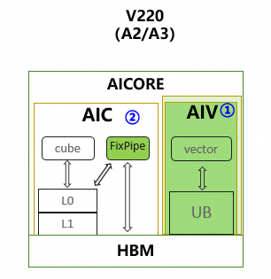
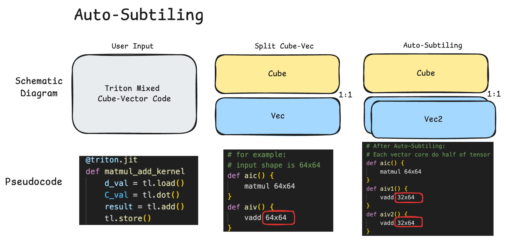
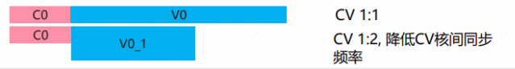

# 自动子块切分

本文介绍HIVM中的AutoBindSubBlock特性。该特性通过Cube-Vector 1:2切分，针对CV类kernel的AIV函数进行优化。在阅读本文之前，建议先阅读[CV Optimization](./cv_optimization.md)，了解CV编译相关术语。

AutoBindSubBlock是该特性的俗称。编译器Pipeline选项名为`--enable-auto-bind-sub-block`，在代码中对应字段`enableAutoBindSubBlock`。真正执行数据切分与绑定的Pass名为`hivm-bind-sub-block`，在代码中对应实现`TileAndBindSubBlock`。不要把特性名或选项名当成Pass名。

## 硬件背景

当前昇腾AI加速芯片，AIC与AIV分离，核数1:2。



在现有生态下，无论是用户编写的算法实现还是社区共享的算子，普遍没有昇腾Cube-Vector 1:2分核处理逻辑。为优化计算效率并实现昇腾亲和性，编译器需具备自动分核能力。该特性旨在自动应用Cube-Vector 1:2分核策略，实现数据切分。

## 算法原理

总体实现的思路是：



带来的效果是：



### 输入输出样例

`TileAndBindSubBlock`作用在带`hivm.part_of_mix`的AIV函数上。

原始代码：

```mlir
%t0 = hivm.hir.vexp ins(%src: tensor<64xf16>)
                     outs(%init: tensor<64xf16>) -> tensor<64xf16>
%t1 = hivm.hir.vabs ins(%t0: tensor<64xf16>)
                     outs(%init: tensor<64xf16>) -> tensor<64xf16>
hivm.hir.store ins(%t1: tensor<64xf16>) outs(%output : memref<64xf16>)
```

切分成功后，函数体被包进`scf.for`（0到2，步长1），并带`map_for_to_forall`与`mapping = [#hivm.sub_block<x>]`。Store按选轴对半切成`extract_slice`或`subview`，BubbleUp后再把Vector算子切到半块；已切分的store带`{tiled_op}`：

```mlir
%c0 = arith.constant 0 : index
%c1 = arith.constant 1 : index
%c2 = arith.constant 2 : index
scf.for %i = %c0 to %c2 step %c1 {
  %off = affine.apply affine_map<()[s0] -> (s0 * 32)>()[%i]
  %src_slice = tensor.extract_slice %src[%off] [32] [1]
      : tensor<64xf16> to tensor<32xf16>
  %init_slice = tensor.empty() : tensor<32xf16>
  %t0 = hivm.hir.vexp ins(%src_slice: tensor<32xf16>)
                       outs(%init_slice: tensor<32xf16>) -> tensor<32xf16>
  %t1 = hivm.hir.vabs ins(%t0: tensor<32xf16>)
                       outs(%init_slice: tensor<32xf16>) -> tensor<32xf16>
  %out_slice = memref.subview %output[%off] [32] [1]
      : memref<64xf16> to memref<32xf16, strided<[1], offset: ?>>
  hivm.hir.store ins(%t1: tensor<32xf16>)
                 outs(%out_slice : memref<32xf16, strided<[1], offset: ?>>)
      {tiled_op}
} {map_for_to_forall, mapping = [#hivm.sub_block<x>]}
```

尚未切分的 store 、copy-to-L1 、 custom 等算子仍可能被limitUniqueSubBlockToStore包进scf.if(get_sub_block_idx == 0)。

### 实现思路

1. Clone AIV函数，用`scf.for`（0到`kSubBlockDim=2`）包住函数体，并打上sub-block mapping；
2. 通过`extract-slice`或`subview`对Store数据进行对半切分；
3. 通过`BubbleUpExtractSlice` Pattern把extract slice往上冒泡；
4. 切分成功则用clone替换原函数；失败则丢掉clone、保留原函数。

若切分失败，回退到1:1，并对未切分的写回算子限制到子块0。


<center>图AutoSubtiling 1:2实现思路</center>

### 实现设计

**Dimension Analyzer选轴**：

Dimension Analyzer的核心功能在于其选轴算法。该算法通过对目标计算内核 (Kernel) 内所有算子 (Operators) 的综合分析，识别并选定一个平行轴(Parallel Axis) 作为数据切分的维度。

**选择平行轴的依据**：

此设计决策源于底层硬件架构的关键特性：​Vector核之间不存在直接的数据通路​。为了最大化并行效率并确保计算正确性，数据切分策略必须严格避免引入跨分片的数据依赖。选择平行轴进行切分数据可被独立地分配至一个向量计算单元进行运算，从而实现高效的并行处理。

**Tile And Slice Store（Leaf）**：

会在每个`StoreOp`或`Leaf`节点前，根据Dimension Analyzer选出的轴，插入1:2切分的Extract SliceOp。

**BubbleUp Extract Slice**：

针对每个类型的Op实现了对应的`BubbleUp Strategy`，目前支持的Op类型包括：

`BroadcastOp`、`ReduceOp`、`ExpandOp`（特定Shape）、`CollapseOp`（特定Shape）

`ElementwiseOp`、`LoopOp`、`ExtractSliceOp`（特定场景）、`InsertSliceOp`（特定场景）

后续可以通过增加`matchAndRewritePattern`增加对更多Op类型的支持。

## 接口说明

可通过选项控制 ：

`--enable-auto-bind-sub-block=True`为启用此特性（默认）。对应`enableAutoBindSubBlock`，会把`TileAndBindSubBlock`的`enable-tile`设为true。

`--enable-auto-bind-sub-block=False`为关闭切分。Pass仍会运行，但`enable-tile=false`，随后对AIV函数调用`limitUniqueSubBlockToStore`：Vector计算仍在两个子核上执行，仅`store`、copy-to-L1、`custom`、`indirect_store`、`stride_store`被`scf.if(get_sub_block_idx == 0)`包住，避免双核重复写回。

`--skip-hivm-bind-sub-block-pass=True`为完全跳过`hivm-bind-sub-block`（默认为`False`）。对应`skipHIVMBindSubBlockPass`。仅当该Pass本身不应运行时使用。

## 使用约束

如果尝试切分失败，或中间转换失败，会自动回退到1:1，保证功能正确性。

`TileAndBindSubBlock`在clone上尝试切分。失败时`failAndRevert`丢掉clone并给Module打`hivm.tile_and_bind_subblock_reverted`，保留原函数，再调用`limitUniqueSubBlockToStore`。

常见失败回退到1:1的原因主要有：

- 选轴分析失败，没有可切分的平行轴，或没有任何store或copy被切分。
- `BubbleUpExtractSlice`中途失败，或切分后verify失败。
- 动态shape store无法切成1:2、紧耦合UB未被切分、post-tiling cleanup失败。
- 满足以下任一条件时，直接跳过切分并走子块0限制：
  - `hivm.core_ratio`的vector核数 `< 2`
  - AIV函数含custom op
  - regbase上的AIC函数带`batch_matmul`
  - AIV函数带implicit transpose
  - membase上load与store同地址

**回退到1:1样例**：

原始代码

```mlir
%t0 = hivm.hir.vexp ins(%src: tensor<64xf16>)
                     outs(%init: tensor<64xf16>) -> tensor<64xf16>
%t1 = hivm.hir.vabs ins(%t0: tensor<64xf16>)
                     outs(%init: tensor<64xf16>) -> tensor<64xf16>
hivm.hir.store ins(%t1: tensor<64xf16>) outs(%output : memref<64xf16>)
```

自动1:2切分失败后，数据保持未切分的1:1形态。Vector计算不包`scf.if`，仅对写回的`store`插入`get_sub_block_idx == 0`守卫（带`limit_sub_block_id0`），避免两个AIV子核重复写同一块buffer：

```mlir
%t0 = hivm.hir.vexp ins(%src: tensor<64xf16>)
                     outs(%init: tensor<64xf16>) -> tensor<64xf16>
%t1 = hivm.hir.vabs ins(%t0: tensor<64xf16>)
                     outs(%init: tensor<64xf16>) -> tensor<64xf16>
%idx = hivm.hir.get_sub_block_idx -> i64
%idx_i = arith.index_cast %idx : i64 to index
%c0 = arith.constant 0 : index
%eq0 = arith.cmpi eq, %idx_i, %c0 : index
scf.if %eq0 {
  hivm.hir.store ins(%t1: tensor<64xf16>) outs(%output : memref<64xf16>)
} {limit_sub_block_id0}
```
