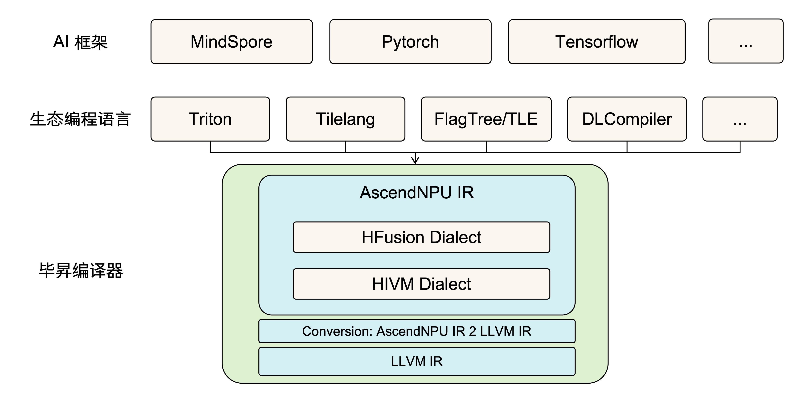
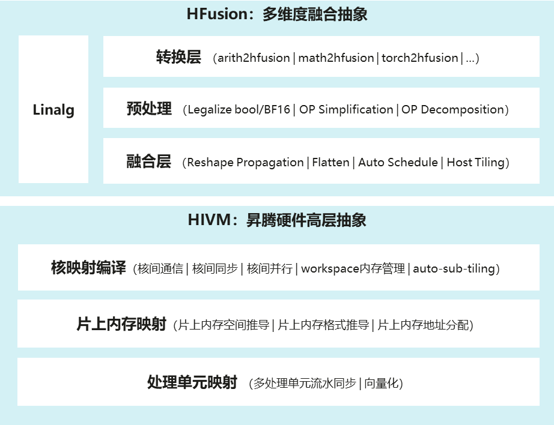
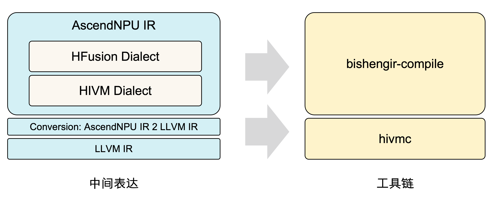

# 架构设计

## 目标定位

毕昇编译器AscendNPU IR是基于MLIR生态构建的昇腾硬件高层抽象表达，它会自下而上对昇腾硬件底层指令、核内资源、核间资源、SOC资源逐层进行抽象编译优化，多层抽象间分层解耦、开源开放，允许生态编程、三方框架权衡性能与易用性的需求灵活对接，为生态框架提供面向昇腾的统一编译接入层和硬件完备表达优化能力。



## 逻辑架构

AscendNPU IR中自研设计的方言有HFusion、HIVM、HACC、Annotation、Scope，其中HFusion方言负责硬件相对无关的优化，HIVM则负责精细化感知NPU硬件细节，将High level的编程语言转换成NPU的底层指令，HACC方言负责异构硬件抽象表达，Annotation和Scope则负责对于特定Operand或者Operation标记compiler hint信息。



### HFusion 方言

HFusion（Hybrid Fusion）方言是基于MLIR社区Linalg方言的扩展集，HFusion方言继承了Linalg方言的所有operations并且自行扩展了Linalg社区还未支持的operations，要注意HFusion方言处理的operations均是named operations，这样可以最大化保留高层语义方便编译器处理。HFusion方言主要包括转换层、预处理、融合处理三层能力：

1. **转换层**：HFusion方言是生态对接关键的一层，当前支持与Arith、Math、Torch等方言关键Operations的Conversion对接，后续会逐步完善补齐生态对接能力。

2. **预处理**：硬件细节相对无关优化层，支持Tensor表达式化简、BF16/Bool数据类型合法化、复杂OP组合实现等常见Device函数优化。

3. **融合处理**：能够自动融合生成Device Kernel算子及Host Tiling函数。

### HIVM 方言

HIVM（Hybrid ISA Virtual Machine）：面向昇腾硬件对计算、搬运、同步等操作进行抽象，提供Tile级Operation支持任意维度、大小的Tensor或者Memref操作类型，屏蔽昇腾硬件底层指令参数。HIVM层编译优化主要分为以下三层：

1. **CV核映射编译**：感知NPU CV核分离硬件架构自动对Mix Kernel（既包括cube操作又包括vector操作的核函数）进行CV融合编译优化，通过分析cube和vector操作间的数据依赖关系自动插入store和load来进行CV核数据交互，计算中间交互所需的workspace global memory空间大小并生成Host侧推导大小的函数，同时对有CV数据依赖处插入核间同步保证依赖顺序，最后自动拆分MixKernel为单独的AIC核函数和AIV核函数，从而实现CV融合编译功能。在性能优化上，通过CVPipeline pass自动实现调整Cube代码与Vector代码顺序保证CV核流水并行，通过AutoSubTiling自动实现CV配比1:2切分特性。

2. **核内片上内存映射**：感知NPU核内片上内存结构，编译优化自动实现片上内存空间推导、片上内存数据格式推导、片上访存自动对齐、OP临时空间申请以及片上内存地址分配。

3. **核内处理单元映射**：感知NPU核内多级流水处理单元，自动插入流水同步操作保证不同流水线有序执行同时并行流水优化；感知NPU指令细节自动完成基于策略的指令自动映射，使能NPU SIMD高效指令。

## 代码架构

AscendNPU IR是基于MLIR生态构建的，MLIR原生社区代码是作为第三方引入，代码结构如下所示，bishengir（即AscendNPU IR）目录下是AscendNPU IR相关实现，build-tools目录下是AscendNPU IR构建所需脚本和patches。AscendNPU IR对于MLIR原生社区的增强会优先在bishengir/Dialect独立目录下创建对应方言目录，通过独立目录新增文件扩展能力来避免对社区侵入式修改；对于无法隔离的修改会通过单独patch文件来进行，每个patch有单独commit相关信息方便之后回合MLIR社区。

```text
.
├── bishengir // AscendNPU IR相关实现
├── build-tools // AscendNPU IR 构建脚本所在目录
│   ├── patches // 存放对third-party生态项目的侵入式修改patches
│   │   ├── llvm-project
│   │   │   ├── 0001-[Huawei][MLIR]-xxx.patch
│   │   │   └── ...
│   │   └── torch-mlir
│   ├── apply_patches.sh
│   └── build.sh
└── third-party
    ├── llvm-project
    └── torch-mlir
```

bishengir目录结构和mlir目录结构保持一致：`include`下存放声明文件，包括C++头文件（`.h`, `.hpp`）和TableGen定义文件（`.td`），构建目录`build/include`中包含TableGen自动生成的文件（`.h.inc`, `.cpp.inc`）；`lib`目录存放实现代码（`.cpp`），其目录结构与`include`基本保持一致。

```text
.
├── bishengir // AscendNPU IR相关实现
│   ├── include
│   │   └── bishengir
│   │       ├── Conversion
│   │       └── Dialect
│   │           ├── 社区方言 // 对于社区方言的扩展增强
│   │           └── 自研方言 // 自定义的方言
├── lib
└── tools
    ├── bishengir-compile // AscendNPU IR编译器命令行驱动程序
    └── bishengir-opt
```

IR中主要由Conversion、Dialect、tools三部分组成，其中Conversion承载不同方言间转换的能力，Dialect下是不同方言的定义和实现，tools目录下定义编译工具链。
Conversion中既包括三方生态对接转换（如TorchToHFusion）也包括AscendNPU IR内部方言间转换（如HFusionToHIVM）；Dialect下既包括自研方言也包括社区方言；tools中bishengir-compile是AscendNPU IR编译器的命令行驱动程序。

## 编译流程

AscendNPU IR对应工具链是bishengir-compile，会负责把高抽象层级的Tile级OP编译成感知NPU 硬件架构的low level op，该工具链输入和输出均是MLIR。hivmc工具会负责把low level的MLIR转成LLVM IR并基于LLVM IR进行底层指令编译优化，最终生成算子二进制。

