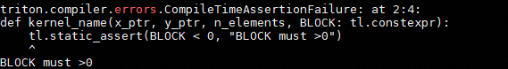
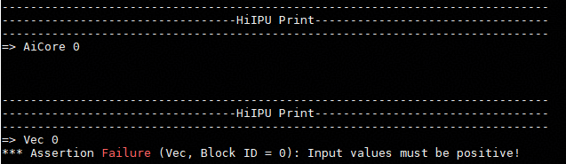
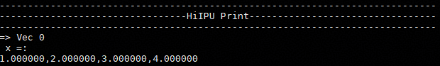
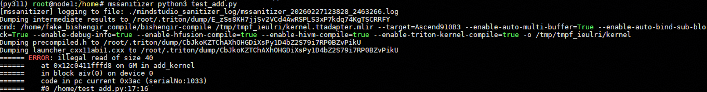
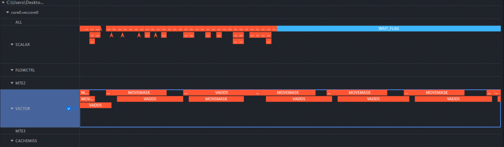

# 调试调测

## 调试：DEBUG OP类

在基于AscendNPU IR进行算子开发与移植过程中（如基于Triton前端编写算子并基于AscendNPU IR编译执行）调试是必不可少的一环。为了帮助开发者在不同抽象层次定位问题，AscendNPU IR定义了两类核心调试算子：

**hfusion层** **`PrintOp`** 在图编译和融合阶段使用，用于打印中间计算结果和张量信息

**hivm层** **`DebugOp`** 在更低级的HIVM层执行时使用，用于打印中间计算结果和张量信息

接下来将从AscendNPU IR的视角出发，介绍这两类调试算子的接口以及使用方式，并以**Triton前端**为例，演示如何在算子开发全流程中注入并使用这些调试能力

### AscendNPU IR 调试op介绍

AscendNPU IR侧依赖毕昇编译器提供的`cce::printf`接口进行打印，要想开启打印需要满足以下两个条件：

1. 需要启用宏`__CCE_ENABLE_PRINT__`(以triton为例, 通过export TRITON_DEVICE_PRINT=1来启用该选项)
2. AscendNPU IR meta op库(将逻辑代码映射成对应硬件指令的地方)编译的时候需要开启--cce-enable-print(当前默认一直开启)

#### hfusion层调试：PrintOp

##### 接口说明

```mlir
// hex：是否将所有值以十六进制而非十进制形式打印
// %0: 待打印tensor shape为一维大小为8，dtype=int64
hfusion.print " x: " {hex = xxx} %0 : tensor<8xi64>
```

##### 使用说明

可以在hfusion Pass阶段或手动构造IR时，显式添加PrintOp节点
如下：当我们想打印load进来的结果时我们可以手动在hfusion阶段IR中添加hfusion.print以实现该效果

```mlir
func.func @vector_kernel(%arg0: memref<?xi8> {hacc.arg_type = #hacc.arg_type<sync_block_lock>}, %arg1: memref<?xi8> {hacc.arg_type = #hacc.arg_type<workspace>}, %arg2: memref<?xi64> {tt.divisibility = 16 : i32, tt.tensor_kind = 0 : i32}, %arg3: i32, %arg4: i32, %arg5: i32, %arg6: i32, %arg7: i32, %arg8: i32, %arg9: i32) attributes {SyncBlockLockArgIdx = 0 : i64, WorkspaceArgIdx = 1 : i64, hacc.entry, hacc.function_kind = #hacc.function_kind<DEVICE>, mix_mode = "aiv", parallel_mode = "simd"} {
  %reinterpret_cast = memref.reinterpret_cast %arg2 to offset: [0], sizes: [8], strides: [1] : memref<?xi64> to memref<8xi64, strided<[1]>>
  %alloc = memref.alloc() : memref<8xi64>
  memref.copy %reinterpret_cast, %alloc : memref<8xi64, strided<[1]>> to memref<8xi64>
  %0 = bufferization.to_tensor %alloc restrict writable : memref<8xi64>
  hfusion.print " x: " {hex = false} %0 : tensor<8xi64>
  return
}
```

#### hivm层调试：DebugOp

##### 接口说明

```mlir
// debugtype：指明当前是print场景还是assert场景
// hex：是否将所有值以十六进制而非十进制形式打印
// prefix：打印在值之前的前缀
// tcoretype: 指明当前debug op是在cube核上执行还是在vector核上执行
// %0: 待打印tensor shape为一维大小为8，dtype=int64
hivm.hir.debug {debugtype = "xxx", hex = xxx, prefix = " xxx: ", tcoretype = #hivm.tcore_type<xxx>} %0 : tensor<8xi64>
```

##### 使用说明

可以在hivm Pass阶段或手动构造IR时，显式添加Debug Op节点
如下：当我们想打印load进来的结果时我们可以手动在hivm阶段IR中添加hivm.hir.debug以实现该效果

```mlir
func.func @vector_kernel(%arg0: i64 {hacc.arg_type = #hacc.arg_type<ffts_base_address>}, %arg1: memref<?xi8> {hacc.arg_type = #hacc.arg_type<sync_block_lock>}, %arg2: memref<?xi8> {hacc.arg_type = #hacc.arg_type<workspace>}, %arg3: memref<?xi64> {tt.divisibility = 16 : i32, tt.tensor_kind = 0 : i32}, %arg4: i32, %arg5: i32, %arg6: i32, %arg7: i32) attributes {SyncBlockLockArgIdx = 0 : i64, WorkspaceArgIdx = 1 : i64, func_dyn_memref_args = dense<[false, true, true, true, false, false, false, false]> : vector<8xi1>, hacc.entry, hacc.function_kind = #hacc.function_kind<DEVICE>, mix_mode = "aiv", parallel_mode = "simd"} {
  %0 = arith.muli %arg5, %arg6 : i32
  %1 = arith.muli %0, %arg7 : i32
  annotation.mark %1 {logical_block_num} : i32
  %reinterpret_cast = memref.reinterpret_cast %arg3 to offset: [0], sizes: [8], strides: [1] : memref<?xi64> to memref<8xi64, strided<[1]>>
  %alloc = memref.alloc() : memref<8xi64>
  hivm.hir.load ins(%reinterpret_cast : memref<8xi64, strided<[1]>>) outs(%alloc : memref<8xi64>) init_out_buffer = false may_implicit_transpose_with_last_axis = false
  %2 = bufferization.to_tensor %alloc restrict writable : memref<8xi64>
  hivm.hir.debug {debugtype = "print", hex = false, prefix = " x: ", tcoretype = #hivm.tcore_type<CUBE_OR_VECTOR>} %2 : tensor<8xi64>
  return
}
```

### triton接入说明

有多种生态编程语言对接AscendNPU IR，当前仅以Triton为例进行介绍，剩余还有TileLang、FlagTree、DLCompiler与TLE等方式，可以参考Triton进行对接

目前与调试调测相关的triton op主要有如下四类：

* **​static_assert：​**编译时静态断言
* **​static_print：​**编译时静态打印
* **​device_assert：​**运行时设备断言
* **​device_print：​**运行时设备打印

#### static_assert

##### 接口描述

```python
# condition: bool - 编译时可计算的布尔表达式
# message: str - 可选，断言失败时显示的消息
triton.language.static_assert(condition: bool, message: str = "") -> None
```

##### 使用示例

可以通过执行`python3 <file>.py`验证功能正确性

```python
import triton
import torch
import triton.language as tl

@triton.jit
def kernel_name(x_ptr, y_ptr, n_elements, BLOCK: tl.constexpr):
    tl.static_assert(BLOCK < 0, "BLOCK must > 0")
    pid = tl.program_id(0)
    offsets = pid * BLOCK + tl.arange(0, BLOCK)
    mask = offsets < n_elements
    x = tl.load(x_ptr + offsets, mask=mask)
    tl.store(y_ptr + offsets, x, mask=mask)

def vector(x, y):
    n = x.numel()
    grid = (triton.cdiv(n, 32),)
    kernel_name[grid](x, y, n, 32)

if __name__ == "__main__":
    x = torch.ones(8, device="npu")
    y = torch.empty_like(x)
    vector(x, y)
```

##### 断言效果



#### static_print

##### 接口描述

```python
# message: str - 要打印的消息，可以包含编译时常量
triton.language.static_print(message: str) -> None
```

##### 使用示例

可以通过执行`python3 <file>.py`验证功能正确性

```python
import triton
import torch
import triton.language as tl

@triton.jit
def kernel_name(x_ptr, y_ptr, n_elements, BLOCK: tl.constexpr):
    tl.static_print(f" BLOCK = {BLOCK} ")
    pid = tl.program_id(0)
    offsets = pid * BLOCK + tl.arange(0, BLOCK)
    mask = offsets < n_elements
    x = tl.load(x_ptr + offsets, mask=mask)
    tl.store(y_ptr + offsets, x, mask=mask)

def vector(x, y):
    n = x.numel()
    grid = (triton.cdiv(n, 32),)
    kernel_name[grid](x, y, n, 32)

if __name__ == "__main__":
    x = torch.ones(8, device="npu")
    y = torch.empty_like(x)
    vector(x, y)
```

#### 打印效果

```text
[warning]: tiling struct [GMMTilingData] is conflict with one in tiling grating tiling
BLOCK = 32
Dumping intermediate results to /root/.triton/dump/KHviKCdUEjStublnqGQietpeng6Sintejlr0t0SujtspD
```

#### device_assert

注：使用此功能前需要设置环境变量export TRITON_DEBUG=1 export TRITON_DEVICE_PRINT=1

##### 接口描述

```python
# condition: bool - 要断言的条件, 必须是一个布尔张量
# message: str - 可选，断言失败时显示的消息

# triton language 接口
triton.language.device_assert(condition: bool, message: str = "") -> None
```

##### 使用示例

可以通过执行`python3 <file>.py`验证功能正确性

```python
import triton
import torch
import triton.language as tl

@triton.jit
def assert_kernel(x_ptr, y_ptr, n_elements, BLOCK: tl.constexpr):
    pid = tl.program_id(0)
    offsets = pid * BLOCK + tl.arange(0, BLOCK)
    mask = offsets < n_elements
    x = tl.load(x_ptr + offsets, mask=mask)
    tl.device_assert(x > 0, "Input values must be positive!")
    tl.store(y_ptr + offsets, x, mask=mask)

def test_assert():
    x_valid = torch.tensor([1.0, 2.0, 3.0, 4.0], device="npu")
    y = torch.empty_like(x_valid)

    grid = (triton.cdiv(x_valid.numel(), 4),)
    assert_kernel[grid](x_valid, y, x_valid.numel(), 4)

    x_invalid = torch.tensor([1.0, -2.0, 3.0, 4.0], device="npu")
    assert_kernel[grid](x_invalid, y, x_invalid.numel(), 4)

if __name__ == "__main__":
    test_assert()
```

##### 断言效果



#### device_print

注：使用此功能前需要设置环境变量export TRITON_DEVICE_PRINT=1

##### 接口描述

```python
# prefix: str - 打印在值之前的前缀，必须是字符串
# *args - 要打印的值可以是任何张量或标量
# hex: bool - 是否将所有值以十六进制而非十进制形式打印

# triton language 接口
triton.language.device_print(prefix, *args, hex=False) -> None
```

##### 使用示例

可以通过执行`python3 <file>.py`验证功能正确性

```python
import triton
import torch
import triton.language as tl

@triton.jit
def print_kernel(x_ptr, y_ptr, n_elements, BLOCK: tl.constexpr):
    pid = tl.program_id(0)
    offsets = pid * BLOCK + tl.arange(0, BLOCK)
    mask = offsets < n_elements
    x = tl.load(x_ptr + offsets, mask=mask)
    tl.device_print("x = ", x)
    tl.store(y_ptr + offsets, x, mask=mask)

def test_print():
    x_valid = torch.tensor([1.0, 2.0, 3.0, 4.0], device="npu")
    y = torch.empty_like(x_valid)

    grid = (triton.cdiv(x_valid.numel(), 4),)
    print_kernel[grid](x_valid, y, x_valid.numel(), 4)

if __name__ == "__main__":
    test_print()
```

##### 打印效果



## 调试：工具类

### mssanitizer

命令行异常检测工具用于triton算子内存检测/竞争检测/未初始化检测等，使用此功能前需要设置环境变量 export TRITON_ENABLE_SANITIZER=true

#### 使用方式

```bash
# 直接拉起triton算子运行即可
mssanitizer python test.py
```

#### 效果展示

以如下triton add用例为例（用例中offsets错误计算）展示mssanitizer的检测效果

```python
import torch
import triton
import triton.language as tl

@triton.jit
def add_kernel(
    x_ptr,
    y_ptr,
    output_ptr,
    n_elements,
    BLOCK_SIZE: tl.constexpr,
):
    pid = tl.program_id(axis=0)
    block_start = pid * BLOCK_SIZE
    offsets = block_start + tl.arange(0, BLOCK_SIZE) - 10
    mask = offsets < n_elements
    x = tl.load(x_ptr + offsets, mask=mask)
    y = tl.load(y_ptr + offsets, mask=mask)
    output = x + y
    tl.store(output_ptr + offsets, output, mask=mask)

def add(x, y):
    output = torch.empty_like(x)
    n_elements = output.numel()
    BLOCK_SIZE = 1024
    grid = (triton.cdiv(n_elements, BLOCK_SIZE),)
    add_kernel[grid](
        x, y, output,
        n_elements,
        BLOCK_SIZE=BLOCK_SIZE
    )

    return output

if __name__ == "__main__":
    size = 1024
    x = torch.rand(size, device='npu:0')
    y = torch.rand(size, device='npu:0')
    output_triton = add(x, y)
```

执行mssanitizer python3 test_add.py产生如下屏幕输出信息，可以看到mssanitizer检测发现当前test_add.py文件中执行到tl.load结点时检测发现GM异常读了40B(10 * float32)的空间



注: 想了解更多mssanitizer的检测情况可以参考[详见MindStdudio算子开发工具](https://www.hiascend.com/document/detail/zh/mindstudio/830/ODtools/Operatordevelopmenttools/atlasopdev_16_0039.html)

### msprof

命令行模型调优工具用于triton算子性能数据的采集和解析

#### 使用方式

```bash
# 整网上板调优
# --output - 收集到的性能数据的存放路径，默认在当前目录下保存性能数据
# --application - 整网执行命令
msprof --output=xxx --application=""

# 单算子上板调优
# --output - 收集到的性能数据的存放路径，默认在当前目录下保存性能数据
# --application - 单算子执行命令
# --kernel-name - 指定要采集的算子名称，支持使用算子名前缀进行模糊匹配
# --aic-metrics - 使能算子性能指标的采集能力和算子采集能力指标（Roofline/Occupancy/MemoryDetail等）
msprof op --output=xxx --application="" --kernel-name=xxx --aic-metrics=xxx

# 单算子仿真调优
# --core-id - 指定部分逻辑核的id，解析部分核的仿真数据
# --kernel-name - 指定要采集的算子名称，支持使用算子名前缀进行模糊匹配
# --soc-version - 指定仿真器类型
# --output - 收集到的性能数据的存放路径，默认在当前目录下保存性能数据
msprof op simulator --core-id=xxx --kernel-name=xxx --soc-version=Ascendxxx --output=xxx
```

#### 常用性能分析图

- **trace.json**：支持在chrome://tracing/上生成指令流水图
    

- **visualize_data.bin**：支持在Mind Studio Insight可视化呈现指令在昇腾AI处理器上的运行情况
    

注：想要了解更多性能分析图可参见[Mindstudio算子开发工具](https://www.hiascend.com/document/detail/zh/mindstudio/830/ODtools/Operatordevelopmenttools/atlasopdev_16_0136.html)

#### triton算子流水采集

以如下add kernel为例，希望跑出对应的流水情况：

```python
import torch
import triton
import triton.language as tl

@triton.jit
def add_kernel(
    x_ptr,
    y_ptr,
    output_ptr,
    n_elements,
    BLOCK_SIZE: tl.constexpr,
):
    pid = tl.program_id(axis=0)
    block_start = pid * BLOCK_SIZE
    offsets = block_start + tl.arange(0, BLOCK_SIZE)
    mask = offsets < n_elements
    x = tl.load(x_ptr + offsets, mask=mask)
    y = tl.load(y_ptr + offsets, mask=mask)
    output = x + y
    tl.store(output_ptr + offsets, output, mask=mask)

def add(x, y):
    output = torch.empty_like(x)
    n_elements = output.numel()
    BLOCK_SIZE = 1024
    grid = (triton.cdiv(n_elements, BLOCK_SIZE),)
    add_kernel[grid](
        x, y, output,
        n_elements,
        BLOCK_SIZE=BLOCK_SIZE
    )

    return output

if __name__ == "__main__":
    size = 1024
    x = torch.rand(size, device='npu:0')
    y = torch.rand(size, device='npu:0')
    output_triton = add(x, y)
```

执行`msprof op simulator --kernel-name="add_kernel" --soc-version=Ascend910B4 --core-id=0 --output=./ python3 test_add.py`在当前路径下会生成带着时间戳的OPPROF文件夹

取出simulator下的visualize_data.bin用MindStudio Insight打开就得到了0核对应的流水图，前面描述的两类常用性能流水图(trace.json/visualize_data.bin)都可以在`./OPPROF_<Timestamp>/simulator`目录下找到

