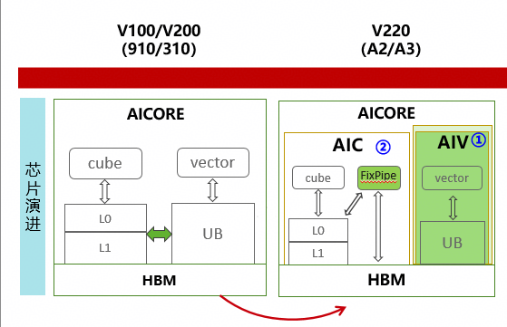
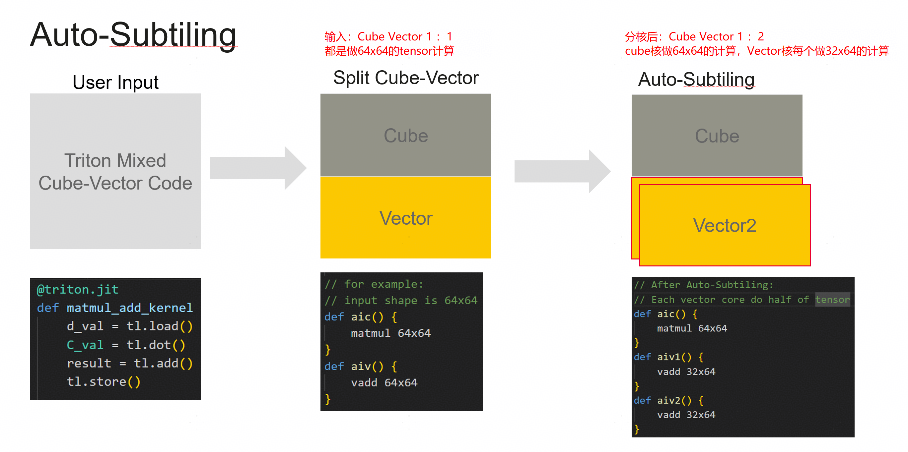
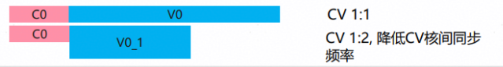
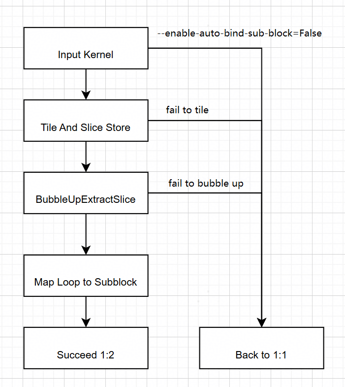
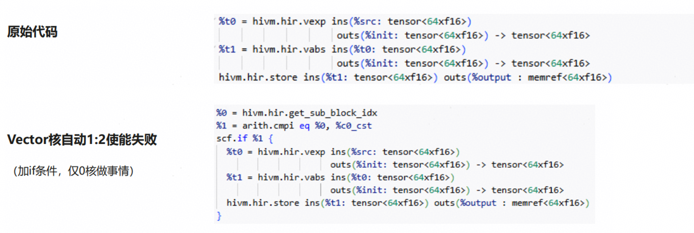

# Auto-Subtiling 1:2使能

## 1.硬件背景

昇腾芯片演进过程中，AIC与AIV分离，粒度变为1:2.

在现有生态下，无论是用户编写的算法实现还是社区共享的算子，普遍没有昇腾 Cube-Vector 1:2 分核处理逻辑

为优化计算效率并实现昇腾亲和，编译器需具备自动分核能力。该特性期待自动应用 Cube-Vector 1:2 分核策略，实现数据切分。

## 2. 算法原理

总体实现的思路是：

带来的效果是：

### 输入输出样例

### 2.2 实现思路

1. 通过extract-slice和for-loop对Store数据进行对半切分
2. 通过BubbleUpExtractSlice Pattern把extract slice往上冒泡
3. Map for-loop to subblock
4. 切分成功

若切分失败，返回1：1

图 Autosubtiling 1:2实现思路

### 2.3 实现设计 

##### Dimension Analyzer选轴：

Dimension Analyzer 的核心功能在于其选轴算法。该算法通过对目标计算内核 (Kernel) 内所有算子 (Operators) 的综合分析，识别并选定一个**平行轴 (Parallel Axis)** 作为数据切分的维度

##### 选择平行轴的依据：

此设计决策源于底层硬件架构的关键特性：​**Vector核之间不存在直接的数据通路**​。为了最大化并行效率并确保计算正确性，数据切分策略必须**严格避免**引入跨分片的数据依赖。选择平行轴进行切分数据可被独立地分配至一个向量计算单元进行运算，从而实现高效的并行处理。

##### Tile And Slice Store(Leaf):

会在每个StoreOp/ Leaf节点前，根据Dimension Analyzer选出的轴，插入1：2切分的Extract SliceOp

##### BubbleUp Extract Slice:

针对每个类型的Op实现了对应的BubbleUp Strategy，目前支持的Op类型包括：

BroadcastOp, ReduceOp, ExpandOp(特定Shape), CollapseOp(特定Shape)

ElementwiseOp, LoopOp, ExtractSliceOp(特定场景), InsertSliceOp(特定场景)

后续可以通过增加matchAndRewritePattern增加对更多Op类型的支持

## 3. 接口说明

可通过选项控制 

--enable-auto-bind-sub-block=True 为启用此特性(默认)

--enable-auto-bind-sub-block=False 为关闭此特性

## 4. 约束能力

如果尝试切分失败，或中间转换失败，会自动回退1：1，保证功能正确性

常见失败回退1：1的原因主要有：

1. 选轴分析失败，没有可切分的平行轴
2. BubbleUpExtractSlicePattern中途遇到了未支持的Op

### 4.1 回退1:1样例

