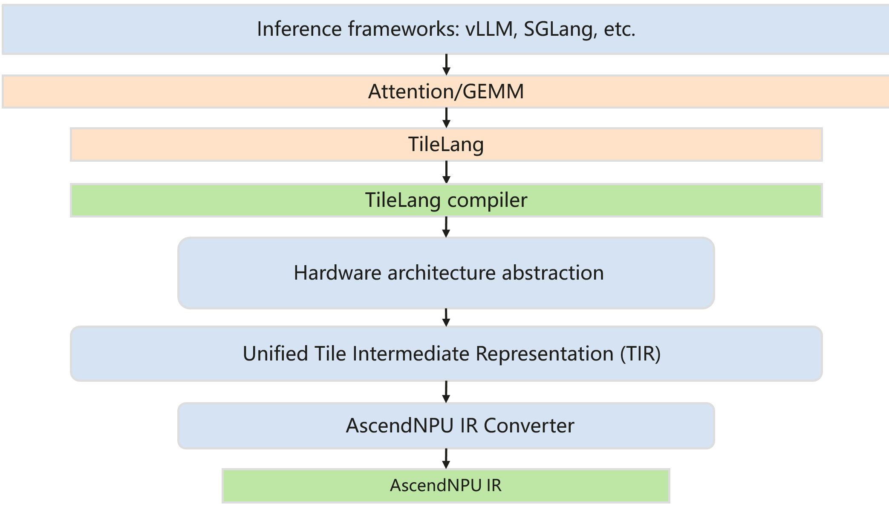

# TileLang Integration

Tile Language Ascend (**tilelang-ascend**) is a specialized variant of the tile-lang domain-specific language, specifically optimized for Huawei Ascend NPU (Neural Processing Unit) architecture. Built upon the foundation of tile-lang's Pythonic syntax and [TVM](https://tvm.apache.org/) compiler infrastructure, tilelang-ascend enables developers to efficiently create high-performance AI compute kernels tailored for Ascend processors, including operations like GEMM, vector operations, and attention mechanisms. Tilelang-ascend allows developers to focus on productivity without sacrificing the low-level optimizations necessary for state-of-the-art performance on the NPU.

Within the TileLang ecosystem, we have developed an NPU Intermediate Representation (AscendNPU IR) infrastructure specifically for Ascend, enabling seamless integration into the open-source AI compiler ecosystem based on MLIR. This effort not only enhances the openness and extensibility of the compiler stack but also provides developers with a more flexible and efficient pathway for custom operator development. The compiler backend supports two technical routes: [AscendNPU IR](https://github.com/tile-ai/tilelang-ascend/tree/npuir) and [Ascend C & PTO](https://github.com/tile-ai/tilelang-ascend/tree/ascendc_pto).




## Installation
### Environment Setup

Install the Ascend Toolkit.

[Download the installation package](https://www.hiascend.com/developer/download/community/result?cann=8.3.RC1.alpha002)，install`Ascend-cann-toolkit`.For complete installation instructions, refer to the [relevant documentation](https://www.hiascend.com/document/detail/zh/CANNCommunityEdition/83RC1alpha002/softwareinst/instg/instg_0008.html?Mode=PmIns&OS=Debian&Software=cannToolKit).

```shell
chmod +x Ascend-cann-toolkit_{ascend-cann-toolkit version}_linux-aarch64.run
./Ascend-cann-toolkit_{ascend-cann-toolkit version}_linux-aarch64.run --install
```

Configure environment variables:

```
source /path/to/install/Ascend/ascend-toolkit/set_env.sh
```

Prepare a Python environment with Python version between 3.7.*x* and 3.11.4 (inclusive) and ensure that `pip3` is available.


   Ascend Toolkit Installation Requirements

   ```shell
   pip3 install attrs cython 'numpy>=1.19.2,<=1.24.0' decorator sympy cffi pyyaml pathlib2 psutil protobuf==3.20.0 scipy requests absl-py
   ```


Set Environment Variables

```shell
export ACL_OP_INIT_MODE=1
```

#### Build

Pull the code

```shell
git clone https://github.com/tile-ai/tilelang-ascend.git --recursive -b npuir
```

Run the installation script

```shell
cd tilelang-ascend
# build AscendNPU-IR in 3rdparty
bash install_npuir.sh
# Alternative way of building with local AscendNPU-IR
bash install_npuir.sh --bishengir-path=/path/to/AscendNPU-IR/build/install
# For example, --bishengir-path=./3rdparty/AscendNPU-IR/build/install
# Assuming that current directory is tilelang-ascend
```

Then do one of the following to apply tilelang settings in your environment:

```shell
source ~/.bashrc

or

export PYTHONPATH=/path/to/tilelang-ascend/:$PYTHONPATH

or

open a new terminal
```

Install torch_npu

```shell
pip install pybind11 torch_npu
```

## Quick Start

This code implements a vector addition kernel using TileLang, a domain-specific language for NPU (Neural Processing Unit) programming. It defines a parallel kernel that adds two float32 vectors of length 4096 on the NPU by loading data into on-chip unified buffers, performing element-wise addition via a low-level NPU instruction (`npuir_add`), and writing the result back to global memory. The test function compares the kernel’s output against PyTorch’s native vector addition to verify correctness. The example runs on NPU device 6 and demonstrates basic TileLang workflow: kernel definition, compilation to AscendNPU IR, and execution with PyTorch tensors.

### TileLang Kernel (vector addition)

```python
# Copyright (c) Tile-AI Corporation.
# Licensed under the MIT License.

import os

import tilelang
import tilelang.language as T  # Import TileLang DSL for kernel definition

import torch
import torch_npu  # Import NPU (Neural Processing Unit) backend support for PyTorch

# Clear any previously cached compiled kernels to ensure a clean run
tilelang.cache.clear_cache()

# Define data type and sequence length for the vector addition
dtype = "float32"
seq_len = 4096  # Length of the vectors to be added

def vec_add(N, block_N, dtype="float32"):
    """
    Define a vector addition kernel using TileLang.
    
    Parameters:
    - N: Total length of the vectors.
    - block_N: Number of elements processed per kernel thread/block.
    - dtype: Data type of the tensors (default: "float32").
    
    Returns:
    - A TileLang prim_func representing the vector addition kernel.
    """
    n_num = N // block_N  # Number of blocks (each block processes `block_N` elements)

    @T.prim_func
    def main(
        A: T.Tensor((N), dtype),  # Input tensor A
        B: T.Tensor((N), dtype),  # Input tensor B
        C: T.Tensor((N), dtype),  # Output tensor C = A + B
        shape: T.int32,           # Actual size (used for handling tail cases if N is not divisible by block_N)
    ):
        # Launch kernel with `n_num` parallel threads on the NPU
        with T.Kernel(n_num, is_npu=True) as (cid, _):
            # Allocate on-chip Unified Buffer (UB) for local computation
            A_VEC = T.alloc_ub((block_N), dtype)
            B_VEC = T.alloc_ub((block_N), dtype)
            C_VEC = T.alloc_ub((block_N), dtype)

            # Calculate the starting index for this thread
            start_idx = cid * block_N
            # Compute remaining elements from this start index to the end of the tensor
            remaining = shape - start_idx
            # Determine how many elements this thread should actually process (handles tail)
            tail_size = T.min(block_N, remaining)

            # Copy data from global memory (A, B) into on-chip buffers (A_VEC, B_VEC)
            T.copy(A[start_idx], A_VEC[:tail_size])
            T.copy(B[start_idx], B_VEC[:tail_size])

            # Perform vector addition on the NPU using low-level NPU IR instruction
            T.npuir_add(A_VEC, B_VEC, C_VEC)

            # Write the result back from on-chip buffer (C_VEC) to global memory (C)
            T.copy(C_VEC[:tail_size], C[start_idx])

    return main

def test_vec_add():
    """
    Test function to validate the vector addition kernel.
    Compares the result of the custom TileLang kernel against PyTorch's native addition.
    """
    # Set the target NPU device (device ID 6 in this case)
    torch.npu.set_device(0)

    # Instantiate the vector addition kernel for the full sequence length (single block)
    func = vec_add(seq_len, seq_len)

    # Compile the TileLang function to NPU IR for execution on the NPU
    compiled_kernel = tilelang.compile(func, target="npuir")

    # Create random input tensors on the NPU
    v1 = torch.randn(size=[seq_len], dtype=eval("torch." + dtype)).npu()
    v2 = torch.randn(size=[seq_len], dtype=eval("torch." + dtype)).npu()
    v3 = torch.zeros(size=[seq_len], dtype=eval("torch." + dtype)).npu()  # Output buffer

    # Compute reference result using PyTorch's native addition (on NPU)
    y_ref = v1.cpu() + v2.cpu()

    # Launch the compiled TileLang kernel
    compiled_kernel(v1, v2, v3, seq_len)

    # Print both results for visual comparison (should be nearly identical)
    print("Reference result (PyTorch):")
    print(y_ref)
    print("TileLang kernel result:")
    print(v3.cpu())

if __name__ == "__main__":
    test_vec_add()
  ```

### AscendNPU-IR (vector addition)

The above kernel generates following AscendNPU-IR if `export TILELANG_DUMP_IR=1` is set:

```mlir
module attributes {hivm.module_core_type = #hivm.module_core_type<AIV>, memref.memref_as_ptr} {
  func.func @main(%arg0: i64 {hacc.arg_type = #hacc.arg_type<ffts_base_address>}, %arg1: memref<?xi8>, %arg2: memref<?xi8>, %arg3: memref<?xf32, #hivm.address_space<gm>>, %arg4: memref<?xf32, #hivm.address_space<gm>>, %arg5: memref<?xf32, #hivm.address_space<gm>>, %arg6: i32, %arg7: i32, %arg8: i32, %arg9: i32, %arg10: i32, %arg11: i32, %arg12: i32) attributes {SyncBlockLockArgIdx = 0 : i64, WorkspaceArgIdx = 1 : i64, hacc.entry, hacc.function_kind = #hacc.function_kind<DEVICE>, hivm.func_core_type = #hivm.func_core_type<AIV>, mix_mode = "aiv"} {
    hivm.hir.set_ffts_base_addr %arg0
    %c1_i32 = arith.constant 1 : i32
    %0 = arith.index_cast %c1_i32 : i32 to index
    %reinterpret_cast = memref.reinterpret_cast %arg3 to offset: [0], sizes: [4096], strides: [%0] : memref<?xf32, #hivm.address_space<gm>> to memref<4096xf32, strided<[1]>, #hivm.address_space<gm>>
    %reinterpret_cast_0 = memref.reinterpret_cast %arg5 to offset: [0], sizes: [4096], strides: [%0] : memref<?xf32, #hivm.address_space<gm>> to memref<4096xf32, strided<[1]>, #hivm.address_space<gm>>
    %reinterpret_cast_1 = memref.reinterpret_cast %arg4 to offset: [0], sizes: [4096], strides: [%0] : memref<?xf32, #hivm.address_space<gm>> to memref<4096xf32, strided<[1]>, #hivm.address_space<gm>>
    %1 = hivm.hir.get_block_idx -> i64
    %2 = arith.trunci %1 : i64 to i32
    %alloc = memref.alloc() : memref<4096xf32, strided<[1]>, #hivm.address_space<ub>>
    %alloc_2 = memref.alloc() : memref<4096xf32, strided<[1]>, #hivm.address_space<ub>>
    %alloc_3 = memref.alloc() : memref<4096xf32, strided<[1]>, #hivm.address_space<ub>>
    %c4096_i32 = arith.constant 4096 : i32
    %3 = arith.minsi %c4096_i32, %arg6 : i32
    %4 = arith.index_cast %3 : i32 to index
    %subview = memref.subview %reinterpret_cast[0] [%4] [1] : memref<4096xf32, strided<[1]>, #hivm.address_space<gm>> to memref<?xf32, strided<[1]>, #hivm.address_space<gm>>
    %subview_4 = memref.subview %alloc[0] [%4] [1] : memref<4096xf32, strided<[1]>, #hivm.address_space<ub>> to memref<?xf32, strided<[1]>, #hivm.address_space<ub>>
    memref.copy %subview, %subview_4 : memref<?xf32, strided<[1]>, #hivm.address_space<gm>> to memref<?xf32, strided<[1]>, #hivm.address_space<ub>>
    %subview_5 = memref.subview %reinterpret_cast_1[0] [%4] [1] : memref<4096xf32, strided<[1]>, #hivm.address_space<gm>> to memref<?xf32, strided<[1]>, #hivm.address_space<gm>>
    %subview_6 = memref.subview %alloc_2[0] [%4] [1] : memref<4096xf32, strided<[1]>, #hivm.address_space<ub>> to memref<?xf32, strided<[1]>, #hivm.address_space<ub>>
    memref.copy %subview_5, %subview_6 : memref<?xf32, strided<[1]>, #hivm.address_space<gm>> to memref<?xf32, strided<[1]>, #hivm.address_space<ub>>
    hivm.hir.vadd ins(%alloc, %alloc_2 : memref<4096xf32, strided<[1]>, #hivm.address_space<ub>>, memref<4096xf32, strided<[1]>, #hivm.address_space<ub>>) outs(%alloc_3 : memref<4096xf32, strided<[1]>, #hivm.address_space<ub>>)
    %subview_7 = memref.subview %alloc_3[0] [%4] [1] : memref<4096xf32, strided<[1]>, #hivm.address_space<ub>> to memref<?xf32, strided<[1]>, #hivm.address_space<ub>>
    %subview_8 = memref.subview %reinterpret_cast_0[0] [%4] [1] : memref<4096xf32, strided<[1]>, #hivm.address_space<gm>> to memref<?xf32, strided<[1]>, #hivm.address_space<gm>>
    memref.copy %subview_7, %subview_8 : memref<?xf32, strided<[1]>, #hivm.address_space<ub>> to memref<?xf32, strided<[1]>, #hivm.address_space<gm>>
    return
  }
}
```