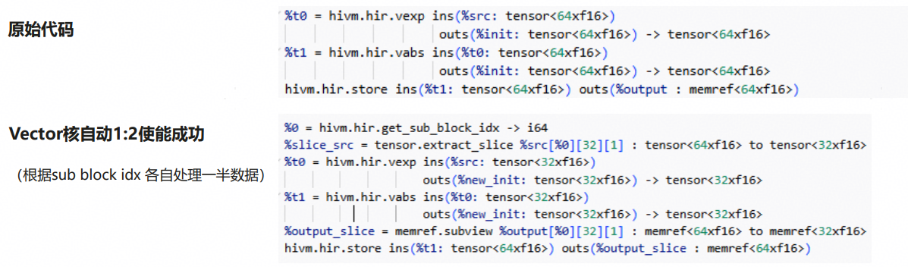
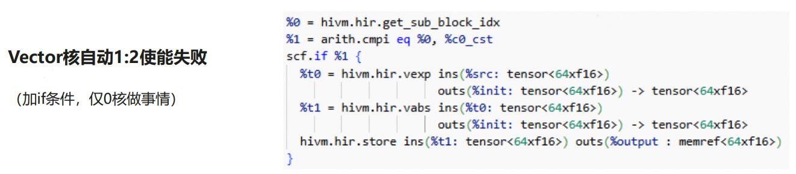

# Auto-Subtiling

## Hardware background

During Ascend chip evolution, AIC and AIV were separated with a 1:2 core ratio.

In the current ecosystem, neither user-written kernels nor community operators typically implement Ascend Cube–Vector 1:2 sub-block logic. To improve compute efficiency and Ascend affinity, the compiler needs automatic sub-block (subtiling) capability. This feature applies a Cube–Vector 1:2 subtiling strategy and performs the corresponding data splitting.

## Algorithm overview

The overall approach is:

Effects:

### Input/output example

### Implementation idea

1. Split Store data in half via extract-slice and for-loop.
2. Bubble up the extract-slice using the BubbleUpExtractSlice pattern.
3. Map the for-loop to subblock.
4. Subtiling succeeds.

If subtiling fails, the compiler falls back to 1:1.

Figure: Auto-subtiling 1:2 implementation.

### Design

##### Dimension analyzer (axis selection)

The Dimension Analyzer chooses a **parallel axis** for splitting by analyzing all operators in the target kernel.

##### Why choose a parallel axis

Vector cores do not share a direct data path. To maximize parallelism and correctness, splitting must avoid cross-tile dependencies. Splitting along a parallel axis allows each tile to be computed independently on a vector unit.

##### Tile and slice store (leaf)

Before each StoreOp/leaf node, an ExtractSliceOp for 1:2 splitting is inserted along the axis chosen by the Dimension Analyzer.

##### BubbleUp Extract Slice

A BubbleUp strategy is implemented per op type. Supported op types include:

- BroadcastOp, ReduceOp, ExpandOp (specific shapes), CollapseOp (specific shapes)
- ElementwiseOp, LoopOp, ExtractSliceOp (specific cases), InsertSliceOp (specific cases)

Additional op types can be supported by adding matchAndRewrite patterns.

## Interface

Behavior is controlled by:

- `--enable-auto-bind-sub-block=True` — enable this feature (default)
- `--enable-auto-bind-sub-block=False` — disable this feature

## Constraints and fallback

If subtiling or an intermediate transformation fails, the compiler automatically falls back to 1:1 to preserve correctness.

Common reasons for falling back to 1:1:

1. Axis selection fails (no valid parallel axis for splitting).
2. BubbleUpExtractSlicePattern encounters an unsupported op.

### Fallback example

