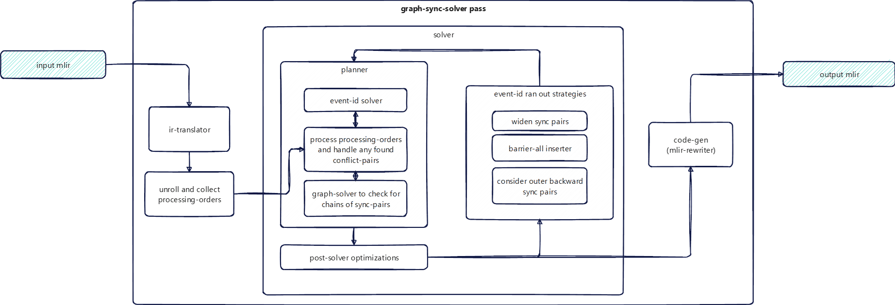

# Auto-Sync

Auto-sync is the AscendNPU-IR (HIVM) compiler feature that automatically inserts synchronization operations so producers and consumers of shared data or resources are correctly ordered. Goals: **correctness** (no data races or ordering bugs) and **minimal overhead** (fewest syncs needed, reuse of hardware events when safe).

---

## AICore Architecture

<https://www.hiascend.com/document/detail/zh/CANNCommunityEdition/83RC1/opdevg/Ascendcopdevg/atlas_ascendc_10_0008.html>

---

## HIVM Synchronization Operations (MLIR)

Synchronization ops are defined in `HIVMIR/HIVMSynchronizationOps.td`. Below they are described in terms of **MLIR usage** (operands/attributes), not assembly syntax.

### Intra-Core-Sync (Normal-Sync)

- **`hivm.set_flag`**  
  Operands/attributes: `set_pipe`, `wait_pipe` and `flag_id`  
  Executes on `set_pipe` after all previous instructions on that pipe finishes.  
  Triggers `flag_id` on execution  

- **`hivm.wait_flag`**  
  Operands/attributes: `set_pipe`, `wait_pipe` and `flag_id`  
  Executes on `wait_pipe`  
  Blocks all following instructions until `flag_id` get triggered

- **`hivm.pipe_barrier`**  
  Operands/attributes: `pipe`  
  Barrier across a given pipe.  
  Block all following instructions on `pipe` until all previous instructions finishes.

### Cross-Core-Sync (Block-Sync) (Intra-Block)

- **`hivm.sync_block_set`**  
  Operands/attributes:  
  - `tcore_type`  target core type (vector/cube)  
  - `tpipe`, `pipe`  (set/wait pipes on target core)  
  - `sync_instr_mode` (default `INTRA_BLOCK_SYNCHRONIZATION`)  
  - `event_id`  

  Executes on `tpipe` (set_pipe) on the `tcore_type` core after all previous instructions on the same core.pipe finishes.
  Sets `event_id`

- **`hivm.sync_block_wait`**  
  Operands/attributes:  
  - `tcore_type`  target core type (vector/cube)  
  - `tpipe`, `pipe`  (set/wait pipes on target core)  
  - `sync_instr_mode` (default `INTRA_BLOCK_SYNCHRONIZATION`)  
  - `event_id`  

  Executes on `pipe` (pipe_wait) on the `tcore_type`  
  Block all following instructions on `pipe` on the `tcore_type` core until all previous instructions finishes.

---

## Auto-Sync Solutions Overview

The codebase provides **two** auto-sync solutions:  

### **`Inject-Sync/Inject-Block-Sync`**  

  Uses multiple passe to insert needed sync operations, remove redundant ones, and allocate flag-ids/event-ids using liveliness analysis.  
  It is the primary solution enabled by default.  

### **`Graph-Sync-Solver/Cross-Core-GSS`**  

  Uses graph-based algorithms to analyze the input code structure and inserts needed sync operations.  
  Still an optional feature that can be enabled by `-hivm-enable-graph-sync-solver=true` command line option, or sync_solver=True triton-ascend option.

---

## InjectSync (Primary Intra-Core Auto-Sync Pass)

**Purpose:** Insert core-level (intra-core) synchronization (`set_flag` / `wait_flag`) using memory-dependence analysis, sync analysis, event-id allocation, and cleanup (move/remove redundant syncs).

**Source:**  

- Headers: `include/../InjectSync/`.  
- Implementation: `lib/../InjectSync/` (e.g. `InjectSync.cpp`, `MemoryDependentAnalyzer.cpp`, `SyncAnalysis.cpp`, `SyncEventIdAllocation.cpp`, `IRTranslator.cpp`, `SyncCodegen.cpp`, `MoveSyncState.cpp`, `RemoveRedundantSync.cpp`, `SyncCommon.cpp`).  

**Stages:**  

1. **IRTranslator**:  
   Build Sync-IR from the input function (compound elements, loops, conditions, memory ops).  
2. **SyncAnalyzer**:  
   For each pair of conflicting operations, it inserts a pair of set_flag/wait_flag operations or a barrier(pipe) operations if both operations are of same pipe.
3. **MoveSyncState**:  
   Reposition sync ops to reduce stalls while preserving semantics.  
4. **RemoveRedundantSync**:  
   Drop redundant sync pairs.  
5. **SyncEventIdAllocation**:  
   Assign static or dynamic event IDs; reuse when safe.  
6. **SyncCodegen**:  
   Emit `hivm.set_flag` / `hivm.wait_flag` / `hivm.barrier`

---

## InjectBlockSync (Block-Level Sync Pass)

**Purpose:** Insert block-level (intra-block) (cross-core) synchronization for **MIX** kernels (cube and vector): `sync_block_set`, `sync_block_wait`.

**Source:** `InjectBlockSync.cpp` `InjectBlockSync.h`  

**Behavior:**

- Runs only on **MIX** kernels (not host, not pure AIC/AIV).
- Inserts `SetFFTSBaseAddrOp` when an FFTS base addr kernel argument is present.
- Three modes (controlled by options and fusion kind):
  - **InjectAllBlockSync** — Emit block sync before/after every `LoadOp` and every `StoreOp` (cube/vector handoff).
  - **InjectBlockMixSync** — Full mix: build block sync IR via `SyncBlockIRTranslator`, then run SyncAnalyzer (BLOCKSYNC mode), MoveSyncState, RemoveRedundantSync, SyncEventIdAllocation, SyncCodegen.

---

## GraphSyncSolver (Solver-Based Intra-Core Pass)

**Purpose:** Alternative to Inject-Sync solution, uses graph-based algorithms decide when to insert pairs of set/wait operations and assign event IDs (often with better reuse than InjectSync).

**Source:**  

- Headers: `include/../GraphSyncSolver/`
- Implementation: `lib/../GraphSyncSolver/` (`GraphSyncSolver.cpp`, `SyncSolver.cpp`, `SyncSolverIR.cpp`, `SyncSolverIRTranslator.cpp`, `SyncSolverCodeGen.cpp`, `GraphSolver.cpp`, `EventIdSolver.cpp`, `Utility.cpp`, `SyncSolverTest.cpp`, `SyncSolverTester.cpp`).  

**Stages:**

1. **IRTranslator**:  
Build Sync-IR from the input function (function, scopes, loops, conditions, rw-operations).  
2. **Solver**:  
Collect conflict pairs (producer–consumer pairs), run pair selection and ordering, optionally reuse conflict pairs to save event IDs.  
3. **CodeGenerator**:  
Translate solver result back to MLIR: emit `hivm.set_flag` / `hivm.wait_flag` / `hivm.barrier`

---

## CrossCoreGSS (Cross-Core Synchronization)

**Purpose:** Insert block-level (intra-block) (cross-core) synchronization for **MIX** kernels (cube and vector): `sync_block_set`, `sync_block_wait`.

**Source:** `CrossCoreGSS.h` `CrossCoreGSS.cpp`; reuses `IRTranslator`, `Solver`, and `CodeGenerator` from GraphSyncSolver.

**How it works:**

- Same as intra-core GSS pass, but handles cross-core memory operations.

---

## Pass Options and CLI Flags

### Global CLI flags (compile tool)

These are typically wired in the compiler driver (e.g. `bishengir-hivm-compile`); see `Passes.td` and tools under `bishengir/lib/Tools/` for exact mapping.

| Flag | Type | Default | Description |
| ---- | ---- | ------- | ----------- |
| `--disable-auto-inject-block-sync` | bool | false | Disable automatic block-level set/wait insertion (InjectBlockSync / CrossCoreGSS). |
| `--disable-hivm-auto-inject-sync` | bool | false | Disable InjectSync (Intra-Core sync). |
| `--enable-hivm-inject-barrier-all-sync` | bool | false | Make InjectSync inserts barrier(all) instructions (useful auto-sync fails) |
| `--enable-hivm-inject-block-all-sync` | bool | false | Make InjectBlockSync inserts block(all) instructions (useful auto-sync fails) |
| `--enable-hivm-unit-flag-sync` | bool | false | Enable unit-flag sync feature. |
| `--enable-hivm-graph-sync-solver` | bool | false | Use GraphSyncSolver/CrossCoreGSS instead of InjectSync/InjectBlockSync for Intra-Core/Cross-Core auto-sync. |

---

## Extending and Debugging

- **InjectSync:** Start from `InjectSync.cpp`; follow analysis → allocation → codegen → move → remove. Memory and sync decisions: `MemoryDependentAnalyzer`, `SyncAnalysis`; event IDs: `SyncEventIdAllocation`; emission: `SyncCodegen`, `IRTranslator`; cleanup: `MoveSyncState`, `RemoveRedundantSync`. Use `SyncDebug` for logging.
- **InjectBlockSync:** Entry in `InjectBlockSync.cpp`; block IR is built by `SyncBlockIRTranslator`; rest of pipeline shared with InjectSync in BLOCKSYNC mode.
- **GraphSyncSolver / CrossCoreGSS:** Entry in `GraphSyncSolver.cpp` and `CrossCoreGSS.cpp`. Inspect `IRTranslator` (sync IR build), `Solver` (conflict selection), `SyncSolverCodeGen` (MLIR emission). Cross-core behavior is gated by `SyncMode::CROSS_CORE_SYNC` in translator, solver, and codegen (block set/wait, no barrier).

**Verification:** Check that emitted ops satisfy dialect verification; set and wait must share the same event/flag ID and compatible pipes.

---
