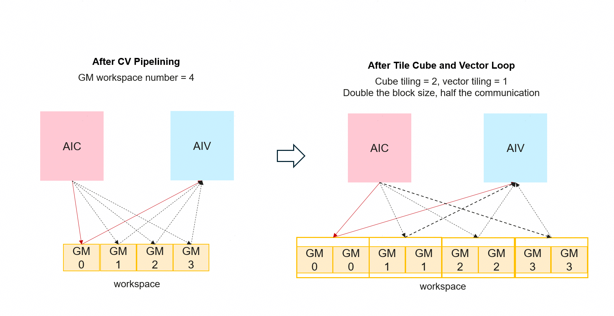

# Tile Cube and Vector Loop

本文介绍 HIVM 中的 **TileCubeVectorLoop** Pass。该Pass针对CV类kernel进行优化。在阅读本文之前，建议先阅读 [CV Optimization](./CVOptimization_zh.md)，了解CV编译相关术语。

---

## 功能介绍



**对MIX算子中已经完成软件流水（CV Pipelining）的 Cube 循环和 Vector 循环，再做一次Tiling切分**，把原来一次迭代干完的一整块计算，拆成多次迭代、每次处理更小的一块。这样做的目的主要有两点：

1. **减少核间同步**：每次迭代处理的数据更小，更可能被限制在本地 buffer（L0C、UB 等）内，从而减少跨核同步的开销。
2. **增大切分粒度**：在满足硬件约束的前提下，有机会使用更大的 tile size，有利于访存与计算效率：
    - **Cube 侧**：矩阵乘法的结果存储在L0C Buffer，若单次迭代的数据总大小超过 L0C 容量，就无法一次性放进 L0C。
    - **Vector 侧**：单次迭代若过大，可能会导致 UB（Unified Buffer）缓冲溢出。


## 接口说明

### 编译选项

| 选项 | 默认值 | 含义 |
|------|--------|------|
| `tile-mix-cube-loop` | 1 | Cube 循环目标 trip count；为 1 时不 tiling。 |
| `tile-mix-vector-loop` | 1 | Vector 循环目标 trip count；为 1 时不 tiling。 |


---

## 算法原理

通过遍历IR，寻找Cube和Vector循环对应的CopyOut操作进行切分，并以其为锚点，将数据的producer以此进行切分，并融合至循环内。

Before:

```
scf.for {
  hivm.load A
  hivm.load B
  hivm.hir.mmadL1
  hivm.hir.fixpipe
} {cube_loop}

```

After:

```
scf.for {
  for {
    hivm.load slice_A
    hivm.load slice_B
    hivm.hir.mmadL1
    hivm.hir.fixpipe
  } {sub_tile}
} {cube_loop}

```

---

## 约束能力

1. 只处理携带 **`hivm.loop_core_type`** 属性的 `scf.for`，且该属性的值为：
    - **`#hivm.tcore_type<CUBE>`**：Cube 循环
    - **`#hivm.tcore_type<VECTOR>`**：Vector 循环

2. 对于Vector计算，假设通过Tiling后的切块大小小于UB对齐大小，则不做Tiling。
3. 对于Cube计算，假设Tiling前的切块大小小于L0C总大小，则不做Tiling *（注：当前尚未考虑L1空间大小约束，部分场景下可能会出现L1 Memory Overflow的报错；后续会结合生命周期分析决定Cube侧的Tiling）*。