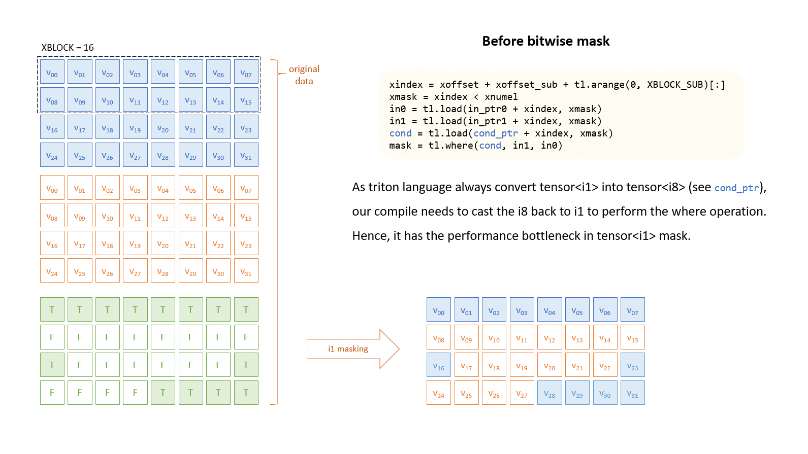
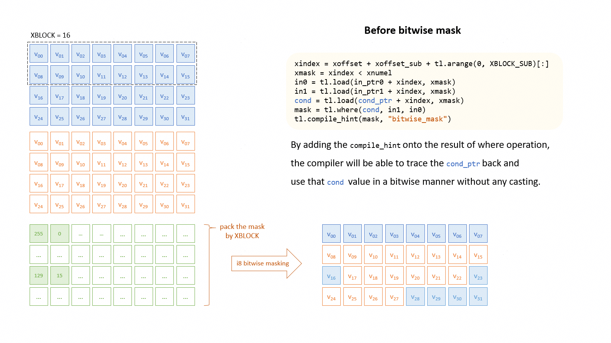
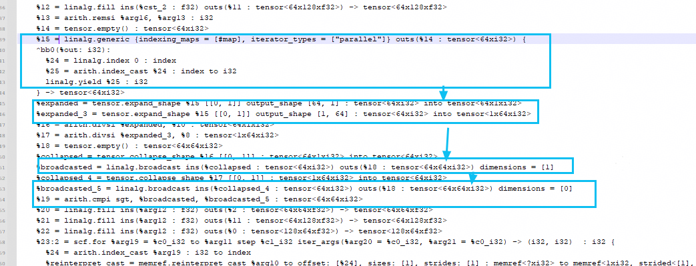
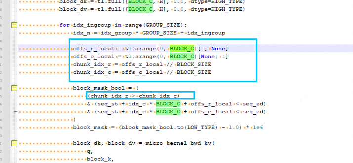
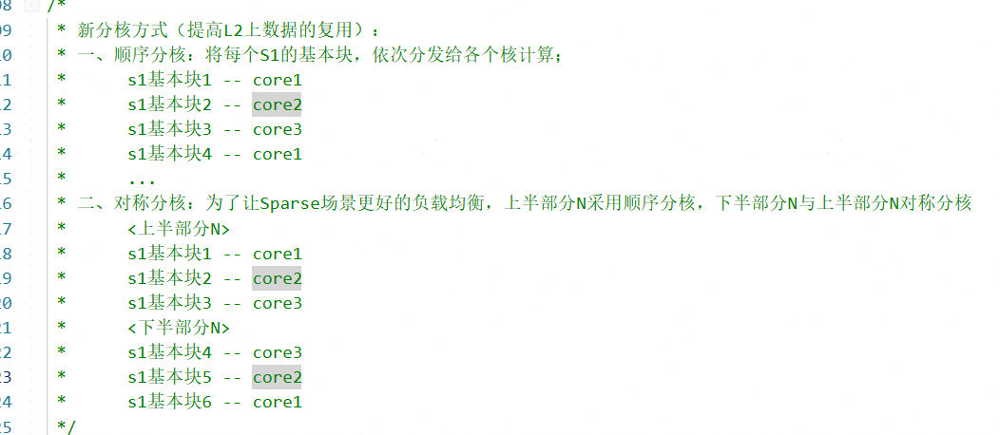

# 最佳实践

本章节介绍Triton NPU算子性能优化指南。

## 访存类

---

### - 使用mayDiscretememaccess规避UB overflow

#### 问题描述

导致UB overflow的成因各异，除了本身张量数据类型过大，导致超出192KB的UB限制，另一个可能的原因是非连续搬运导致UB内扩轴。以`<Nx1xf32>`数据类型为例，由于硬件在尾轴需要32B对齐，而`1xf32`只有4B大小，因此`<Nx1xf32>`在硬件上的实际大小会被扩轴至`<Nx8xf32>`以确保32B对齐。

无论因为什么原因导致的UB overflow，都可以通过加上`mayDiscretememaccess`的编译提示，使张量操作退化为标量操作，从而避免UB overflow。

#### 算子示例

改写算子时，只需在load/store操作的数据上加上`compile_hint`即可，参考以下代码段：

```python
# 若为load操作，compile_hint需加在加载出的value中
value = tl.load(pointer)
tl.compile_hint(value, "mayDiscretememaccess")

# 若为store操作，compile_hint需加在被存入的value中
tl.compile_hint(value, "mayDiscretememaccess")
tl.store(pointer, value)
```

以GDN网络的`causal_conv1d_states_fwd_kernel`算子为例，原代码逻辑为

```python
b_x = tl.load(x + o_t * D + o_d[:, None], mask=(m_t & m_d[:, None]), other=0)
```

通过增加编译提示，张量访存会被退化为标量访存，避免UB overflow，参考以下代码段：

```python
b_x = tl.load(x + o_t * D + o_d[:, None], mask=(m_t & m_d[:, None]), other=0)
tl.compile_hint(b_x, "mayDiscretememaccess")
```

<hr>

### - 使用load+mask替换make_block_ptr

#### 问题描述

由于make_block_ptr在处理非对齐尾块时支持度不足，导致脏数据引入，影响精度，因此当尾块为非对齐配置时，可以通过改写make_block_ptr为load+mask以准确处理尾块数据。

#### 算子示例

以GDN网络的`causal_conv1d_fwd_kernel`算子为例，原代码逻辑为

```python
p_yi = tl.make_block_ptr(x + bos * D, (T, D), (D, 1), (i_t * BT + i_w, i_d * BD), (BT, BD), (1, 0))
b_yi = tl.load(p_yi, boundary_check=(0, 1)).to(tl.float32)
```

通过改写make_block_ptr，上述操作会被降解为以下的load+mask操作

```python
# initialize `p_yi` with the correct stride and size
yi_t = i_t * BT + i_w + tl.arange(0, BT)
yi_d = i_d * BD + tl.arange(0, BD)
p_yi = x + bos * D + yi_t[:, None] * D + yi_d
# boundary check in the load operation by adding the mask
yi_t_m = (yi_t < T) & (yi_t >= 0)
yi_d_m = (yi_d < D) & (yi_d >= 0)
b_yi = tl.load(p_yi, mask=yi_t_m[:, None] & yi_d_m[None, :], other=0.).to(tl.float32)
```

---

### - 使用非负数iter arg作为访存索引

#### 问题描述

由于编译过程会对访存操作进行分析并优化编译结果，若访存操作的索引涉及到复杂的控制流（如for循环索引引入的访问越界），目前编译器或许没有能力完全覆盖，因此建议使用非负数的for循环iter参数作为访存索引。

#### 算子示例

以GDN网络的`causal_conv1d_fwd_kernel`算子为例，原代码逻辑为

```python
for i_w in tl.static_range(-W + 1, 1):
  p_yi = tl.make_block_ptr(x + bos * D, (T, D), (D, 1), (i_t * BT + i_w, i_d * BD), (BT, BD), (1, 0))
  b_yi = tl.load(p_yi, boundary_check=(0, 1)).to(tl.float32)
  if HAS_WEIGHT:
    b_yi *= tl.sum(b_w * (o_w == (i_w + W - 1)), 1)
```

由于`i_w`可为负数，以上算子需改写为

```python
for i_w in tl.static_range(W):
  p_yi = tl.make_block_ptr(x + bos * D, (T, D), (D, 1), (i_t * BT + i_w - W + 1, i_d * BD), (BT, BD), (1, 0))
  b_yi = tl.load(p_yi, boundary_check=(0, 1)).to(tl.float32)
  if HAS_WEIGHT:
    b_yi *= tl.sum(b_w * (o_w == i_w), 1)
```

---

### - 使用bitwise_mask优化访存掩码

#### 问题描述

由于Triton前端会将入参中i1类型的张量转化为i8类型的张量进行运算，若用户将i1类型的张量入参作为掩码，实际上在硬件上会先将i1转换成i8，再将i8转换回i1，从而带来性能损耗。面对上述情况，可通过bitwise_mask编译器提示进行优化。

具体使用方法只需在where后的结果加上`compile_hint("bitwise_mask")`即可，参考以下代码段：

```
mask = tl.where(cond, value1, value2)
tl.compile_hint(mask, "bitwise_mask")
```

需留意，由于mask以bitmask的形式表达，因此对应的mask指针偏移量也需正确运算。





#### 算子示例

参考 [Ascend where 算子](https://gitcode.com/Ascend/triton-ascend/blob/master/ascend/examples/pytest_ut/test_where_lt.py)进行改写，若用户需要输入bitwise的i8掩码作为算子入参，只需为tl.where的结果加上compile_hint即可，见以下代码：

```python
@triton.jit
def triton_where_lt_case1(in_ptr0, in_ptr1, cond_ptr, out_ptr0, xnumel, XBLOCK: tl.constexpr, XBLOCK_SUB: tl.constexpr):
    xoffset = tl.program_id(0) * XBLOCK
    for xoffset_sub in range(0, XBLOCK, XBLOCK_SUB):
        xindex = xoffset + xoffset_sub + tl.arange(0, XBLOCK_SUB)[:]
        xmask = xindex < xnumel
        in0 = tl.load(in_ptr0 + xindex, xmask)
        in1 = tl.load(in_ptr1 + xindex, xmask)
        cond = tl.load(cond_ptr + xindex, xmask)
        mask = tl.where(cond, in1, in0)
        tl.extra.cann.extension.compile_hint(mask, "bitwise_mask")
        tl.store(out_ptr0 + (xindex), mask, xmask)
```

由于bitwise mask将8个i8类型的True/False压缩至一个i8类型的数据，因此mask组装逻辑也需相关更新，可参考以下代码：

```python
def test_where_lt_case1(param_list):
       dtype, shape, ncore, xblock, xblock_sub = param_list
       if shape[-1] %8 != 0:
           raise ValueError("The last dimension should be a multiple of 8")
       x0 = test_common.generate_tensor(shape, dtype).npu()
       x1 = test_common.generate_tensor(shape, dtype).npu()
       # Run triton with i8 bitwise mask
       cond_i8 = test_common.generate_tensor(shape, 'uint8').npu()
       y_cal = test_common.generate_tensor(shape, dtype).npu()
       triton_where_lt_case1[ncore, 1, 1](x0, x1, cond_i8, y_cal, x0.numel(), xblock, xblock_sub)
       # Run torch with i1 mask
       flatten_cond_i8 = cond_i8.flatten()
       numel = flatten_cond_i8.shape[-1]
       num_sub_block = numel // xblock_sub
       flatten_cond_bool = torch.zeros(flatten_cond_i8.shape, dtype=torch.bool).npu()
       for sub_block_id in range(num_sub_block):
           for i in range(min(numel, xblock_sub) // 8):
               byte_value = flatten_cond_i8[xblock_sub * sub_block_id + i]
               for bit in range(8):
                   flatten_cond_bool[..., xblock_sub * sub_block_id + i*8 + bit] = (byte_value & (1 << bit)) != 0
       cond_bool = flatten_cond_bool.view(shape)
       y_ref = torch_where_lt_case1(x0, x1, cond_bool)
       # Precision test
       test_common.validate_cmp(dtype, y_cal, y_ref)
```

#### 限制

只支持i8类型的mask

- 由于Triton前端会将i1转换为i8，如果对其他类型如i16/i32等进行bitwise_mask操作反而会带来性能损耗，因此此功能只支持i8类型的mask

---

### - 动态生成mask类

#### 问题描述

经常出现range后cmp生成下三角的mask，我们硬件上的指令不支持i32/i64的比较，转scalar





#### 算子示例

diffusion_attention类的

```python
for idx_ingroup in range(GROUP_SIZE):
    idx_n = idx_group * GROUP_SIZE + idx_ingroup
    offs_r_local = tl.arange(0, BLOCK_C)[:, None]
            offs_c_local = tl.arange(0, BLOCK_C)[None, :]
            chunk_idx_r = offs_r_local // BLOCK_SIZE
            chunk_idx_c = offs_c_local // BLOCK_SIZE

        block_mask_bool = (
                (chunk_idx_r > chunk_idx_c)
                & (seq_st + idx_c * BLOCK_C + offs_r_local < seq_ed)
                & (seq_st + idx_c * BLOCK_C + offs_c_local < seq_ed)
            )
```

## CV类

---

### - 算子选项规避超时报错

#### 问题描述

导致算子卡死的部分原因是与硬件同步相关，其中可能涉及核内/间同步，或涉及流水同步。若遇上算子卡死的情况，你可以尝试在调用Kernel时，传入以下入参，修改二进制的同步逻辑，以规避算子卡死的问题。

```python
# 核同步选项
inject_block_all = True # 开启核间同步
inject_barrier_all = True # 开启核内同步
# 流水选项
limit_auto_multi_buffer_only_for_local_buffer = True # 关闭(GM space) CV流水
multibuffer = False # 关闭乒乓流水
```

#### 算子示例

以GDN网络的`chunk_gated_delta_rule_fwd_kernel_h_blockdim64`算子为例，原代码调用为

```python
chunk_gated_delta_rule_fwd_kernel_h_blockdim64[grid](
    k=k,
    v=u,
    w=w,
    v_new=v_new,
    g=g,
    gk=gk,
    h=h,
    h0=initial_state,
    ht=final_state,
    cu_seqlens=cu_seqlens,
    chunk_offsets=chunk_offsets,
    T=T,
    H=H,
    K=K,
    V=V,
    BT=BT,
)
```

关闭CV流水后的调用则为

```python
chunk_gated_delta_rule_fwd_kernel_h_blockdim64[grid](
    k=k,
    v=u,
    w=w,
    v_new=v_new,
    g=g,
    gk=gk,
    h=h,
    h0=initial_state,
    ht=final_state,
    cu_seqlens=cu_seqlens,
    chunk_offsets=chunk_offsets,
    T=T,
    H=H,
    K=K,
    V=V,
    BT=BT,
    limit_auto_multi_buffer_only_for_local_buffer = True,
)
```

---

### - 使用tile_cube_loop规避L1越界

#### 问题描述

由于编译器目前只能对单个matmul进行切分需求分析，并不考虑其他matmul的生命周期，因此当matmul被多次触发时（例如执行逻辑为`cube -> vector -> cube`时），若上一个matmul的生命周期和当前的matmul生命周期有所重叠，算子运行时可能会导致L1越界。后续编译器会对切分的生命周期分析进行增强，目前则需通过加上 `tile_cubloop` 编译提示，令编译器可以感知是否需要对相关的matmul操作进行sub tiling。

#### 算子示例

改寫算子時，只需为dot操作结果加上`tile_cube_loop`的编译提示即可，參考一下代碼段：

```python
res = tl.dot(lhs, rhs)
tl.compile_hint(res, "tile_cube_loop")
```

以Flash Attention的`_attn_fwd_inner`算子为例，原代码的QKV矩阵乘法逻辑大致为

```python
qk = tl.dot(q, trans_k)
# softmax calculation in between
qk = ...
p = tl.math.exp(qk)
pv = tl.dot(p, v)
```

参考以上代码，`qk`是cube操作，而softmax等计算属于vector操作，最后vector计算出的结果又再导入到第二次的cube操作中执行矩阵乘法。在以上场景下，编译器无法监控第二次cube操作中的切分逻辑，代码或许会在L1缓存中越界。因此，需要为第二次的dot操作结果加上`tile_cube_loop`的编译提示，令编译器对该操作进行sub tiling，见以下代码段：

```python
qk = tl.dot(q, trans_k)
# softmax calculation in between
qk = ...
p = tl.math.exp(qk)
pv = tl.dot(p, v)
tl.compile_hint(pv, "tile_cube_loop", 2)
```

---

### - 参考：编译优化选项

| 编译选项| 含义| 取值范围|
| --- | --- | --- |
| multibuffer | 设置是否启用乒乓流水 | False(默认),True |
| limit_auto_multi_buffer_of_local_buffer | 设置乒乓流水在片中(L1, L0, 及UB)的作用范围"no-limit"表示不限乒乓流水范围"no-l0c"表示只允许L0缓存外启用乒乓流水 | "no-limit","no-l0c"(默认) |
| unit_flag | 设置cube搬出时是否按照block搬出，仅限数据对齐场景下使用 | False(默认),True |
| limit_auto_multi_buffer_only_for_local_buffer | 设置是否在GM workspace中启用CV流水并行，False表示启用  后续会整改接口，提供更可读的选项 | False(默认),True |
| set_workspace_multibuffer | 仅在limit_auto_multi_buffer_only_for_local_buffer=false的场景下生效设置CV并行的并行度使用时需确保数据没有依赖若设置为N，则N个CV操作并行执行 | 2 (默认),4 |
| tile_mix_vector_loop | 仅在limit_auto_multi_buffer_only_for_local_buffer=false的场景下生效设置当前vector的切分数量，数值可由autotuning得出，均可为最优 | 1 (默认),2,4 |
| tile_mix_cube_loop | 仅在limit_auto_multi_buffer_only_for_local_buffer=false的场景下生效设置当前cube的切分数量，数值可由autotuning得出，均可为最优 | 1 (默认),2,4 |

### - 算子分核逻辑

#### 问题描述

对于attention的注意力机制，存在负载不均衡的问题。不同核计算的任务量不同。因为attetnionmask一般是存在倒三角，所以越到后面的核计算的任务量越重，因此我们尽可能把计算少的和计算多的放在同一个核上。



#### 算子示例

[mmad](https://gitee.com/guangpengz/triton-ascend/blob/master/ascend/examples/tutorials/13-matrix-multiplication-optimized.py)

---

### - 算子选项规避超时报错

#### 问题描述

导致算子卡死的部分原因是与硬件同步相关，其中可能涉及核内/间同步，或涉及流水同步。若遇上算子卡死的情况，你可以尝试在调用Kernel时，传入以下入参，修改二进制的同步逻辑，以规避算子卡死的问题。

```python
# 核同步选项
inject_block_all = True # 开启核间同步
inject_barrier_all = True # 开启核内同步
# 流水选项
limit_auto_multi_buffer_only_for_local_buffer = True # 关闭(GM space) CV流水
multibuffer = False # 关闭乒乓流水
```

#### 算子示例

以GDN网络的`chunk_gated_delta_rule_fwd_kernel_h_blockdim64`算子为例，原代码调用为

```python
chunk_gated_delta_rule_fwd_kernel_h_blockdim64[grid](
    k=k,
    v=u,
    w=w,
    v_new=v_new,
    g=g,
    gk=gk,
    h=h,
    h0=initial_state,
    ht=final_state,
    cu_seqlens=cu_seqlens,
    chunk_offsets=chunk_offsets,
    T=T,
    H=H,
    K=K,
    V=V,
    BT=BT,
)
```

关闭CV流水后的调用则为

```python
chunk_gated_delta_rule_fwd_kernel_h_blockdim64[grid](
    k=k,
    v=u,
    w=w,
    v_new=v_new,
    g=g,
    gk=gk,
    h=h,
    h0=initial_state,
    ht=final_state,
    cu_seqlens=cu_seqlens,
    chunk_offsets=chunk_offsets,
    T=T,
    H=H,
    K=K,
    V=V,
    BT=BT,
    limit_auto_multi_buffer_only_for_local_buffer = True,
)
```

---

## Triton NPU 编程案例
Triton NPU 编程请参考：
[https://github.com/Ascend/triton-ascend-ops/blob/main/tutorial/README.zh.md](https://github.com/Ascend/triton-ascend-ops/blob/main/tutorial/README.zh.md)

