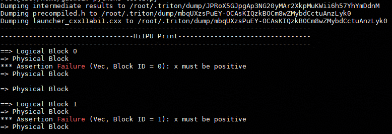
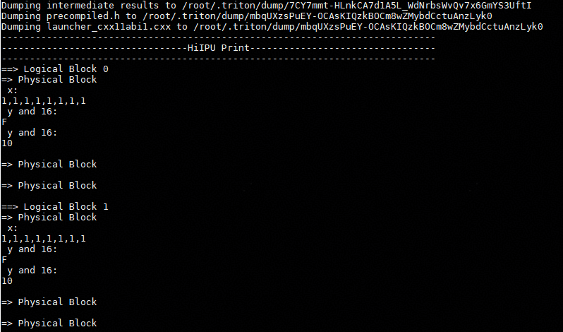
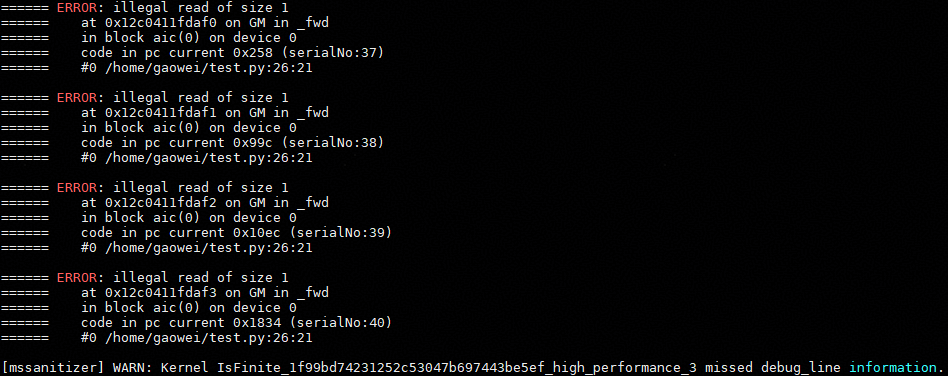
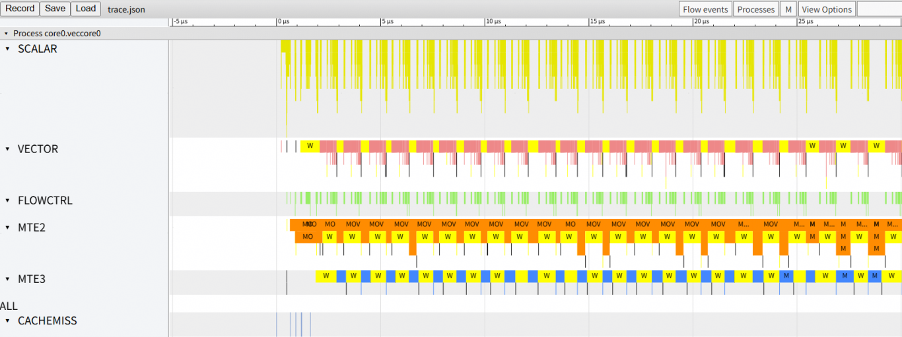
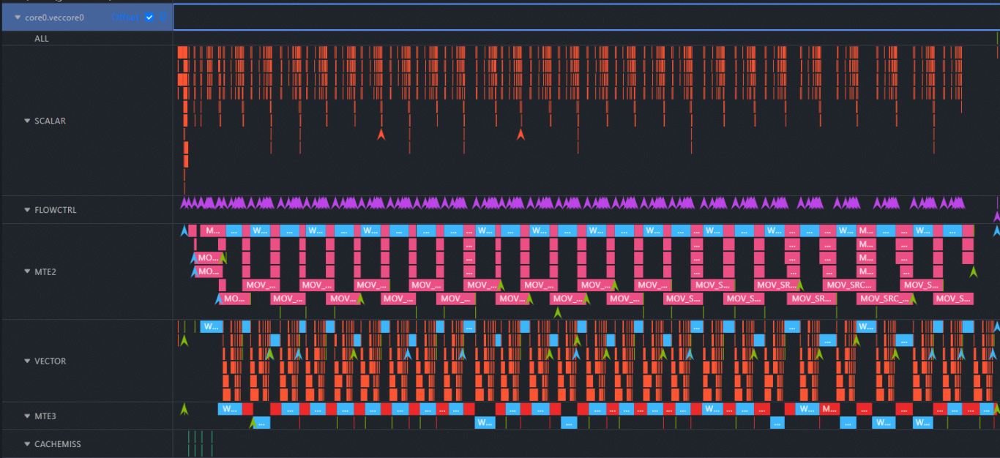

# 调试指南

## 调试：DEBUG OP类

目前与调试调测相关的op主要有如下四类：

* **​static_assert：​**编译时静态断言
* **​static_print：​**编译时静态打印
* **​device_assert：​**运行时设备断言
* **​device_print：​**运行时设备打印

### static_assert

#### 接口描述

```
# condition: bool - 编译时可计算的布尔表达式
# message: str - 可选，断言失败时显示的消息
triton.language.static_assert(condition: bool, message: str = "") -> None
```

#### 使用示例

```
import triton
import triton.language as tl

@triton.jit
def kernel_name(
    input_tensor,
    output_tensor,
    BLOCK_SIZE: tl.constexpr
):
    tl.static_assert(BLOCK_SIZE > 0, "BLOCK_SIZE must be positive")
```

### static_print

#### 接口描述

```
# message: str - 要打印的消息，可以包含编译时常量
triton.language.static_print(message: str) -> None
```

#### 使用示例

```
import triton
import triton.language as tl

@triton.jit
def kernel_name(
    input_tensor,
    output_tensor,
    BLOCK_SIZE: tl.constexpr
):
    tl.static_print(f"  BLOCK_SIZE = {BLOCK_SIZE}")
```

### device_assert

注：使用此功能前需要设置环境变量export TRITON_DEBUG=1 export TRITON_DEVICE_PRINT=1

#### 接口描述

```
# condition: bool - 要断言的条件, 必须是一个布尔张量
# message: str - 可选，断言失败时显示的消息

# triton language 接口
triton.language.device_assert(condition: bool, message: str = "") -> None

# hfusion op接口
hfusion.assert "condition = xxx" %condition : i1

# hivm op接口
# hex: bool - 是否将所有值以十六进制而非十进制形式打印
# tcoretype - 指明是在core核上运行还是vector核上运行（CUBE/VECTOR/CUBE_OR_VECTOR）
hivm.hir.debug {debugtype = "assert", hex = xxx, prefix = "condition = xxx", tcoretype = #hivm.tcore_type<VECTOR>} %condition : i1
```

#### 使用示例

```
import triton
import triton.language as tl

@triton.jit
def kernel_name(x_ptr, y):
    x_ptrs = x_ptr + tl.arange(0, 8)
    x = tl.load(x_ptrs)
    tl.device_assert(x > 0, "x must be positive")
```

#### AscendNPU IR片段示例：

```
// ttadapter ir:
module {
  func.func private @triton_assert_0(tensor<8xi1>) attributes {msg = "x must be positive"}
  func.func @vector_kernel(%arg0: memref<?xi8>, %arg1: memref<?xi8>, %arg2: memref<?xi64> {tt.divisibility = 16 : i32, tt.tensor_kind = 0 : i32}, %arg3: i32, %arg4: i32, %arg5: i32, %arg6: i32, %arg7: i32, %arg8: i32, %arg9: i32) attributes {SyncBlockLockArgIdx = 0 : i64, WorkspaceArgIdx = 1 : i64, global_kernel = "local", mix_mode = "aiv", parallel_mode = "simd"} {
    %c0_i64 = arith.constant 0 : i64
    %0 = tensor.empty() : tensor<8xi64>
    %1 = linalg.fill ins(%c0_i64 : i64) outs(%0 : tensor<8xi64>) -> tensor<8xi64>
    %reinterpret_cast = memref.reinterpret_cast %arg2 to offset: [0], sizes: [8], strides: [1] : memref<?xi64> to memref<8xi64, strided<[1]>>
    %alloc = memref.alloc() : memref<8xi64>
    memref.copy %reinterpret_cast, %alloc : memref<8xi64, strided<[1]>> to memref<8xi64>
    %2 = bufferization.to_tensor %alloc restrict writable : memref<8xi64>
    %3 = arith.cmpi sgt, %2, %1 : tensor<8xi64>
    call @triton_assert_0(%3) : (tensor<8xi1>) -> ()
    return
  }
}

// 转到hfusion层
// -----// IR Dump After AdaptTritonKernel (adapt-triton-kernel) //----- //
module attributes {dlti.target_system_spec = #dlti.target_system_spec<"NPU" : #hacc.target_device_spec<#dlti.dl_entry<"AI_CORE_COUNT", 20 : i32>, #dlti.dl_entry<"CUBE_CORE_COUNT", 20 : i32>, #dlti.dl_entry<"VECTOR_CORE_COUNT", 40 : i32>, #dlti.dl_entry<"UB_SIZE", 1572864 : i32>, #dlti.dl_entry<"L1_SIZE", 4194304 : i32>, #dlti.dl_entry<"L0A_SIZE", 524288 : i32>, #dlti.dl_entry<"L0B_SIZE", 524288 : i32>, #dlti.dl_entry<"L0C_SIZE", 1048576 : i32>, #dlti.dl_entry<"UB_ALIGN_SIZE", 256 : i32>, #dlti.dl_entry<"L1_ALIGN_SIZE", 256 : i32>, #dlti.dl_entry<"L0C_ALIGN_SIZE", 4096 : i32>>>, memref.memref_as_ptr} {
  func.func @vector_kernel(%arg0: memref<?xi8> {hacc.arg_type = #hacc.arg_type<sync_block_lock>}, %arg1: memref<?xi8> {hacc.arg_type = #hacc.arg_type<workspace>}, %arg2: memref<?xi64> {tt.divisibility = 16 : i32, tt.tensor_kind = 0 : i32}, %arg3: i32, %arg4: i32, %arg5: i32, %arg6: i32, %arg7: i32, %arg8: i32, %arg9: i32) attributes {SyncBlockLockArgIdx = 0 : i64, WorkspaceArgIdx = 1 : i64, hacc.entry, hacc.function_kind = #hacc.function_kind<DEVICE>, mix_mode = "aiv", parallel_mode = "simd"} {
    %c0_i64 = arith.constant 0 : i64
    %0 = tensor.empty() : tensor<8xi64>
    %1 = linalg.fill ins(%c0_i64 : i64) outs(%0 : tensor<8xi64>) -> tensor<8xi64>
    %reinterpret_cast = memref.reinterpret_cast %arg2 to offset: [0], sizes: [8], strides: [1] : memref<?xi64> to memref<8xi64, strided<[1]>>
    %alloc = memref.alloc() : memref<8xi64>
    memref.copy %reinterpret_cast, %alloc : memref<8xi64, strided<[1]>> to memref<8xi64>
    %2 = bufferization.to_tensor %alloc restrict writable : memref<8xi64>
    %3 = tensor.empty() : tensor<8xi1>
    %4 = hfusion.compare {compare_fn = #hfusion.compare_fn<vgt>} ins(%2, %1 : tensor<8xi64>, tensor<8xi64>) outs(%3 : tensor<8xi1>) -> tensor<8xi1>
    %5 = arith.extui %4 : tensor<8xi1> to tensor<8xi8>
    hfusion.assert "x must be positive" %5 : tensor<8xi8>
    return
  }
}

// 转到hivm层
// -----// IR Dump After ConvertHFusionToHIVM (convert-hfusion-to-hivm) //----- //
module attributes {dlti.target_system_spec = #dlti.target_system_spec<"NPU" : #hacc.target_device_spec<#dlti.dl_entry<"AI_CORE_COUNT", 20 : i32>, #dlti.dl_entry<"CUBE_CORE_COUNT", 20 : i32>, #dltentry<"VECTOR_CORE_COUNT", 40 : i32>, #dlti.dl_entry<"UB_SIZE", 1572864 : i32>, #dlti.dl_entry<"L1_SIZE", 4194304 : i32>, #dlti.dl_entry<"L0A_SIZE", 524288 : i32>, #dlti.dl_entry<"L0B_SIZE", 5242i32>, #dlti.dl_entry<"L0C_SIZE", 1048576 : i32>, #dlti.dl_entry<"UB_ALIGN_SIZE", 256 : i32>, #dlti.dl_entry<"L1_ALIGN_SIZE", 256 : i32>, #dlti.dl_entry<"L0C_ALIGN_SIZE", 4096 : i32>>>, memref.mems_ptr} {
  func.func @vector_kernel(%arg0: i64 {hacc.arg_type = #hacc.arg_type<ffts_base_address>}, %arg1: memref<?xi8> {hacc.arg_type = #hacc.arg_type<sync_block_lock>}, %arg2: memref<?xi8> {hacc.arg_typhacc.arg_type<workspace>}, %arg3: memref<?xi64> {tt.divisibility = 16 : i32, tt.tensor_kind = 0 : i32}, %arg4: i32, %arg5: i32, %arg6: i32, %arg7: i32, %arg8: i32, %arg9: i32, %arg10: i32) attrib{SyncBlockLockArgIdx = 0 : i64, WorkspaceArgIdx = 1 : i64, hacc.entry, hacc.function_kind = #hacc.function_kind<DEVICE>, mix_mode = "aiv", parallel_mode = "simd"} {
    %c0_i64 = arith.constant 0 : i64
    %0 = tensor.empty() : tensor<8xi64>
    %1 = hivm.hir.vbrc ins(%c0_i64 : i64) outs(%0 : tensor<8xi64>) -> tensor<8xi64>
    %reinterpret_cast = memref.reinterpret_cast %arg3 to offset: [0], sizes: [8], strides: [1] : memref<?xi64> to memref<8xi64, strided<[1]>>
    %alloc = memref.alloc() : memref<8xi64>
    memref.copy %reinterpret_cast, %alloc : memref<8xi64, strided<[1]>> to memref<8xi64>
    %2 = bufferization.to_tensor %alloc restrict writable : memref<8xi64>
    %3 = tensor.empty() : tensor<8xi1>
    %4 = hivm.hir.vcmp ins(%2, %1 : tensor<8xi64>, tensor<8xi64>) outs(%3 : tensor<8xi1>) compare_mode = <gt> -> tensor<8xi1>
    %5 = tensor.empty() : tensor<8xi8>
    %6 = hivm.hir.vcast ins(%4 : tensor<8xi1>) outs(%5 : tensor<8xi8>) -> tensor<8xi8>
    hivm.hir.debug {debugtype = "assert", hex = false, prefix = "x must be positive", tcoretype = #hivm.tcore_type<CUBE_OR_VECTOR>} %6 : tensor<8xi8>
    return
  }
}
```

#### 断言效果：



### device_print

注：使用此功能前需要设置环境变量export TRITON_DEBUG=1 export TRITON_DEVICE_PRINT=1

#### 接口描述

```
# prefix: str - 打印在值之前的前缀，必须是字符串
# *args - 要打印的值可以是任何张量或标量
# hex: bool - 是否将所有值以十六进制而非十进制形式打印

# triton language 接口
triton.language.device_print(prefix, *args, hex=False) -> None

# hfusion op接口
# dtype - 待打印tensor/scalar对应的数据类型
hfusion.print " prefix = xxx " {hex = xxx} %args : dtype

# hivm op接口
# tcoretype - 指明是在core核上运行还是vector核上运行（默认初始值为: CUBE_OR_VECTOR）
hivm.hir.debug {debugtype = "print", hex = xxx, prefix = " xxx: ", tcoretype = #hivm.tcore_type<CUBE_OR_VECTOR>} %args : dtype
```

#### 使用示例

```
import triton
import triton.language as tl

@triton.jit
def kernel_name(x_ptr, y):
    x_ptrs = x_ptr + tl.arange(0, 8)
    x = tl.load(x_ptrs)
    tl.device_print("x", x)
    tl.device_print("y and 16", y, 16, hex=True)
```

#### AscendNPU IR片段示例：

```
// ttadapter ir:
module {
  func.func private @triton_print_0(tensor<8xi64>) attributes {hex = false, prefix = " x: "}
  func.func private @triton_print_1(i32, i32) attributes {hex = true, prefix = " y and 16: "}
  func.func @vector_kernel(%arg0: memref<?xi8>, %arg1: memref<?xi8>, %arg2: memref<?xi64> {tt.divisibility = 16 : i32, tt.tensor_kind = 0 : i32}, %arg3: i32, %arg4: i32, %arg5: i32, %arg6: i32, %arg7: i32, %arg8: i32, %arg9: i32) attributes {SyncBlockLockArgIdx = 0 : i64, WorkspaceArgIdx = 1 : i64, global_kernel = "local", mix_mode = "aiv", parallel_mode = "simd"} {
    %c16_i32 = arith.constant 16 : i32
    %reinterpret_cast = memref.reinterpret_cast %arg2 to offset: [0], sizes: [8], strides: [1] : memref<?xi64> to memref<8xi64, strided<[1]>>
    %alloc = memref.alloc() : memref<8xi64>
    memref.copy %reinterpret_cast, %alloc : memref<8xi64, strided<[1]>> to memref<8xi64>
    %0 = bufferization.to_tensor %alloc restrict writable : memref<8xi64>
    call @triton_print_0(%0) : (tensor<8xi64>) -> ()
    call @triton_print_1(%arg3, %c16_i32) : (i32, i32) -> ()
    return
  }
}

// 转到hfusion层
// -----// IR Dump After AdaptTritonKernel (adapt-triton-kernel) //----- //
module attributes {dlti.target_system_spec = #dlti.target_system_spec<"NPU" : #hacc.target_device_spec<#dlti.dl_entry<"AI_CORE_COUNT", 20 : i32>, #dlti.dl_entry<"CUBE_CORE_COUNT", 20 : i32>, #dlti.dl_entry<"VECTOR_CORE_COUNT", 40 : i32>, #dlti.dl_entry<"UB_SIZE", 1572864 : i32>, #dlti.dl_entry<"L1_SIZE", 4194304 : i32>, #dlti.dl_entry<"L0A_SIZE", 524288 : i32>, #dlti.dl_entry<"L0B_SIZE", 524288 : i32>, #dlti.dl_entry<"L0C_SIZE", 1048576 : i32>, #dlti.dl_entry<"UB_ALIGN_SIZE", 256 : i32>, #dlti.dl_entry<"L1_ALIGN_SIZE", 256 : i32>, #dlti.dl_entry<"L0C_ALIGN_SIZE", 4096 : i32>>>, memref.memref_as_ptr} {
  func.func @vector_kernel(%arg0: memref<?xi8> {hacc.arg_type = #hacc.arg_type<sync_block_lock>}, %arg1: memref<?xi8> {hacc.arg_type = #hacc.arg_type<workspace>}, %arg2: memref<?xi64> {tt.divisibility = 16 : i32, tt.tensor_kind = 0 : i32}, %arg3: i32, %arg4: i32, %arg5: i32, %arg6: i32, %arg7: i32, %arg8: i32, %arg9: i32) attributes {SyncBlockLockArgIdx = 0 : i64, WorkspaceArgIdx = 1 : i64, hacc.entry, hacc.function_kind = #hacc.function_kind<DEVICE>, mix_mode = "aiv", parallel_mode = "simd"} {
    %c16_i32 = arith.constant 16 : i32
    %reinterpret_cast = memref.reinterpret_cast %arg2 to offset: [0], sizes: [8], strides: [1] : memref<?xi64> to memref<8xi64, strided<[1]>>
    %alloc = memref.alloc() : memref<8xi64>
    memref.copy %reinterpret_cast, %alloc : memref<8xi64, strided<[1]>> to memref<8xi64>
    %0 = bufferization.to_tensor %alloc restrict writable : memref<8xi64>
    hfusion.print " x: " {hex = false} %0 : tensor<8xi64>
    hfusion.print " y and 16: " {hex = true} %arg3 : i32
    hfusion.print " y and 16: " {hex = true} %c16_i32 : i32
    return
  }
}

// 转到hivm层
// -----// IR Dump After ConvertHFusionToHIVM (convert-hfusion-to-hivm) //----- //
module attributes {dlti.target_system_spec = #dlti.target_system_spec<"NPU" : #hacc.target_device_spec<#dlti.dl_entry<"AI_CORE_COUNT", 20 : i32>, #dlti.dl_entry<"CUBE_CORE_COUNT", 20 : i32>, #dlti.dl_entry<"VECTOR_CORE_COUNT", 40 : i32>, #dlti.dl_entry<"UB_SIZE", 1572864 : i32>, #dlti.dl_entry<"L1_SIZE", 4194304 : i32>, #dlti.dl_entry<"L0A_SIZE", 524288 : i32>, #dlti.dl_entry<"L0B_SIZE", 524288 : i32>, #dlti.dl_entry<"L0C_SIZE", 1048576 : i32>, #dlti.dl_entry<"UB_ALIGN_SIZE", 256 : i32>, #dlti.dl_entry<"L1_ALIGN_SIZE", 256 : i32>, #dlti.dl_entry<"L0C_ALIGN_SIZE", 4096 : i32>>>, memref.memref_as_ptr} {
  func.func @vector_kernel(%arg0: i64 {hacc.arg_type = #hacc.arg_type<ffts_base_address>}, %arg1: memref<?xi8> {hacc.arg_type = #hacc.arg_type<sync_block_lock>}, %arg2: memref<?xi8> {hacc.arg_type = #hacc.arg_type<workspace>}, %arg3: memref<?xi64> {tt.divisibility = 16 : i32, tt.tensor_kind = 0 : i32}, %arg4: i32, %arg5: i32, %arg6: i32, %arg7: i32, %arg8: i32, %arg9: i32, %arg10: i32) attributes {SyncBlockLockArgIdx = 0 : i64, WorkspaceArgIdx = 1 : i64, hacc.entry, hacc.function_kind = #hacc.function_kind<DEVICE>, mix_mode = "aiv", parallel_mode = "simd"} {
    %c16_i32 = arith.constant 16 : i32
    %reinterpret_cast = memref.reinterpret_cast %arg3 to offset: [0], sizes: [8], strides: [1] : memref<?xi64> to memref<8xi64, strided<[1]>>
    %alloc = memref.alloc() : memref<8xi64>
    memref.copy %reinterpret_cast, %alloc : memref<8xi64, strided<[1]>> to memref<8xi64>
    %0 = bufferization.to_tensor %alloc restrict writable : memref<8xi64>
    hivm.hir.debug {debugtype = "print", hex = false, prefix = " x: ", tcoretype = #hivm.tcore_type<CUBE_OR_VECTOR>} %0 : tensor<8xi64>
    hivm.hir.debug {debugtype = "print", hex = true, prefix = " y and 16: ", tcoretype = #hivm.tcore_type<CUBE_OR_VECTOR>} %arg4 : i32
    hivm.hir.debug {debugtype = "print", hex = true, prefix = " y and 16: ", tcoretype = #hivm.tcore_type<CUBE_OR_VECTOR>} %c16_i32 : i32
    return
  }
}
```

#### 打印效果：



## 调试：工具类


### mssanitizer

命令行异常检测工具用于triton算子内存检测/竞争检测/未初始化检测等

注：使用此功能前需要设置环境变量 export TRITON_ENABLE_SANITIZER=true

#### 使用方式

```
# 直接拉起triton算子运行即可
mssanitizer python test.py
```
#### 效果展示



### msprof

命令行模型调优工具用于triton算子性能数据的采集和解析

#### 使用方式

```
# 整网上板调优
# --output - 收集到的性能数据的存放路径，默认在当前目录下保存性能数据
# --application - 整网执行命令
msprof --output=xxx --application=""

# 单算子上板调优
# --output - 收集到的性能数据的存放路径，默认在当前目录下保存性能数据
# --application - 单算子执行命令
# --kernel-name - 指定要采集的算子名称，支持使用算子名前缀进行模糊匹配
# --aic-metrics - 使能算子性能指标的采集能力和算子采集能力指标（Roofline/Occupancy/MemoryDetail等）
msprof op --output=xxx --application="" --kernel-name=xxx --aic-metrics=xxx

# 单算子仿真调优
# --core-id - 指定部分逻辑核的id，解析部分核的仿真数据
# --kernel-name - 指定要采集的算子名称，支持使用算子名前缀进行模糊匹配
# --soc-version - 指定仿真器类型
# --output - 收集到的性能数据的存放路径，默认在当前目录下保存性能数据
msprof op simulator --core-id=xxx --kernel-name=xxx --soc-version=Ascendxxx --output=xxx
```

#### AscendNPU IR编译选项

#### 常用性能分析图

性能流水图数据可在以下文件中获取

trace.json：支持在chrome://tracing/上生成指令流水图


visualize_data.bin：支持在Mind Studio Insight可视化呈现指令在昇腾AI处理器上的运行情况


#### 其他性能分析图

详见[Mindstudio算子开发工具](https://www.hiascend.com/document/detail/zh/mindstudio/830/ODtools/Operatordevelopmenttools/atlasopdev_16_0136.html)

### AscendNPU IR编译选项

#### enable-sanitizer

开启TRITON_ENABLE_SANITIZER环境变量后enable-sanitizer置为true，将debug 信息（行号等）以及 metadata（桩函数名称等）传给毕昇编译器，毕昇编译器根据这些信息添加桩函数调用 (CALL) 完成插桩，而桩函数的实现在 mssanitizer 工具里面

#### enable-debug-info

用于传递对应的triton kernel行号信息


